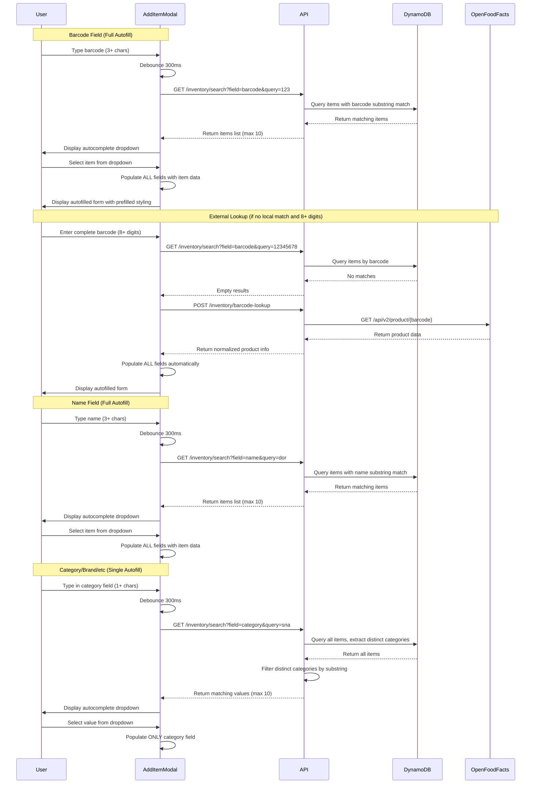

# Design Document: Barcode Autofill Feature

## Overview

The autocomplete and autofill feature enhances the AddItemModal component by providing intelligent field suggestions and automatic population based on existing inventory data. All text input fields (barcode, name, category, brand, whereToBuy, onlineStoreLink) now display autocomplete dropdowns showing matching values from previously entered items. The unit field remains a standard dropdown with VALID_UNITS and does not have autocomplete.

The feature distinguishes between two types of autofill behavior:
- **Full Autofill Fields** (barcode, name): Selecting from their autocomplete dropdown populates ALL other form fields with complete item data
- **Single Autofill Fields** (category, brand, whereToBuy, onlineStoreLink): Selecting from their autocomplete dropdown only populates that specific field

For barcode lookups, the system implements a two-tier strategy:
1. **Local lookup**: Search the user's existing inventory items by barcode (shows in autocomplete dropdown)
2. **External lookup**: Query Open Food Facts API if no local match is found and barcode appears complete (8+ digits)

The system provides visual feedback to distinguish prefilled fields from user-edited fields, supports keyboard navigation for all autocomplete dropdowns (Arrow keys, Tab/Shift+Tab, Enter/Space, Escape), and includes debouncing to optimize performance.

## Architecture

### Component Architecture

```
AddItemModal (Enhanced)
├── Autocomplete System
│   ├── Barcode field autocomplete (Full Autofill)
│   ├── Name field autocomplete (Full Autofill)
│   ├── Category field autocomplete (Single Autofill)
│   ├── Brand field autocomplete (Single Autofill)
│   ├── WhereToBuy field autocomplete (Single Autofill)
│   └── OnlineStoreLink field autocomplete (Single Autofill)
├── Autofill State Management
│   ├── Prefilled field tracking
│   ├── User edit detection
│   ├── Dropdown visibility state (per field)
│   ├── Dropdown focus/selection state
│   └── Loading state management
├── Lookup Trigger Logic
│   ├── Barcode change handler (3+ chars → local search, 8+ → external)
│   ├── Name change handler (3+ chars, debounced 300ms)
│   ├── Category change handler (1+ chars, debounced 300ms)
│   ├── Brand change handler (1+ chars, debounced 300ms)
│   ├── WhereToBuy change handler (1+ chars, debounced 300ms)
│   ├── OnlineStoreLink change handler (3+ chars, debounced 300ms)
│   └── Duplicate request prevention
├── Keyboard Navigation
│   ├── Arrow key navigation (Up/Down)
│   ├── Tab/Shift+Tab navigation
│   ├── Enter/Space selection
│   └── Escape to close dropdown
└── Visual Styling System
    ├── Prefilled field styles
    ├── User-edited field styles
    ├── Loading indicators
    └── Dropdown styling
```

### Backend Architecture

```
GET /inventory/search
├── Input validation (field, query)
├── Field-specific search logic
│   ├── barcode: Substring match on barcode field → return full items
│   ├── name: Substring match on name field → return full items
│   ├── category: Extract distinct categories → filter by substring
│   ├── brand: Extract distinct brands → filter by substring
│   ├── whereToBuy: Extract distinct whereToBuy values → filter by substring
│   └── onlineStoreLink: Extract distinct onlineStoreLink values → filter by substring
└── Response formatting (items or values)

POST /inventory/barcode-lookup (ALREADY IMPLEMENTED)
├── Open Food Facts API integration
├── Caching with TTL
├── 5s timeout handling
└── Response normalization
```

### Data Flow



## Components and Interfaces

### Frontend: AddItemModal Enhancements

#### New State Variables

```typescript
interface AutofillState {
  prefilledFields: Set<string>;        // Tracks which fields were autofilled
  userEditedFields: Set<string>;       // Tracks which prefilled fields were edited
  lookupLoading: boolean;              // Loading state for barcode lookup
  lookupError: string | null;          // Error message from lookup
  lastLookupBarcode: string | null;    // Prevents duplicate lookups
  
  // Autocomplete dropdown state
  autocompleteDropdowns: {
    barcode: { visible: boolean; items: InventoryItem[]; focusedIndex: number };
    name: { visible: boolean; items: InventoryItem[]; focusedIndex: number };
    category: { visible: boolean; values: string[]; focusedIndex: number };
    brand: { visible: boolean; values: string[]; focusedIndex: number };
    whereToBuy: { visible: boolean; values: string[]; focusedIndex: number };
    onlineStoreLink: { visible: boolean; values: string[]; focusedIndex: number };
  };
}
```

#### New Props (None - internal state only)

The AddItemModal component interface remains unchanged. All autofill functionality is internal.

#### Styling Constants

```typescript
const AUTOFILL_STYLES = {
  prefilled: {
    backgroundColor: '#e0f2fe',        // Light blue background
    borderColor: '#0284c7',            // Blue border
  },
  userEdited: {
    backgroundColor: '#ffffff',        // White background (normal)
    borderColor: '#d1d5db',            // Gray border (normal)
  },
  loading: {
    opacity: 0.6,
  },
  dropdown: {
    position: 'absolute',
    backgroundColor: '#ffffff',
    border: '1px solid #d1d5db',
    borderRadius: '6px',
    boxShadow: '0 4px 6px rgba(0, 0, 0, 0.1)',
    maxHeight: '200px',
    overflowY: 'auto',
    zIndex: 1000,
  },
  dropdownItem: {
    padding: '0.5rem 0.75rem',
    cursor: 'pointer',
    borderBottom: '1px solid #f3f4f6',
  },
  dropdownItemFocused: {
    backgroundColor: '#f3f4f6',
  },
};
```

### Backend: Inventory Search Handler

#### Request Interface

```typescript
interface InventorySearchRequest {
  field: 'barcode' | 'name' | 'category' | 'brand' | 'whereToBuy' | 'onlineStoreLink';
  query: string;  // Non-empty search query
}
```

#### Response Interface

```typescript
interface InventorySearchResponse {
  field: string;
  query: string;
  resultType: 'items' | 'values';
  items?: InventoryItem[];  // For barcode and name fields (Full Autofill)
  values?: string[];         // For category, brand, whereToBuy, onlineStoreLink (Single Autofill)
  count: number;             // Number of results returned (max 10)
}
```

#### Search Logic by Field

```typescript
// Barcode field: Return full items with barcode substring match
async function searchByBarcode(userId: string, query: string): Promise<InventoryItem[]> {
  // Query DynamoDB with FilterExpression: contains(barcode, :query)
  // Return up to 10 matching items
}

// Name field: Return full items with name substring match
async function searchByName(userId: string, query: string): Promise<InventoryItem[]> {
  // Query all user items, filter by name substring (case-insensitive)
  // Return up to 10 matching items
}

// Category field: Return distinct category values
async function searchByCategory(userId: string, query: string): Promise<string[]> {
  // Query all user items
  // Extract distinct category values
  // Filter by query substring (case-insensitive)
  // Return up to 10 matching values
}

// Brand field: Return distinct brand values
async function searchByBrand(userId: string, query: string): Promise<string[]> {
  // Query all user items
  // Extract distinct brand values (non-empty)
  // Filter by query substring (case-insensitive)
  // Return up to 10 matching values
}

// WhereToBuy field: Return distinct whereToBuy values
async function searchByWhereToBuy(userId: string, query: string): Promise<string[]> {
  // Query all user items
  // Extract distinct whereToBuy values (non-empty)
  // Filter by query substring (case-insensitive)
  // Return up to 10 matching values
}

// OnlineStoreLink field: Return distinct onlineStoreLink values
async function searchByOnlineStoreLink(userId: string, query: string): Promise<string[]> {
  // Query all user items
  // Extract distinct onlineStoreLink values (non-empty)
  // Filter by query substring (case-insensitive)
  // Return up to 10 matching values
}
```

### Backend: Barcode Lookup Handler (Already Implemented)

The POST /inventory/barcode-lookup endpoint is already implemented with:
- Open Food Facts API integration
- In-memory caching with TTL
- 5-second timeout handling
- Error handling for 404, network failures, invalid responses
- Response mapping to ProductInfo interface

No additional implementation needed for this endpoint.

### Frontend: API Client Functions

```typescript
// frontend/src/api/inventory.ts

// Unified search endpoint for all autocomplete fields
export async function searchInventory(
  field: 'barcode' | 'name' | 'category' | 'brand' | 'whereToBuy' | 'onlineStoreLink',
  query: string
): Promise<InventorySearchResponse> {
  const response = await fetch(
    `${API_URL}/inventory/search?field=${encodeURIComponent(field)}&query=${encodeURIComponent(query)}`,
    {
      method: 'GET',
      headers: {
        Authorization: `Bearer ${token}`,
      },
    }
  );
  
  if (!response.ok) {
    throw new Error('Inventory search failed');
  }
  
  return response.json();
}

// External barcode lookup (ALREADY IMPLEMENTED)
// export async function lookupBarcode(barcode: string): Promise<BarcodeLookupResponse>
```

## Data Models

### DynamoDB Query Patterns

#### Barcode Search (Full Autofill)

```typescript
{
  TableName: 'PantryApp',
  KeyConditionExpression: 'PK = :pk AND begins_with(SK, :skPrefix)',
  FilterExpression: 'contains(barcode, :query)',
  ExpressionAttributeValues: {
    ':pk': `USER#${userId}`,
    ':skPrefix': 'ITEM#',
    ':query': query,
  },
  Limit: 10,
}
```

#### Name Search (Full Autofill)

```typescript
{
  TableName: 'PantryApp',
  KeyConditionExpression: 'PK = :pk AND begins_with(SK, :skPrefix)',
  ExpressionAttributeValues: {
    ':pk': `USER#${userId}`,
    ':skPrefix': 'ITEM#',
  },
}
// Filter by name substring on backend (case-insensitive)
// Return up to 10 matches
```

#### Distinct Value Search (Single Autofill)

```typescript
// For category, brand, whereToBuy, onlineStoreLink
{
  TableName: 'PantryApp',
  KeyConditionExpression: 'PK = :pk AND begins_with(SK, :skPrefix)',
  ExpressionAttributeValues: {
    ':pk': `USER#${userId}`,
    ':skPrefix': 'ITEM#',
  },
}
// Backend processing:
// 1. Extract all items
// 2. Collect distinct non-empty values for the specified field
// 3. Filter by query substring (case-insensitive)
// 4. Return up to 10 matches
```

### Open Food Facts API Response Mapping (Already Implemented)

The backend already handles mapping Open Food Facts responses to the ProductInfo interface with proper error handling and validation.

## Correctness Properties

*A property is a characteristic or behavior that should hold true across all valid executions of a system—essentially, a formal statement about what the system should do. Properties serve as the bridge between human-readable specifications and machine-verifiable correctness guarantees.*

### Property 1: Character Threshold Triggers Search

*For any* autocomplete field and input string, a search SHALL be triggered if and only if the string length meets the field's minimum threshold (barcode: 3, name: 3, category: 1, brand: 1, whereToBuy: 1, onlineStoreLink: 3)

**Validates: Requirements 1.1, 1.5, 2.1, 2.7, 2.2.1, 2.3.1, 2.4.1, 2.5.1**

### Property 2: Dropdown Displays Matching Results

*For any* autocomplete field with non-empty search results, the autocomplete dropdown SHALL be visible and display the matching items or values

**Validates: Requirements 1.2, 2.2, 2.2.2, 2.3.2, 2.4.2, 2.5.2**

### Property 3: Dropdown Hides for Empty Results

*For any* autocomplete field with empty search results, the autocomplete dropdown SHALL not be displayed

**Validates: Requirements 2.8**

### Property 4: Maximum Dropdown Items

*For any* autocomplete dropdown with search results, the number of displayed items SHALL not exceed 10

**Validates: Requirements 1.3, 2.3**

### Property 5: Dropdown Content Completeness

*For any* autocomplete dropdown item, the rendered content SHALL include all required fields for that dropdown type (barcode dropdown: barcode + name + brand; name dropdown: name + category + brand; single field dropdowns: the field value)

**Validates: Requirements 1.4, 2.4**

### Property 6: Case-Insensitive Substring Matching

*For any* text-based autocomplete field (name, category, brand, whereToBuy, onlineStoreLink) and search query, matching SHALL be case-insensitive and support substring matching

**Validates: Requirements 2.5, 2.2.4, 2.3.4, 2.4.4, 2.5.4**

### Property 7: Full Autofill Population

*For any* item selected from a Full Autofill Field dropdown (barcode or name), ALL available form fields SHALL be populated with data from the selected item

**Validates: Requirements 1.6, 2.9, 2.1.2**

### Property 8: Single Autofill Population

*For any* value selected from a Single Autofill Field dropdown (category, brand, whereToBuy, onlineStoreLink), ONLY that specific field SHALL be populated with the selected value

**Validates: Requirements 2.1.3, 2.2.6, 2.3.6, 2.4.6, 2.5.6**

### Property 9: External Lookup Trigger

*For any* barcode with 8 or more digits that returns no local matches, an external lookup to Open Food Facts API SHALL be triggered

**Validates: Requirements 1.7**

### Property 10: External Lookup Population

*For any* external lookup that returns product data, ALL available form fields SHALL be populated with the returned data

**Validates: Requirements 1.8**

### Property 11: Duplicate Lookup Prevention

*For any* barcode, while a lookup is in progress, subsequent lookup requests for the same barcode SHALL be prevented

**Validates: Requirements 1.9**

### Property 12: Prefilled Field Styling

*For any* form field populated by the autofill system, the field SHALL have distinct prefilled visual styling applied

**Validates: Requirements 3.1, 3.4**

### Property 13: User Edit Style Transition

*For any* prefilled field that is modified by the user, the field styling SHALL transition from prefilled to user-edited styling

**Validates: Requirements 4.1, 4.3**

### Property 14: Independent Field Edit Tracking

*For any* form field, the edit state SHALL be tracked independently such that modifying one field does not affect the edit state of other fields

**Validates: Requirements 4.4**

### Property 15: Selective Field Population

*For any* lookup result, the autofill system SHALL populate only the fields that have corresponding data in the result (name, category, brand, unit, whereToBuy, onlineStoreLink) and SHALL NOT populate expirationDate, locationId, quantity, or threshold fields

**Validates: Requirements 5.1, 5.2, 5.3, 5.4, 5.5, 5.6, 5.7**

### Property 16: User Data Preservation

*For any* form field that already contains user-entered data, the autofill system SHALL NOT overwrite that field when performing autofill

**Validates: Requirements 5.8**

### Property 17: Form Submission Completeness

*For any* form submission, ALL fields (prefilled and user-edited) SHALL be included in the submission data

**Validates: Requirements 7.1, 7.2**

### Property 18: Validation Consistency

*For any* form field, validation rules SHALL be applied consistently regardless of whether the field value is prefilled, user-edited, or manually entered

**Validates: Requirements 7.3**


## Error Handling

### Frontend Error Handling

#### Network Errors
- Barcode lookup failures due to network issues display a user-friendly error message near the barcode field
- Error message: "Unable to lookup barcode. Please check your connection and try again."
- Users can continue editing the form manually even if lookup fails
- Error state is cleared when the user modifies the barcode field

#### API Errors
- 400 Bad Request: Display "Invalid barcode format" message
- 401 Unauthorized: Redirect to login (handled by global auth interceptor)
- 500 Server Error: Display "Lookup service temporarily unavailable" message
- Timeout (>10s): Display "Lookup is taking longer than expected" message

#### Empty Results
- No error message is displayed when lookup returns no results
- Dropdown simply remains hidden or shows "No matches found" message
- Users can continue entering data manually

#### Invalid Data from External API
- If Open Food Facts returns invalid unit values, skip the unit field population
- If required fields are missing from external data, populate only available fields
- Log warnings for data quality issues but don't block the user

### Backend Error Handling

#### DynamoDB Errors
- Query failures are logged with full error details
- Return 500 status code with generic error message to client
- Implement exponential backoff for transient errors

#### Open Food Facts API Errors
- Network timeouts (>5s): Log error and return empty result to client
- 404 Not Found: Return `{ found: false }` (not an error condition)
- 429 Rate Limited: Log warning and return empty result
- Invalid response format: Log error and return empty result

#### Input Validation
- Empty barcode: Return 400 with "Barcode is required" message
- Barcode with invalid characters: Return 400 with "Invalid barcode format" message
- Barcode exceeding reasonable length (>50 chars): Return 400 with "Barcode too long" message

### Cleanup and Cancellation

#### Modal Close
- Cancel any in-progress lookup requests using AbortController
- Clear all error messages
- Reset loading states
- Preserve form data until modal is reopened (then reset)

#### Component Unmount
- Cancel all pending requests
- Clear all timers (debounce timers)
- Remove event listeners

## Testing Strategy

### Unit Tests

Unit tests focus on specific behaviors, edge cases, and error conditions:

#### Autocomplete Dropdown Tests
- Dropdown appears when character threshold is met
- Dropdown hides when input is below threshold
- Dropdown hides when clicking outside
- Dropdown shows "No matches found" for empty results
- Maximum 10 items are displayed regardless of result count

#### Keyboard Navigation Tests
- Arrow keys navigate dropdown items
- Tab/Shift+Tab navigate dropdown items with wrapping
- Enter/Space select focused item
- Escape closes dropdown and returns focus to input

#### Autofill Behavior Tests
- Selecting from barcode dropdown populates all fields
- Selecting from name dropdown populates all fields
- Selecting from category dropdown populates only category field
- Selecting from brand dropdown populates only brand field
- User-entered data is not overwritten by autofill

#### Visual Styling Tests
- Prefilled fields have distinct background color
- User-edited fields transition to normal styling
- Loading indicator appears during lookup
- Error messages display correctly

#### Error Handling Tests
- Network errors display appropriate messages
- Empty results don't show error messages
- Invalid API responses are handled gracefully
- Modal close cancels pending requests

### Property-Based Tests

Property-based tests verify universal properties across randomized inputs using fast-check. Each test runs a minimum of 100 iterations.

#### Test Configuration
```typescript
// frontend/src/components/AddItemModal.property.test.tsx
import fc from 'fast-check';

const TEST_ITERATIONS = 100;
```

#### Property Test 1: Character Threshold Triggers Search
```typescript
// Feature: barcode-autofill, Property 1: Character threshold triggers search
fc.assert(
  fc.property(
    fc.record({
      field: fc.constantFrom('barcode', 'name', 'category', 'brand', 'whereToBuy', 'onlineStoreLink'),
      input: fc.string({ minLength: 0, maxLength: 20 }),
    }),
    ({ field, input }) => {
      const thresholds = { barcode: 3, name: 3, category: 1, brand: 1, whereToBuy: 1, onlineStoreLink: 3 };
      const shouldTrigger = input.length >= thresholds[field];
      // Test that search is triggered iff length >= threshold
    }
  ),
  { numRuns: TEST_ITERATIONS }
);
```

#### Property Test 2: Dropdown Displays Matching Results
```typescript
// Feature: barcode-autofill, Property 2: Dropdown displays matching results
fc.assert(
  fc.property(
    fc.array(fc.record({ name: fc.string(), category: fc.string() }), { minLength: 1, maxLength: 50 }),
    (results) => {
      // Render dropdown with results
      // Verify dropdown is visible
    }
  ),
  { numRuns: TEST_ITERATIONS }
);
```

#### Property Test 3: Maximum Dropdown Items
```typescript
// Feature: barcode-autofill, Property 4: Maximum dropdown items
fc.assert(
  fc.property(
    fc.array(fc.record({ name: fc.string() }), { minLength: 0, maxLength: 100 }),
    (results) => {
      // Render dropdown with results
      // Verify displayed count <= 10
    }
  ),
  { numRuns: TEST_ITERATIONS }
);
```

#### Property Test 4: Case-Insensitive Substring Matching
```typescript
// Feature: barcode-autofill, Property 6: Case-insensitive substring matching
fc.assert(
  fc.property(
    fc.string({ minLength: 1, maxLength: 20 }),
    fc.constantFrom('lower', 'upper', 'mixed'),
    (query, caseType) => {
      const transformedQuery = caseType === 'lower' ? query.toLowerCase() : 
                               caseType === 'upper' ? query.toUpperCase() : query;
      // Verify matching works regardless of case
    }
  ),
  { numRuns: TEST_ITERATIONS }
);
```

#### Property Test 5: Full Autofill Population
```typescript
// Feature: barcode-autofill, Property 7: Full autofill population
fc.assert(
  fc.property(
    fc.record({
      name: fc.string(),
      category: fc.string(),
      brand: fc.option(fc.string()),
      unit: fc.option(fc.constantFrom('Gram', 'Kilo', 'Milliliter', 'Liter', 'Unit')),
      whereToBuy: fc.option(fc.string()),
      onlineStoreLink: fc.option(fc.webUrl()),
    }),
    (item) => {
      // Select item from barcode or name dropdown
      // Verify all available fields are populated
    }
  ),
  { numRuns: TEST_ITERATIONS }
);
```

#### Property Test 6: Single Autofill Population
```typescript
// Feature: barcode-autofill, Property 8: Single autofill population
fc.assert(
  fc.property(
    fc.constantFrom('category', 'brand', 'whereToBuy', 'onlineStoreLink'),
    fc.string(),
    (field, value) => {
      // Select value from single autofill field dropdown
      // Verify only that field is populated
      // Verify other fields remain unchanged
    }
  ),
  { numRuns: TEST_ITERATIONS }
);
```

#### Property Test 7: User Data Preservation
```typescript
// Feature: barcode-autofill, Property 16: User data preservation
fc.assert(
  fc.property(
    fc.record({
      userEnteredFields: fc.dictionary(
        fc.constantFrom('name', 'category', 'brand'),
        fc.string()
      ),
      autofillData: fc.record({
        name: fc.string(),
        category: fc.string(),
        brand: fc.string(),
      }),
    }),
    ({ userEnteredFields, autofillData }) => {
      // Pre-populate form with user-entered data
      // Trigger autofill
      // Verify user-entered fields are not overwritten
    }
  ),
  { numRuns: TEST_ITERATIONS }
);
```

#### Property Test 8: Independent Field Edit Tracking
```typescript
// Feature: barcode-autofill, Property 14: Independent field edit tracking
fc.assert(
  fc.property(
    fc.array(fc.constantFrom('name', 'category', 'brand', 'whereToBuy'), { minLength: 1, maxLength: 4 }),
    (fieldsToEdit) => {
      // Autofill all fields
      // Edit specified fields
      // Verify only edited fields have user-edited styling
      // Verify non-edited fields retain prefilled styling
    }
  ),
  { numRuns: TEST_ITERATIONS }
);
```

#### Property Test 9: Validation Consistency
```typescript
// Feature: barcode-autofill, Property 18: Validation consistency
fc.assert(
  fc.property(
    fc.record({
      name: fc.string(),
      category: fc.string(),
      isPrefilled: fc.boolean(),
    }),
    ({ name, category, isPrefilled }) => {
      // Populate fields either via autofill or manual entry
      // Submit form
      // Verify validation errors are consistent regardless of source
    }
  ),
  { numRuns: TEST_ITERATIONS }
);
```

### Integration Tests

Integration tests verify the feature works correctly with real backend APIs and external services:

#### Backend Integration Tests
- Barcode lookup returns correct data from DynamoDB
- External API integration with Open Food Facts works correctly
- Error responses are properly formatted
- Rate limiting is respected

#### End-to-End Tests
- Complete user flow: enter barcode → see dropdown → select item → verify all fields populated
- Complete user flow: type name → see dropdown → select item → verify all fields populated
- Keyboard navigation works across all dropdowns
- Form submission includes autofilled data

### Accessibility Tests

Manual testing with assistive technologies:

#### Screen Reader Tests
- Autofill actions are announced
- Dropdown appearance is announced with item count
- Keyboard navigation announces focused items
- ARIA attributes are correctly implemented

#### Keyboard Navigation Tests
- All autocomplete functionality is keyboard accessible
- Focus management is correct during autofill
- Tab order is logical and predictable

#### Contrast Tests
- Prefilled field styling meets WCAG 2.1 Level AA contrast requirements
- Dropdown styling meets contrast requirements
- Loading indicators are visible and meet contrast requirements
