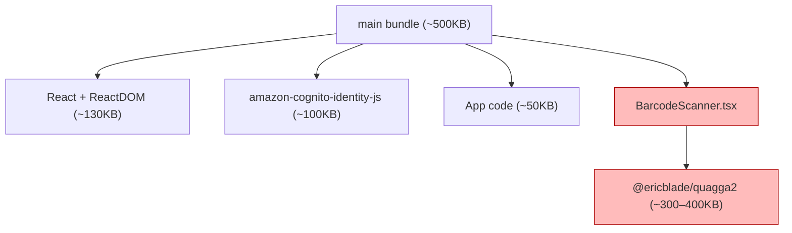
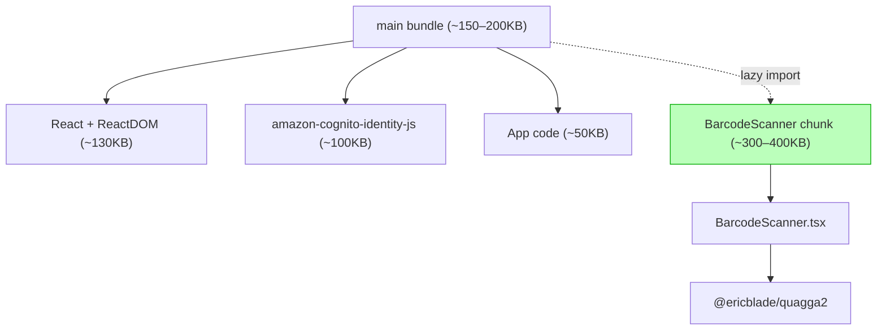

# Design Document: Barcode Scanner Lazy Load

## Overview

The frontend's main JavaScript bundle is currently around 500KB minified. Profiling shows that `@ericblade/quagga2` (~300–400KB) dominates the cost, pulled in transitively because `BarcodeScanner` is statically imported by `InventoryPage`. Quagga2 therefore ships in the main chunk and is downloaded by every user on every page load, even those who never open the scanner.

This feature converts the static import of `BarcodeScanner` into a dynamic `React.lazy(() => import(...))` import at the single call site (`InventoryPage`) and conditionally renders the lazy component inside a `<Suspense>` boundary only while the scanner is open. Vite/Rollup then emits a separate chunk for `BarcodeScanner.tsx` and its `quagga2` dependency, which is fetched on demand the first time the user activates "Barcode Scan" from the Add menu. Functional behavior of the scanner is unchanged.

The change is a pure frontend code-splitting refactor: no backend changes, no API contract changes, no DynamoDB or `data-model.md` changes.

## Architecture

### Current state (before)



`InventoryPage` statically imports `BarcodeScanner`, which statically imports `Quagga`. All of it lands in the main entry chunk that Vite emits for `index.tsx`.

### Target state (after)



`InventoryPage` references `BarcodeScanner` only through `React.lazy(() => import('...'))`, so the static module graph from the entry point no longer reaches Quagga. Vite/Rollup automatically splits the dynamic `import()` into its own chunk.

### Sequence: opening the scanner for the first time

```mermaid
sequenceDiagram
    actor User
    participant InventoryPage
    participant Suspense
    participant Browser
    participant ScannerChunk as BarcodeScanner chunk

    User->>InventoryPage: Click "Add" → "Barcode Scan"
    InventoryPage->>InventoryPage: setScannerOpen(true)
    InventoryPage->>Suspense: render &lt;LazyBarcodeScanner /&gt;
    Suspense-->>User: Show "Loading scanner…" fallback
    Suspense->>Browser: dynamic import('BarcodeScanner')
    Browser-->>Suspense: chunk fetched + parsed
    Suspense->>ScannerChunk: instantiate BarcodeScanner
    ScannerChunk-->>User: Scanner UI (camera prompt, video)
```

On subsequent opens within the same session the chunk is already in the module cache, so `<Suspense>` resolves synchronously and no fallback is shown.

### Call sites

A grep across `frontend/src` confirms `BarcodeScanner` is imported in exactly one place:

| File | Type of import | Action |
|------|----------------|--------|
| `frontend/src/pages/InventoryPage/InventoryPage.tsx` | `import BarcodeScanner ...` (default, value) | Convert to `React.lazy` and gate behind `Suspense` |
| `frontend/src/pages/InventoryPage/InventoryPage.tsx` | `import type { BarcodeLookupResult } ...` | Leave unchanged — type-only imports are erased at compile time and do not pull Quagga |
| `frontend/src/pages/AddItemPage/AddItemPage.tsx` | imports `lookupBarcode` from the inventory API, not the component | No change |
| `frontend/src/pages/ItemDetailPage/ItemDetailPage.tsx` | does not import `BarcodeScanner` | No change |

Because the call site is singular, the refactor is small and contained.

## Components and Interfaces

### `BarcodeScanner.tsx`

The scanner component itself does not change. Its public API is preserved:

```typescript
export interface BarcodeLookupResult {
  barcode: string;
  found: boolean;
  product?: { name: string; brand?: string; category?: string };
}

interface BarcodeScannerProps {
  isOpen: boolean;
  onClose: () => void;
  onBarcodeDetected: (result: BarcodeLookupResult) => void;
}

declare const BarcodeScanner: React.FC<BarcodeScannerProps>;
export default BarcodeScanner;
```

The `BarcodeLookupResult` type is exported as a named type. Type-only imports (`import type { ... }`) are erased by TypeScript and do not produce a runtime reference to the module, so the type can continue to be imported into `InventoryPage` without re-introducing the static dependency on Quagga.

### `InventoryPage.tsx` (updated)

`InventoryPage` is the only place that needs to change. The static value import is replaced by a `React.lazy` wrapper, and the rendered element is guarded by `Suspense` and a conditional render keyed off `scannerOpen`:

```typescript
import React, { Suspense, lazy, useCallback, useEffect, useState } from 'react';
// Type-only import is erased at compile time — does NOT pull in Quagga
import type { BarcodeLookupResult } from '../../components/BarcodeScanner/BarcodeScanner';

// Dynamic import — Vite emits this as a separate chunk
const BarcodeScanner = lazy(() => import('../../components/BarcodeScanner/BarcodeScanner'));

// ... existing component body unchanged ...

return (
  <div className="page inventory-page">
    {/* ... existing content ... */}

    {scannerOpen && (
      <Suspense fallback={<BarcodeScannerLoadingFallback />}>
        <BarcodeScanner
          isOpen={scannerOpen}
          onClose={() => setScannerOpen(false)}
          onBarcodeDetected={handleBarcodeDetected}
        />
      </Suspense>
    )}
  </div>
);
```

The `{scannerOpen && ...}` guard is essential. If the lazy element were rendered unconditionally (the way the current `<BarcodeScanner isOpen={scannerOpen} />` is written), React would trigger the dynamic import on the first render of `InventoryPage`, defeating the entire optimization. By only mounting the lazy element when `scannerOpen` is true, the chunk download is deferred until the user actually clicks "Barcode Scan".

### `BarcodeScannerLoadingFallback`

A small, locally-defined component rendered by `Suspense` while the chunk is being fetched. It mirrors the modal overlay style of the scanner so the visual transition is smooth, and announces the loading state to assistive technology.

```typescript
const BarcodeScannerLoadingFallback: React.FC = () => (
  <div
    role="status"
    aria-live="polite"
    aria-label="Loading barcode scanner"
    style={fallbackStyles.overlay}
    data-testid="barcode-scanner-loading"
  >
    <div style={fallbackStyles.modal}>
      <div style={fallbackStyles.spinner} aria-hidden="true" />
      <p style={fallbackStyles.text}>Loading scanner…</p>
    </div>
  </div>
);
```

It lives inside `InventoryPage.tsx` (or a tiny sibling file) so that it is part of the main bundle and does not itself trigger any further dynamic import.

### `vite.config.ts`

No required change. Vite/Rollup automatically emit a separate chunk for any `() => import('…')` expression. The current config has no `build.rollupOptions.output.manualChunks` and adding one is unnecessary for this feature. The existing `mockAuthPlugin` is unaffected.

If, during verification, the auto-generated chunk filename turns out to be opaque (`assets/index-xxxx.js`), we may add a magic comment to label it for easier inspection:

```typescript
const BarcodeScanner = lazy(
  () => import(/* webpackChunkName: "barcode-scanner" */ '../../components/BarcodeScanner/BarcodeScanner'),
);
```

Vite/Rollup respects `/* @vite-ignore */` and chunk-name magic comments where applicable; this is purely cosmetic.

## Data Models

No data model changes. No DynamoDB, S3, or API contract changes. `data-model.md` is unaffected.

## Algorithmic Pseudocode

### Loading flow when the user opens the scanner

```pascal
ALGORITHM openScanner()
INPUT: user click on "Barcode Scan" menu item
OUTPUT: scanner UI rendered with no functional regression

PRECONDITIONS:
  - User is authenticated and on InventoryPage
  - scannerOpen is currently false
  - BarcodeScanner chunk MAY or MAY NOT already be in the module cache

POSTCONDITIONS:
  - scannerOpen is true
  - Either the scanner is mounted, or the loading fallback is mounted
  - When the chunk resolves, scanner is mounted and behaves exactly like
    the previous statically-imported BarcodeScanner

BEGIN
  setScannerOpen(true)

  // React renders <Suspense fallback={...}><BarcodeScanner /></Suspense>
  IF chunk NOT in module cache THEN
    Suspense suspends and shows BarcodeScannerLoadingFallback
    Browser fetches the BarcodeScanner chunk (network request)
    Chunk parses; React resumes
  END IF

  Mount BarcodeScanner with isOpen=true
  BarcodeScanner internal effect calls Quagga.init(...)
  // From here on, behavior is identical to pre-refactor code
END

LOOP INVARIANT (during chunk fetch):
  - The user always sees either the fallback or the scanner; never a blank
  - scannerOpen remains true; user click on close cancels both states
```

### Algorithm: closing the scanner

```pascal
ALGORITHM closeScanner()
INPUT: user click on close button OR successful barcode detection
OUTPUT: scanner unmounted, scannerOpen reset to false

POSTCONDITIONS:
  - scannerOpen is false
  - <Suspense> branch is no longer rendered (because of {scannerOpen && ...})
  - BarcodeScanner unmount effect runs Quagga.stop() (existing behavior)
  - Chunk remains in module cache; reopening is instant

BEGIN
  setScannerOpen(false)
  // Conditional render unmounts the Suspense subtree
  // Existing BarcodeScanner cleanup useEffect calls stopQuagga()
END
```

### Function specifications

**`React.lazy(loader)` (used here)**

- **Preconditions:** `loader` is a function returning a Promise that resolves to `{ default: ComponentType }`
- **Postconditions:** Returns a `LazyExoticComponent<T>` that, when first rendered, triggers `loader()` and suspends until it resolves
- **Loop invariants:** N/A

**`import('../../components/BarcodeScanner/BarcodeScanner')` (the loader expression)**

- **Preconditions:** Module path resolves at build time
- **Postconditions:** Promise resolves to the module namespace object whose `default` export is `BarcodeScanner`
- **Side effects:** First call triggers a network fetch for the chunk; subsequent calls return the cached module
- **Loop invariants:** N/A

## Example Usage

### Updated `InventoryPage.tsx` (relevant excerpt)

```typescript
import React, { Suspense, lazy, useCallback, useEffect, useState } from 'react';
import StorageLocationManager from '../../components/StorageLocationManager/StorageLocationManager';
import InventoryList from '../../components/InventoryList/InventoryList';
import { InAppNotification } from '../../components/InventoryList/InventoryList';
// Type-only — erased at compile time, does not pull in Quagga
import type { BarcodeLookupResult } from '../../components/BarcodeScanner/BarcodeScanner';
// Lazy value import — Vite emits a separate chunk
const BarcodeScanner = lazy(
  () => import('../../components/BarcodeScanner/BarcodeScanner'),
);

const BarcodeScannerLoadingFallback: React.FC = () => (
  <div
    role="status"
    aria-live="polite"
    aria-label="Loading barcode scanner"
    data-testid="barcode-scanner-loading"
    style={fallbackStyles.overlay}
  >
    <div style={fallbackStyles.modal}>
      <div style={fallbackStyles.spinner} aria-hidden="true" />
      <p style={fallbackStyles.text}>Loading scanner…</p>
    </div>
  </div>
);

const InventoryPage: React.FC<InventoryPageProps> = (props) => {
  // ... existing state, including:
  const [scannerOpen, setScannerOpen] = useState(false);

  // ... existing handlers unchanged: handleAddMenuSelect, handleBarcodeDetected, etc.

  return (
    <div className="page inventory-page">
      {/* ... unchanged content ... */}

      {scannerOpen && (
        <Suspense fallback={<BarcodeScannerLoadingFallback />}>
          <BarcodeScanner
            isOpen={scannerOpen}
            onClose={() => setScannerOpen(false)}
            onBarcodeDetected={handleBarcodeDetected}
          />
        </Suspense>
      )}
    </div>
  );
};
```

### Bundle verification command

After the build, the operator (or a CI step) inspects the build output:

```bash
cd frontend && npm run build
ls -la build/assets/
# Expect: an entry chunk plus a separate chunk whose contents include Quagga
node scripts/verify-no-quagga-in-main.mjs   # see Testing Strategy below
```

## Correctness Properties

*A property is a characteristic or behavior that should hold true across all valid executions of a system — essentially, a formal statement about what the system should do.*

Note: this feature is primarily a build/bundling concern, so traditional fast-check property-based testing has limited applicability. The properties below are observable invariants verified via a mix of unit tests, e2e tests, and a small build-output assertion script. Where a property is fully realized as `fc.property(...)`, that is called out explicitly; where the verification mechanism is a deterministic build assertion or e2e flow, that is also noted.

### Property 1: Functional Equivalence of the Scanner

*For any* user action that previously opened the scanner from `InventoryPage` ("Add" → "Barcode Scan"), THE lazy-loaded scanner SHALL produce a working scanner UI that is behaviorally indistinguishable from the eagerly-loaded scanner: camera initialization, barcode detection, manual entry fallback, timeout, retry, and `onBarcodeDetected` callback all SHALL continue to behave per the pre-refactor implementation.

**Verification:** Existing e2e test `e2e/barcode-autofill.spec.ts` continues to pass without modification (other than waiting for the lazy chunk to load if necessary). Existing example-based tests in `frontend/src/pages/InventoryPage/__tests__/InventoryPage.test.tsx` continue to pass.

**Validates: Requirements 1, 2, 4**

### Property 2: Initial Bundle Excludes Quagga

*For any* production build of the frontend (`npm run build`), THE entry chunk(s) loaded synchronously by `index.html` SHALL NOT contain Quagga2 source code. Quagga2 source SHALL appear in exactly one separate chunk that is fetched only via dynamic `import()`.

**Verification:** A small Node script `frontend/scripts/verify-bundle-split.mjs` reads `frontend/build/index.html`, identifies the entry chunk(s), and asserts that no entry chunk file contains a Quagga2-specific marker (e.g. the string `'@ericblade/quagga2'` package marker, or a known Quagga2 internal symbol such as `Quagga.onProcessed`/`Quagga.CameraAccess`). The same script asserts that exactly one non-entry chunk does contain such a marker.

This is a deterministic build-output property, not a fast-check property.

**Validates: Requirement 3**

### Property 3: Suspense Fallback During Chunk Load

*For any* first-time activation of the scanner within a session where the chunk is not yet cached, THE `BarcodeScannerLoadingFallback` SHALL be visible to the user from the moment `scannerOpen` becomes true until the chunk has finished loading and `BarcodeScanner` has mounted.

**Verification:** A unit test in `InventoryPage.test.tsx` mocks `import()` of `BarcodeScanner` with a delayed promise, clicks "Barcode Scan", and asserts that an element with `data-testid="barcode-scanner-loading"` is rendered before the resolved scanner replaces it. An e2e test optionally throttles network throughput to observe the fallback in a real browser.

**Validates: Requirement 5**

### Property 4: Lazy Chunk Is Not Fetched Before Activation

*For any* render of `InventoryPage` where `scannerOpen === false`, THE browser SHALL NOT issue a network request for the BarcodeScanner chunk. The chunk SHALL only be fetched when `scannerOpen` transitions to `true` for the first time.

**Verification:** An e2e test loads `/`, navigates to the Inventory page, and asserts that no request matching `*/barcode-scanner*.js` (or whichever chunk filename Vite emits) has been issued. It then clicks "Barcode Scan" and asserts the request appears.

**Validates: Requirement 3**

### Property 5: Existing Tests Continue to Pass

*For any* existing unit test, property test, or e2e test that touches `InventoryPage`, the inventory list, the Add menu, or the scanner end-to-end, THE refactored code SHALL produce the same observable behavior. No test SHALL need to be deleted; tests MAY be extended to assert the new Suspense fallback or to await the lazy mount via `waitFor`/`findByRole`.

**Verification:** Run `npm run test` and `npm run test:e2e` after the refactor. Per workflow rules, all failures must be resolved.

**Validates: Requirements 4, 6**

## Error Handling

### Scenario 1: chunk fetch fails (offline or network error)

**Condition:** The browser fails to fetch the BarcodeScanner chunk because the user is offline or the asset is missing from the CDN.

**Response:** React's lazy boundary throws on the next render attempt. Without an Error Boundary, the failure would propagate up to the React root and unmount `InventoryPage`. To prevent this, the `<Suspense>` block is wrapped in a small Error Boundary that catches the chunk-load error, displays a recoverable inline error message inside the modal overlay, and offers a "Retry" button that toggles `scannerOpen` off and back on (which causes React to retry the dynamic import).

**Recovery:** The retry path triggers a fresh `import()` call. If the user is permanently offline, the message remains and the user can dismiss the scanner; the rest of `InventoryPage` is unaffected.

```typescript
class BarcodeScannerErrorBoundary extends React.Component<
  { onClose: () => void; onRetry: () => void; children: React.ReactNode },
  { error: Error | null }
> {
  state = { error: null as Error | null };
  static getDerivedStateFromError(error: Error) {
    return { error };
  }
  render() {
    if (this.state.error) {
      return (
        <ChunkLoadErrorOverlay
          onClose={this.props.onClose}
          onRetry={() => {
            this.setState({ error: null });
            this.props.onRetry();
          }}
        />
      );
    }
    return this.props.children;
  }
}
```

### Scenario 2: chunk fetch is slow

**Condition:** Slow network causes a multi-second wait between clicking "Barcode Scan" and the scanner appearing.

**Response:** The `<Suspense>` fallback (`BarcodeScannerLoadingFallback`) is shown for the duration. The fallback uses an `aria-live="polite"` announcement and a visible spinner so the user understands the system is working.

**Recovery:** Eventually the chunk loads and the scanner mounts. If the user clicks the close button on the fallback overlay, `scannerOpen` is set to false and the Suspense subtree unmounts; the in-flight import continues but its result is discarded by React because the lazy element is no longer mounted. (The browser will still cache the chunk, so a subsequent click is fast.)

### Scenario 3: bundle verification fails in CI

**Condition:** The `verify-bundle-split.mjs` script detects Quagga symbols in the entry chunk after a future change re-introduces a static import.

**Response:** The build step exits with a non-zero status, failing CI. The error message identifies the entry chunk filename and the offending symbol so a developer can locate the regression.

**Recovery:** Fix the regression by removing the static import (typically a misplaced `import BarcodeScanner from '...'` reintroduced in a feature branch). The script is the early-warning mechanism for this class of regression.

## Testing Strategy

### Unit Tests

**`frontend/src/pages/InventoryPage/__tests__/InventoryPage.test.tsx`** (extend existing file)

- Existing tests continue to pass; they may need `await screen.findByRole(...)` instead of synchronous `getByRole(...)` only if they actually open the scanner — currently they do not.
- Add: clicking "Barcode Scan" shows the loading fallback (`data-testid="barcode-scanner-loading"`) before resolving to the real scanner. Achieved by mocking the dynamic import via `jest.mock(...)` with a deferred promise.
- Add: the fallback is removed and replaced by the scanner UI once the mocked import resolves.
- Add: clicking "Barcode Scan" while the scanner module is already cached does not flash a fallback (use `await waitFor(() => expect(scanner).toBeVisible())` and assert the loading element never appears).

Mocking approach for the dynamic import in Jest:

```typescript
jest.mock('../../../components/BarcodeScanner/BarcodeScanner', () => ({
  __esModule: true,
  default: jest.fn().mockImplementation((props) => (
    <div data-testid="barcode-scanner-mock" />
  )),
}));
```

This stubs the module entirely so the real Quagga is never loaded in the test environment (which avoids known jsdom/camera issues anyway).

**`frontend/src/components/BarcodeScanner/__tests__/BarcodeScanner.test.tsx`** (optional, currently does not exist)

Out of scope for this feature. The scanner's existing behavior is exercised end-to-end by the existing e2e test, and adding a unit test is a separate concern that does not affect the lazy-load refactor.

### Property-Based Testing Approach

**Property Test Library**: fast-check (already used in this project)

Traditional fast-check PBT is not a strong fit for this feature. Most observable invariants (Properties 2, 3, 4) are deterministic build-output or single-event behaviors with no input space worth quantifying over. Property 1 (functional equivalence) is exercised by the existing test suite.

If a fast-check property is desired for completeness, one candidate is a snapshot-style property over a small enumerated set of scanner-open/scanner-close event sequences, asserting that the user-visible state always matches a deterministic state machine. This is effectively example-based testing dressed in `fc.property` clothing and is recommended only if it adds confidence beyond the existing example tests.

### Integration / Build-Output Testing

**`frontend/scripts/verify-bundle-split.mjs`** (new script)

A small Node script run after `npm run build` (and optionally wired into CI):

```javascript
// Pseudocode-level outline
import fs from 'fs';
import path from 'path';

const buildDir = 'build';
const indexHtml = fs.readFileSync(path.join(buildDir, 'index.html'), 'utf8');
const entryChunks = [...indexHtml.matchAll(/src="\/assets\/([^"]+\.js)"/g)].map((m) => m[1]);

const QUAGGA_MARKERS = ['@ericblade/quagga2', 'Quagga.onProcessed', 'CameraAccess'];

let entryHasQuagga = false;
let lazyChunksWithQuagga = 0;

for (const file of fs.readdirSync(path.join(buildDir, 'assets'))) {
  if (!file.endsWith('.js')) continue;
  const content = fs.readFileSync(path.join(buildDir, 'assets', file), 'utf8');
  const hasQuagga = QUAGGA_MARKERS.some((m) => content.includes(m));
  if (entryChunks.includes(file) && hasQuagga) entryHasQuagga = true;
  if (!entryChunks.includes(file) && hasQuagga) lazyChunksWithQuagga += 1;
}

if (entryHasQuagga) {
  console.error('FAIL: Quagga2 found in entry chunk');
  process.exit(1);
}
if (lazyChunksWithQuagga !== 1) {
  console.error(`FAIL: expected exactly 1 lazy chunk with Quagga2, found ${lazyChunksWithQuagga}`);
  process.exit(1);
}
console.log('OK: bundle split verified');
```

The script is deterministic and fast (a few hundred ms on a typical build output) and serves as the canonical assertion for Property 2.

### E2E Tests

**`e2e/barcode-autofill.spec.ts`** (existing file, no changes required)

The existing test suite drives barcode autofill via the AddItemPage form and does not actually open the scanner camera UI. It will continue to pass without modification because the AddItemPage path is not touched by this feature.

**`e2e/barcode-scanner-lazy-load.spec.ts`** (new file, optional)

A small new spec that verifies the lazy-load behavior end-to-end:

- Login, navigate to Inventory, assert that no network request for the barcode-scanner chunk has been issued.
- Click "Add" → "Barcode Scan", assert the loading fallback briefly appears (or that the chunk request is now issued).
- Assert the scanner overlay (`data-testid="barcode-scanner-overlay"`) eventually appears.
- Close the scanner, reopen it, assert the loading fallback does not reappear (chunk is cached).

This test uses `page.route()` and `page.waitForRequest()` to observe chunk requests. Camera initialization is mocked or simply not asserted (the existing camera-permission code path is unaffected by this feature).

## Performance Considerations

### Expected impact

| Metric | Before | After (target) |
|--------|--------|----------------|
| Main bundle size (minified) | ~500KB | ~150–200KB |
| Time-to-interactive on cold load (3G) | longer | shorter (~60% reduction in JS to parse for non-scanner users) |
| Time-to-scanner on first activation | 0 (already loaded) | + chunk fetch latency (~one round trip + parse) |
| Time-to-scanner on subsequent activation | 0 | 0 (cached) |

The trade-off is: every page load gets faster for users who never open the scanner, while the first scanner activation per session pays a one-time chunk-load cost. Given that most users on most page loads never open the scanner, the trade is favorable.

### Service worker considerations

The PWA service worker (`frontend/public/sw.js`) caches static assets. Once the BarcodeScanner chunk has been fetched once on a device, the service worker should serve it from cache on subsequent loads — including the first scanner activation in future sessions. No service worker changes are required for this feature, but if `sw.js` uses an explicit precache list that enumerates chunk filenames, that list needs to either include the new chunk pattern or use a wildcard such as `assets/*.js`. (This is verified during implementation; if the service worker uses a runtime-cache strategy with no precache list, no change is needed.)

### Rollback considerations

Reverting this feature is trivial: revert the change to `InventoryPage.tsx` (replace the `lazy(...)` import with the static import and remove the `Suspense`/conditional render). No data migration, no API change, no infrastructure change. The bundle-verification script can be left in place as a regression guard for any future re-attempt, or removed alongside the revert.

## Security Considerations

No security-relevant change. Lazy-loading a chunk loads JavaScript from the same origin via the same CloudFront distribution that serves the entry bundle. Subresource integrity, CSP, and cross-origin policies are unaffected. No new external endpoints are contacted.

## Dependencies

- **`@ericblade/quagga2`** (already in `frontend/package.json`) — no version change. The library continues to be loaded; only the timing of its loading changes.
- **React 18** (`react`, `react-dom`) — already in the project. `React.lazy` and `<Suspense>` are stable React 18 APIs.
- **Vite 5 / Rollup** — already in the project. Dynamic `import()` is supported out of the box; no plugin or config addition required.
- **No new runtime dependencies.**
- **No new dev dependencies.** The optional bundle-verification script is plain Node and uses only `fs` and `path`.
