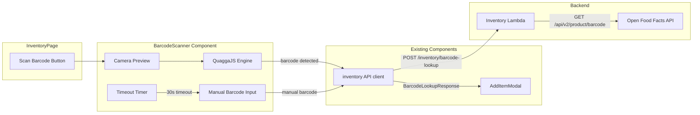

# Technical Design Document: Barcode Scanning

## Overview

This feature adds barcode scanning to the Pantry Tracking App, allowing users to scan product barcodes with their phone camera and automatically look up product information via the Open Food Facts API. The feature spans two layers: a frontend React component using QuaggaJS for real-time barcode detection, and a backend endpoint on the existing Inventory Lambda that proxies barcode lookups to Open Food Facts.

When a barcode is detected, the system looks up the product and pre-fills the existing AddItemModal with the product name, brand, category, and barcode value. The user confirms or edits the details before adding the item. When lookup fails or scanning times out, the user falls back to manual entry with the barcode field pre-filled.

### Key Design Decisions

- **QuaggaJS** for client-side barcode detection — runs entirely in the browser, no server-side image processing needed
- **Backend proxy** for Open Food Facts — keeps the external API call server-side for caching, error handling, and avoiding CORS issues
- **Existing Inventory Lambda** hosts the new `/inventory/barcode-lookup` route — no new Lambda needed
- **AddItemModal integration** — the scanner feeds data into the existing form rather than creating a separate flow
- **30-second timeout** with retry/manual fallback — prevents users from being stuck on a non-detecting scan

### Technology Choices

| Concern | Choice | Rationale |
|---------|--------|-----------|
| Barcode detection | QuaggaJS | Mature browser-based library, supports EAN-13/UPC-A common on food products |
| Product data | Open Food Facts API v2 | Free, open-source food product database with good coverage |
| Caching | In-memory Map on Lambda | Simple, sufficient for reducing redundant API calls within a Lambda invocation; DynamoDB cache optional for cross-invocation persistence |
| Frontend testing | Jest + @testing-library/react + fast-check | Matches existing test stack |
| Backend testing | Jest + fast-check | Matches existing test stack |

## Architecture

### Barcode Scanning Flow

```mermaid
sequenceDiagram
    participant User as Beautiful_User
    participant Scanner as BarcodeScanner
    participant Modal as AddItemModal
    participant API as inventory API client
    participant Lambda as Inventory Lambda
    participant OFF as Open Food Facts

    User->>Scanner: Tap "Scan Barcode"
    Scanner->>Scanner: Request camera permission
    alt Permission granted
        Scanner->>Scanner: Start QuaggaJS with live preview
        Scanner->>Scanner: Start 30s timeout countdown
        alt Barcode detected
            Scanner->>Scanner: Stop QuaggaJS
            Scanner->>API: lookupBarcode(barcode)
            API->>Lambda: POST /inventory/barcode-lookup
            Lambda->>OFF: GET /api/v2/product/{barcode}
            OFF-->>Lambda: Product data (or 404)
            Lambda-->>API: BarcodeLookupResponse
            API-->>Scanner: { found, product? }
            alt Product found
                Scanner->>Modal: Open with pre-filled name, brand, category, barcode
            else Not found
                Scanner->>Modal: Open with only barcode pre-filled
            end
        else Timeout (30s)
            Scanner->>Scanner: Stop QuaggaJS
            Scanner->>User: Show retry/manual entry prompt
        end
    else Permission denied
        Scanner->>User: Show camera permission instructions
    end
```

### Component Integration



## Components and Interfaces

### Frontend Components

#### BarcodeScanner

New component at `frontend/src/components/BarcodeScanner.tsx`.

```typescript
interface BarcodeScannerProps {
  isOpen: boolean;
  onClose: () => void;
  onBarcodeDetected: (result: BarcodeLookupResult) => void;
}

interface BarcodeLookupResult {
  barcode: string;
  found: boolean;
  product?: {
    name: string;
    brand?: string;
    category?: string;
  };
}
```

Responsibilities:
- Renders a modal overlay with a live camera preview
- Initializes QuaggaJS targeting the rear camera with EAN-13 and UPC-A decoders
- Displays a scanning region indicator overlay on the video feed
- Shows a countdown timer (30 seconds)
- On successful decode: stops QuaggaJS, calls `lookupBarcode()`, invokes `onBarcodeDetected` callback
- On timeout: stops QuaggaJS, shows retry/manual entry prompt
- On camera permission denied: shows permission instructions
- On camera unavailable: shows manual barcode text input fallback
- Cleans up QuaggaJS on unmount

QuaggaJS configuration:
```typescript
Quagga.init({
  inputStream: {
    type: 'LiveStream',
    target: videoContainerRef.current,
    constraints: {
      facingMode: 'environment',  // rear camera
      width: { ideal: 640 },
      height: { ideal: 480 },
    },
  },
  decoder: {
    readers: ['ean_reader', 'upc_reader'],
  },
  locate: true,
}, callback);
```

#### AddItemModal Changes

The existing `AddItemModal` component needs a minor extension to accept optional pre-fill data:

```typescript
// New optional prop added to AddItemModalProps
interface AddItemModalProps {
  isOpen: boolean;
  onClose: () => void;
  onSubmit: (item: AddItemData) => Promise<{ error?: string }>;
  locations: StorageLocation[];
  prefillData?: {           // NEW
    name?: string;
    brand?: string;
    category?: string;
    barcode?: string;
  };
}
```

When `prefillData` is provided, the modal initializes the form fields with those values instead of empty strings. The user can edit any pre-filled field before submitting.

#### InventoryPage Changes

The existing `InventoryPage` adds a "Scan Barcode" button and manages the scanner/modal state flow:

```typescript
// New state in InventoryPage
const [scannerOpen, setScannerOpen] = useState(false);
const [prefillData, setPrefillData] = useState<PrefillData | undefined>();

// When scanner detects a barcode and lookup completes:
const handleBarcodeDetected = (result: BarcodeLookupResult) => {
  setScannerOpen(false);
  setPrefillData({
    barcode: result.barcode,
    name: result.product?.name,
    brand: result.product?.brand,
    category: result.product?.category,
  });
  setAddModalOpen(true);
};
```

### Backend: Barcode Lookup Handler

New route handler added to the existing `backend/src/handlers/inventory.ts`.

```typescript
// POST /inventory/barcode-lookup
async function barcodeLookup(
  userId: string,
  body: string | null,
): Promise<APIGatewayProxyResult> {
  // 1. Parse and validate request body
  // 2. Check in-memory cache for barcode
  // 3. Call Open Food Facts API with 5s timeout
  // 4. Extract product name, brand, category from response
  // 5. Cache successful result
  // 6. Return BarcodeLookupResponse
}
```

Open Food Facts API integration:
- Endpoint: `https://world.openfoodfacts.org/api/v2/product/{barcode}`
- Uses Node.js native `fetch` (available in Node 18+ Lambda runtime)
- 5-second timeout via `AbortController`
- Extracts `product_name`, `brands`, and `categories_tags[0]` from the response
- Returns `{ found: false }` on 404, timeout, or any error (errors are logged)

### API Client Extension

New function added to `frontend/src/api/inventory.ts`:

```typescript
export interface BarcodeLookupResponse {
  found: boolean;
  product?: {
    name: string;
    brand?: string;
    category?: string;
  };
}

export async function lookupBarcode(barcode: string): Promise<BarcodeLookupResponse> {
  const headers = await getAuthHeaders();
  const res = await fetch(`${API_URL}/inventory/barcode-lookup`, {
    method: 'POST',
    headers,
    body: JSON.stringify({ barcode }),
  });
  if (!res.ok) {
    throw new Error('Barcode lookup failed');
  }
  return res.json();
}
```

## Data Models

This feature uses existing data models defined in the [data-model steering file](../../steering/data-model.md). No new DynamoDB entities are introduced.

### Referenced Models

- **InventoryItem**: The `barcode` and `brand` optional fields are already defined on the entity schema. Scanned items are added via the existing `POST /inventory` endpoint.
- **BarcodeLookupRequest / BarcodeLookupResponse**: Defined in the data-model steering file under API Request/Response Interfaces → Inventory.

### ProductInfo (Backend Internal)

This type is internal to the barcode lookup handler and not persisted:

```typescript
interface ProductInfo {
  name: string;
  brand?: string;
  category?: string;
}
```

### Open Food Facts Response Shape (Relevant Fields)

```typescript
// Subset of the Open Food Facts API v2 response used by the handler
interface OpenFoodFactsProduct {
  product_name?: string;
  brands?: string;
  categories_tags?: string[];
  status: number;  // 1 = found, 0 = not found
}
```

### In-Memory Cache Structure

```typescript
// Simple Map used within a single Lambda invocation
const barcodeCache = new Map<string, { product: ProductInfo; timestamp: number }>();
const CACHE_TTL_MS = 5 * 60 * 1000; // 5 minutes
```


## Correctness Properties

*A property is a characteristic or behavior that should hold true across all valid executions of a system — essentially, a formal statement about what the system should do. Properties serve as the bridge between human-readable specifications and machine-verifiable correctness guarantees.*

### Property 1: Barcode Lookup Response Correctness

*For any* valid Open Food Facts API response containing product data (with product_name, brands, categories_tags), the barcode lookup handler should return `found: true` with a product object containing the extracted name, brand, and category. When the API response indicates the product was not found (status 0 or HTTP 404), the handler should return `found: false` with no product object.

**Validates: Requirements 3.2, 5.2**

### Property 2: Form Pre-fill from Lookup Result

*For any* barcode lookup result, when `found` is true the AddItemModal should initialize with the product's name, brand, category, and the scanned barcode value in the corresponding form fields. When `found` is false, the AddItemModal should initialize with only the barcode field pre-filled and all other fields empty.

**Validates: Requirements 4.1, 4.2, 4.5**

### Property 3: Barcode Input Validation

*For any* string that is empty or composed entirely of whitespace, the barcode lookup endpoint should reject the request with a 400 status code. *For any* non-empty, non-whitespace string, the endpoint should accept the request and process the lookup (returning either a found or not-found result).

**Validates: Requirements 5.1, 5.3**

### Property 4: Barcode Cache Idempotence

*For any* barcode that has been successfully looked up (found: true), performing the same lookup again should return an identical result without making a second call to the Open Food Facts API.

**Validates: Requirements 5.5**

## Error Handling

### Frontend Error Handling

| Error Condition | Behavior | User Experience |
|----------------|----------|-----------------|
| Camera permission denied | Detect `NotAllowedError` from `getUserMedia` | Display instructions explaining how to enable camera permissions in browser/OS settings |
| Camera unavailable | Detect `NotFoundError` or `NotReadableError` | Display message, show manual barcode text input field as fallback |
| QuaggaJS init failure | Catch error from `Quagga.init` callback | Display generic error, offer manual barcode entry |
| Scan timeout (30s) | `setTimeout` triggers after 30 seconds with no `onDetected` event | Stop QuaggaJS, show prompt with "Retry" and "Enter Manually" buttons |
| Barcode lookup network error | `fetch` throws or returns non-2xx | Show error toast, pre-fill barcode field only, open AddItemModal for manual entry |
| Barcode lookup returns not-found | Response has `found: false` | Open AddItemModal with only barcode pre-filled, inform user product wasn't found |

### Backend Error Handling

| Error Condition | Behavior | HTTP Response |
|----------------|----------|---------------|
| Missing/empty barcode in request body | Validation check before API call | 400 `{ error: 'VALIDATION_ERROR', message: 'barcode is required' }` |
| Invalid JSON body | JSON.parse fails | 400 `{ error: 'VALIDATION_ERROR', message: 'Invalid JSON body' }` |
| Missing request body | `event.body` is null | 400 `{ error: 'VALIDATION_ERROR', message: 'Missing request body' }` |
| Open Food Facts returns 404 / status 0 | Product not in database | 200 `{ found: false }` |
| Open Food Facts returns 5xx | External service error | 200 `{ found: false }` (error logged) |
| Open Food Facts timeout (5s) | `AbortController` signal fires | 200 `{ found: false }` (timeout logged) |
| Open Food Facts network unreachable | `fetch` throws | 200 `{ found: false }` (error logged) |
| Unauthenticated request | No valid userId from token | 401 `{ error: 'UNAUTHORIZED' }` (handled by existing auth check) |

Design rationale: External API failures return 200 with `found: false` rather than 5xx because the barcode lookup is a best-effort enrichment. The user can always proceed with manual entry. Errors are logged server-side for monitoring.

## Testing Strategy

### Unit Tests

Unit tests verify specific scenarios and edge cases using Jest + @testing-library/react (frontend) and Jest (backend).

**Frontend unit tests** (`frontend/src/components/BarcodeScanner.test.tsx`):
- Scanner renders camera preview when permission is granted (mock QuaggaJS)
- Scanner shows permission instructions when camera access is denied
- Scanner shows manual entry fallback when camera is unavailable
- Scanner shows timeout prompt after 30 seconds (mock timers)
- Retry button restarts scanning with fresh timeout
- Manual entry button closes scanner and opens AddItemModal
- Scanner calls `onBarcodeDetected` with lookup result when barcode is detected
- Scanner cleans up QuaggaJS on unmount

**Frontend unit tests** (`frontend/src/components/AddItemModal.test.tsx` — additions):
- AddItemModal pre-fills fields when `prefillData` prop is provided
- Pre-filled fields are editable by the user
- AddItemModal with `prefillData` where only barcode is set leaves other fields empty

**Frontend unit tests** (`frontend/src/api/inventory.test.ts` — additions):
- `lookupBarcode` sends POST to correct URL with barcode in body
- `lookupBarcode` throws on non-2xx response

**Backend unit tests** (`backend/src/handlers/inventory.test.ts` — additions):
- Barcode lookup returns 400 for missing body
- Barcode lookup returns 400 for empty barcode
- Barcode lookup returns found result when Open Food Facts has the product (mock fetch)
- Barcode lookup returns not-found when Open Food Facts returns 404 (mock fetch)
- Barcode lookup returns not-found when Open Food Facts times out (mock AbortController)
- Barcode lookup returns not-found when Open Food Facts is unreachable (mock fetch throw)
- Barcode lookup returns cached result on second call for same barcode

### Property-Based Tests

Property-based tests use fast-check to verify universal properties across generated inputs. Each test runs a minimum of 100 iterations.

**Backend property tests** (`backend/src/handlers/inventory.property.test.ts` — additions):

- **Feature: barcode-scanning, Property 1: Barcode Lookup Response Correctness**
  Generate random Open Food Facts API responses (with and without product data). Verify the handler always returns the correct `found` flag and extracts fields correctly when present.

- **Feature: barcode-scanning, Property 3: Barcode Input Validation**
  Generate random strings (including empty, whitespace-only, and valid barcodes). Verify the handler returns 400 for empty/whitespace inputs and processes non-empty inputs.

- **Feature: barcode-scanning, Property 4: Barcode Cache Idempotence**
  Generate random barcodes and mock successful API responses. Call the lookup twice for the same barcode and verify the second call returns the same result. Verify the external API was called only once.

**Frontend property tests** (`frontend/src/components/BarcodeScanner.property.test.tsx`):

- **Feature: barcode-scanning, Property 2: Form Pre-fill from Lookup Result**
  Generate random `BarcodeLookupResult` objects (both found and not-found). Verify the pre-fill data passed to AddItemModal matches: all fields populated when found, only barcode when not found.
