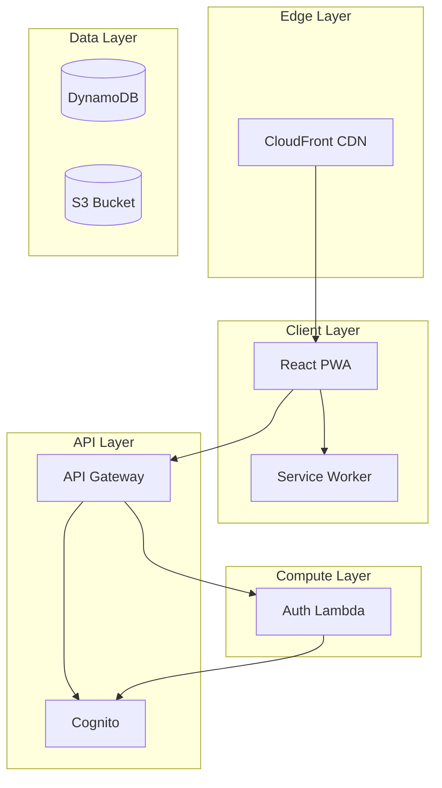
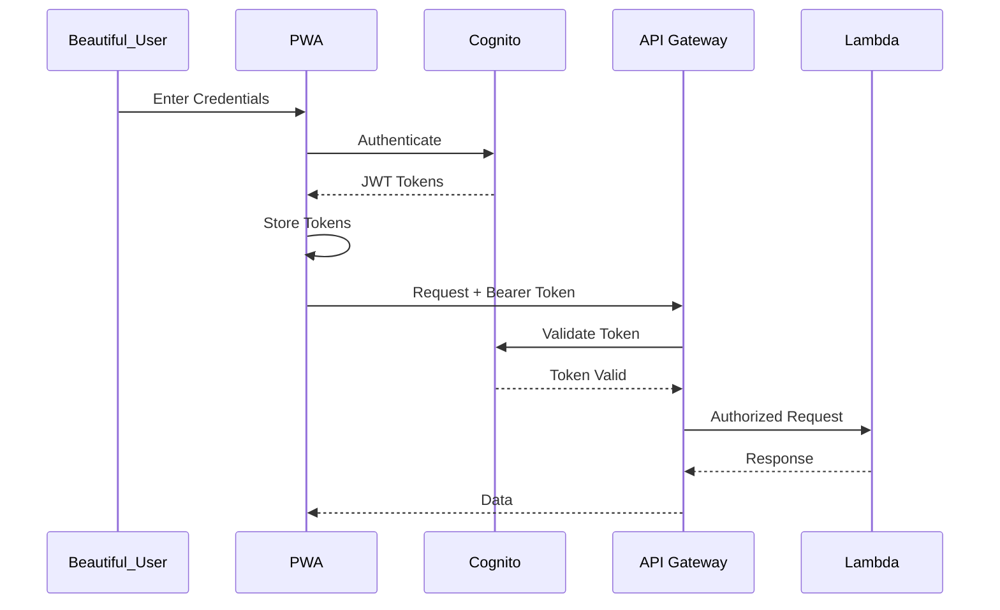

# Technical Design Document: Foundation & Authentication (Stage 0 + Stage 1)

## Overview

This feature establishes the foundational infrastructure and authentication layer for the Pantry Tracking App. It includes the AWS CDK stack (DynamoDB, S3, Cognito, API Gateway, CloudFront), the Auth Lambda for token verification, the React PWA shell with responsive layout and stubbed navigation, and the full authentication UI (login, signup, password strength checker).

### Technology Stack

| Layer | Technology |
|-------|------------|
| Frontend | React 18 PWA, TypeScript, Vite, Service Workers |
| API | AWS API Gateway (REST) |
| Compute | AWS Lambda (Node.js) |
| Database | DynamoDB (single-table design) |
| Storage | S3 |
| Auth | AWS Cognito |
| CDN | CloudFront |
| IaC | AWS CDK v2 |

## Architecture

### High-Level Architecture



### Authentication Flow



## Components and Interfaces

### Frontend Components

#### Authentication Module
- **AuthProvider**: React context for auth state management
- **LoginForm**: Email/password login UI
- **SignupForm**: New user registration
- **PasswordStrength**: Dynamic password strength checker with 5 rules, visual bar, strength label, and checklist
- **TokenManager**: JWT token refresh and storage

#### Shell Module
- **Layout**: Responsive shell with mobile-first design (320px–1920px), touch-friendly navigation (44x44px tap targets)
- **OnlineIndicator**: Shows connection status (placeholder)
- **Placeholder pages**: Inventory, Recipes, Meal Plan, Shopping List

### Backend

#### Auth Lambda
```typescript
// POST /auth/verify - Verify Cognito token
interface VerifyRequest {
  token: string;
}
interface VerifyResponse {
  userId: string;
  email: string;
  valid: boolean;
}
```

### CDK Infrastructure (PantryStack)

- DynamoDB table: `PantryApp` with single-table design (PK/SK + GSI1PK/GSI1SK)
- S3 bucket: receipts, inventory item pictures, exports
- Cognito User Pool: email authentication
- API Gateway REST API with Cognito authorizer
- CloudFront distribution (default URL)
- Lambda functions (NodejsFunction)

Data models and API routes are defined in the shared steering file: `.kiro/steering/data-model.md`

## Correctness Properties

### Property 23: Authentication Scope Isolation

*For any* authenticated beautiful user, API requests should only return data where the `userId` matches the authenticated user's ID. No cross-user data access should be possible.

**Validates: Requirements 1.2**

### Property 24: Unauthenticated Access Denial

*For any* request to a protected API endpoint without a valid authentication token, the request should be rejected with a 401 Unauthorized response.

**Validates: Requirements 1.4**

### Property 25: Authentication Failure Error Display

*For any* authentication attempt that fails (invalid credentials, expired token, network error), an error message describing the failure reason should be returned/displayed.

**Validates: Requirements 1.3**

## Error Handling

### Authentication Errors
- **Token Expiry**: Automatic token refresh via Cognito; redirect to login if refresh fails
- **Invalid Credentials**: Display error message from Cognito with retry option
- **Session Timeout**: Prompt re-authentication with preserved navigation state

## Testing Strategy

### Property-Based Testing
- Property 23, 24, 25 using fast-check with 100+ iterations per property
- Tag format: `Feature: foundation-and-auth, Property {number}: {property_text}`

### Unit Testing
- Login form displays error on invalid credentials
- Signup form validates password strength rules
- AuthProvider context manages auth state correctly
- PasswordStrength component evaluates all 5 rules
- Layout renders responsive shell with correct tap targets
