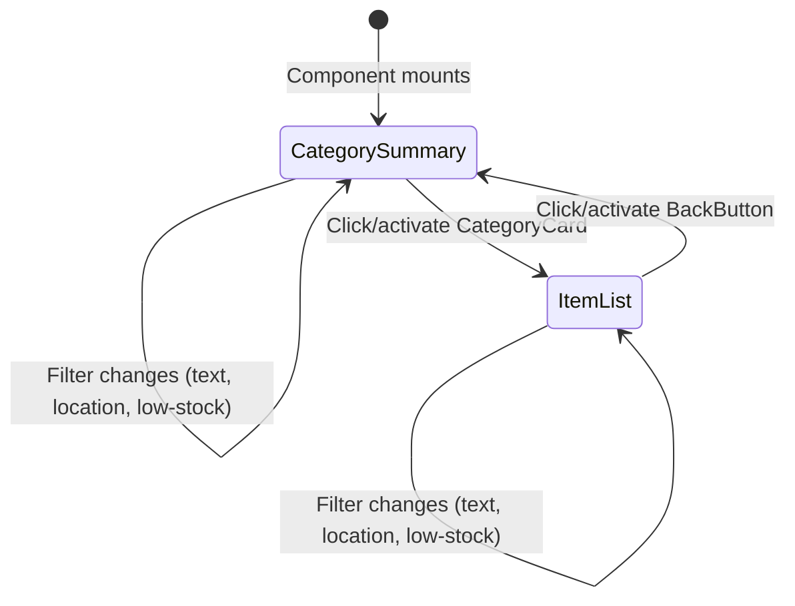
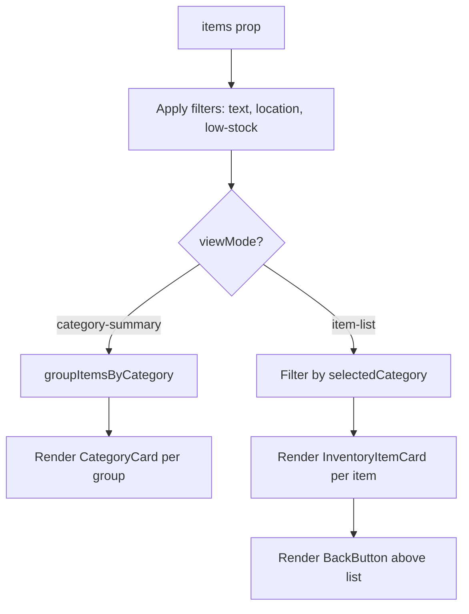

# Design Document: Inventory Category View

## Overview

This feature transforms the InventoryList component's default view from a flat item list into a category summary view. Each unique category is displayed as a clickable card showing the category name, distinct item count, and total quantity sum. Clicking a category card drills down into the existing item list filtered to that category. A back button returns the user to the category summary.

The implementation is entirely frontend — no backend or API changes are needed. The existing `InventoryList` component in `frontend/src/components/InventoryList.tsx` gains internal view state (`category-summary` vs `item-list`) and a new `CategoryCard` sub-component. All existing filters (text, location, low-stock toggle) continue to work in both views, and the category filter dropdown is hidden since navigation now handles category selection.

## Architecture

### Component Architecture

```
InventoryList (enhanced)
├── View State Management
│   ├── viewMode: 'category-summary' | 'item-list'
│   └── selectedCategory: string | null
├── Category Summary View
│   ├── groupItemsByCategory(filteredItems) → CategorySummary[]
│   └── CategoryCard (new sub-component)
│       ├── Category name
│       ├── Distinct item count
│       ├── Total quantity sum
│       └── Low-stock indicator (conditional)
├── Item List View (existing)
│   ├── BackButton (new sub-component)
│   └── InventoryItemCard[] (existing, filtered to selected category)
└── Filter Bar (existing, minus category dropdown in summary view)
    ├── QuickFilterInput
    ├── CategorySelector (hidden when in category-summary view)
    ├── LocationFilter
    └── Low-stock toggle
```

### State Flow



### Data Flow



## Components and Interfaces

### CategorySummary Type

```typescript
interface CategorySummary {
  category: string;
  itemCount: number;       // number of distinct items
  totalQuantity: number;   // sum of quantity across all items
  lowStockCount: number;   // count of items where isLowStock === true
}
```

### groupItemsByCategory Pure Function

```typescript
function groupItemsByCategory(items: InventoryItem[]): CategorySummary[] {
  // 1. Group items by category field
  // 2. For each group compute itemCount, totalQuantity, lowStockCount
  // 3. Sort alphabetically by category name
  // 4. Return array of CategorySummary
}
```

This is extracted as a pure function (not inline in the component) to enable direct unit and property-based testing.

### CategoryCard Sub-Component

```typescript
interface CategoryCardProps {
  summary: CategorySummary;
  onClick: () => void;
}

const CategoryCard: React.FC<CategoryCardProps> = ({ summary, onClick }) => {
  // Renders a card with:
  //   - role="button", tabIndex={0}
  //   - onClick and onKeyDown (Enter/Space) handlers
  //   - aria-label: "{category}, {itemCount} items, {totalQuantity} total"
  //   - min 44x44px touch target
  //   - Low-stock indicator when lowStockCount > 0
};
```

### BackButton Sub-Component

```typescript
interface BackButtonProps {
  onClick: () => void;
}

const BackButton: React.FC<BackButtonProps> = ({ onClick }) => {
  // Renders a button with:
  //   - aria-label="Back to categories"
  //   - onClick and onKeyDown (Enter/Space) handlers
  //   - min 44x44px touch target
  //   - "← Back to categories" label text
};
```

### InventoryList State Changes

The existing `InventoryList` component gains two new state variables:

```typescript
const [viewMode, setViewMode] = useState<'category-summary' | 'item-list'>('category-summary');
const [selectedCategory, setSelectedCategory] = useState<string | null>(null);
```

When `viewMode` is `'category-summary'`:
- The category filter dropdown (`CategorySelector`) is hidden
- `filteredItems` (after text, location, low-stock filters) are grouped via `groupItemsByCategory`
- Each `CategorySummary` renders as a `CategoryCard`

When `viewMode` is `'item-list'`:
- A `BackButton` is rendered above the item list
- `filteredItems` are further filtered to `selectedCategory`
- Existing `InventoryItemCard` rendering is used

Clicking a `CategoryCard` sets `selectedCategory` and transitions to `'item-list'`. Clicking `BackButton` clears `selectedCategory` and transitions to `'category-summary'`. All existing filters (text, location, low-stock) are preserved across transitions.

### Remove Mode Behavior

When `removeMode` is active and the user clicks a `CategoryCard`, the component drills into that category's item list (same as normal click). The item list then shows remove buttons on each card per existing behavior.

## Data Models

No new data models or backend changes are required. The feature operates entirely on the existing `InventoryItem[]` prop passed to `InventoryList`.

The `CategorySummary` interface is a derived, client-side-only type computed from the items array. It is not persisted or sent to any API.


## Correctness Properties

*A property is a characteristic or behavior that should hold true across all valid executions of a system — essentially, a formal statement about what the system should do. Properties serve as the bridge between human-readable specifications and machine-verifiable correctness guarantees.*

### Property 1: Category Grouping is a Correct Partition

*For any* list of InventoryItems, `groupItemsByCategory` SHALL produce a result where:
- The number of groups equals the number of distinct `category` values in the input
- Each group's `itemCount` equals the number of items with that category in the input
- Each group's `totalQuantity` equals the sum of `quantity` for items with that category
- The sum of all `itemCount` values equals the total number of input items (partition property)

**Validates: Requirements 1.1, 1.2, 7.1, 7.2, 7.3**

### Property 2: Category Grouping is Sorted Alphabetically

*For any* list of InventoryItems, the output of `groupItemsByCategory` SHALL be sorted in ascending alphabetical order by category name.

**Validates: Requirements 1.4**

### Property 3: Low-Stock Count Correctness

*For any* list of InventoryItems, each category group produced by `groupItemsByCategory` SHALL have a `lowStockCount` equal to the number of items in that category where `isLowStock` is true. When `lowStockCount` is 0, no low-stock indicator is shown; when > 0, the indicator displays the count.

**Validates: Requirements 5.1, 5.2**

### Property 4: Drill-Down Shows Only Selected Category Items

*For any* list of InventoryItems and any category present in that list, after drilling into that category, the displayed items SHALL be exactly the items whose `category` field matches the selected category (intersected with any active filters).

**Validates: Requirements 2.1, 2.3**

### Property 5: Category Card Aria-Label Completeness

*For any* CategorySummary, the CategoryCard's `aria-label` SHALL contain the category name, item count, and total quantity.

**Validates: Requirements 4.3**

## Error Handling

### Empty State

- When `items` is empty or all items are filtered out, the existing "No items match the current filters." message is displayed in both views.
- When drilling into a category that becomes empty due to filter changes, the empty message is shown within the item list view. The back button remains visible so the user can navigate back.

### View State Consistency

- If the `items` prop changes (e.g., after an item is removed) and the `selectedCategory` no longer exists in the item set, the component automatically resets to `category-summary` view.
- Filter state is never lost during view transitions — `textFilter`, `locationFilter`, and `showLowStockOnly` are preserved.

### Remove Mode

- Remove mode works identically in both views. Clicking a category card in remove mode drills into the category, showing items with remove buttons.
- After removing the last item in a category, the component stays in item-list view showing the empty message. The user can click back to return to the category summary, which will no longer show that category.

## Testing Strategy

### Unit Tests (Example-Based)

Focus on specific interactions, edge cases, and accessibility:

- Empty items array shows "No items match the current filters." message
- Keyboard activation (Enter/Space) on CategoryCard triggers drill-down
- Keyboard activation (Enter/Space) on BackButton returns to category summary
- BackButton has `aria-label="Back to categories"`
- CategoryCard has `role="button"` and `tabIndex={0}`
- CategoryCard has minimum 44x44px touch target (via inline styles)
- BackButton has minimum 44x44px touch target
- Remove mode + click category card drills into item list with remove buttons
- Remove mode shows remove buttons on item cards in item-list view
- Filters (text, location, low-stock) are preserved when navigating back from item-list to category-summary
- Filters are applied in item-list view (text + location + low-stock + selected category)
- Back button is visible in item-list view and hidden in category-summary view
- Category filter dropdown is hidden in category-summary view

### Property-Based Tests

Property-based tests use `fast-check` with a minimum of 100 iterations per property. Tests target the pure `groupItemsByCategory` function and the `CategoryCard` rendering.

Test file: `frontend/src/components/InventoryList.category.property.test.tsx`

```typescript
import fc from 'fast-check';

const TEST_ITERATIONS = 100;
```

#### Property Test 1: Category Grouping is a Correct Partition
```
// Feature: inventory-category-view, Property 1: Category grouping is a correct partition
// Generate random InventoryItem arrays
// Call groupItemsByCategory
// Verify: group count === distinct categories
// Verify: each group's itemCount === items with that category
// Verify: each group's totalQuantity === sum of quantities for that category
// Verify: sum of all itemCount === total input items
```

#### Property Test 2: Category Grouping is Sorted Alphabetically
```
// Feature: inventory-category-view, Property 2: Category grouping is sorted alphabetically
// Generate random InventoryItem arrays
// Call groupItemsByCategory
// Verify: output categories are in ascending alphabetical order
```

#### Property Test 3: Low-Stock Count Correctness
```
// Feature: inventory-category-view, Property 3: Low-stock count correctness
// Generate random InventoryItem arrays with varying isLowStock values
// Call groupItemsByCategory
// Verify: each group's lowStockCount === count of items with isLowStock true in that category
```

#### Property Test 4: Drill-Down Shows Only Selected Category Items
```
// Feature: inventory-category-view, Property 4: Drill-down shows only selected category items
// Generate random InventoryItem arrays
// Render InventoryList, click a random category card
// Verify: all displayed item cards belong to the selected category
// Verify: no items from other categories are displayed
```

#### Property Test 5: Category Card Aria-Label Completeness
```
// Feature: inventory-category-view, Property 5: Category card aria-label completeness
// Generate random CategorySummary objects
// Render CategoryCard
// Verify: aria-label contains category name, item count, and total quantity
```

### Test Configuration

- Property tests: `frontend/src/components/InventoryList.category.property.test.tsx`
- Unit tests: additions to `frontend/src/components/InventoryList.test.tsx`
- Test runner: Jest with jsdom environment
- PBT library: fast-check
- Each property test tagged with: `Feature: inventory-category-view, Property {N}: {title}`
