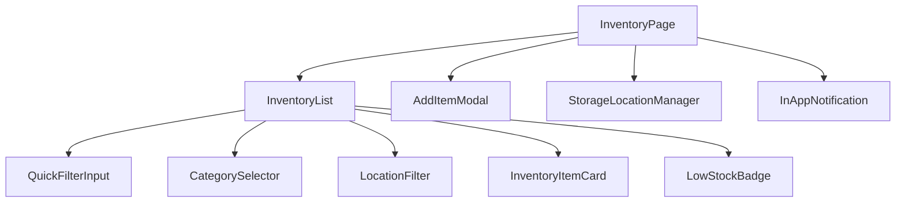

# Technical Design Document: Inventory Core (Stage 2)

## Overview

This feature implements manual inventory item management across user-defined storage locations. It includes the Storage Location Lambda, Inventory Lambda (CRUD + low-stock), frontend components (StorageLocationManager, InventoryList, AddItemModal, MainScreen with Add/Remove buttons), and the API client layer.

Data models and API routes are defined in the shared steering file: `.kiro/steering/data-model.md`

### UnitType Enum

The `unit` field on inventory items is constrained to a fixed set of measurement units:

```typescript
type UnitType = 'Gram' | 'Kilo' | 'Milliliter' | 'Liter' | 'Unit';

const VALID_UNITS: UnitType[] = ['Gram', 'Kilo', 'Milliliter', 'Liter', 'Unit'];
```

This enum is enforced both client-side (dropdown select) and server-side (validation on POST/PUT).

### Key Design Decisions

- **Storage locations are user-managed**: Each user starts with a default "Pantry" location and can add, rename, or remove locations. Locations are ordered by creation date.
- **Single-table DynamoDB design**: All entities share one table with PK/SK patterns. GSI1 supports category, location, and low-stock queries.
- **isLowStock computed on write**: The `isLowStock` flag is calculated on item create/update as `quantity <= threshold`, avoiding runtime computation on reads.
- **In-app notifications for low-stock transitions**: When an item transitions to low-stock status, the API response includes a notification payload for the frontend to display.

## Architecture

### Component Hierarchy



## Components and Interfaces

### Frontend Components

#### Inventory Module
- **InventoryPage**: Page-level component managing inventory state, Add/Remove buttons
- **InventoryList**: Displays items with filtering (text, category, location, low-stock toggle)
- **QuickFilterInput**: Real-time text filtering by product name
- **CategorySelector**: Dropdown for filtering by category
- **LocationFilter**: Filter by user's defined storage locations
- **InventoryItemCard**: Individual item display with thumbnail, badges, remove action
- **AddItemModal**: Manual item entry form with all fields and validation. The Units field is rendered as a dropdown select control restricted to UnitType values (Gram, Kilo, Milliliter, Liter, Unit)
- **LowStockBadge**: Visual indicator for threshold alerts
- **InAppNotification**: Displays low-stock transition notifications

#### Storage Location Module
- **StorageLocationManager**: UI for managing storage locations (add, rename, remove with validation)

### Backend Lambda Functions

#### Storage Location Lambda

Endpoints: GET/POST/PUT/DELETE `/locations`

- GET returns locations ordered by createdAt; auto-creates default "Pantry" on first access
- POST validates unique name (case-insensitive)
- PUT validates unique name for rename
- DELETE guards: rejects if location has items or is last remaining

#### Inventory Lambda

Endpoints: GET/POST/PUT/DELETE `/inventory`, GET `/inventory/low-stock`

- POST validates required fields (name, category, expirationDate, locationId, quantity, unit) and validates that `unit` is a valid UnitType value
- PUT supports partial updates for all fields including barcode; validates `unit` against UnitType when provided
- isLowStock flag computed on create/update: `quantity <= threshold`
- Low-stock transition detection: returns `lowStockTransition` flag and notification payload
- GSI1 updated for category and location queries

Request/response interfaces are defined in `.kiro/steering/data-model.md`

### API Client (Frontend)

```typescript
// frontend/src/api/inventory.ts
fetchInventory(): Promise<{ items: InventoryItem[] }>
addInventoryItem(data: Record<string, unknown>): Promise<MutationResponse>
updateInventoryItem(itemId: string, data: Record<string, unknown>): Promise<MutationResponse>
deleteInventoryItem(itemId: string): Promise<void>

// frontend/src/api/locations.ts
fetchLocations(): Promise<StorageLocation[]>
createLocation(name: string): Promise<StorageLocation>
renameLocation(locationId: string, name: string): Promise<StorageLocation>
deleteLocation(locationId: string): Promise<void>
```

## Correctness Properties

### Property 1: Item Addition Persistence

*For any* valid inventory item data (name, category, expirationDate, location, quantity, unit), when the item is added to the inventory, querying the inventory should return an item with matching data.

**Validates: Requirements 3.2**

### Property 2: Item Deletion Removes from Inventory

*For any* inventory item that exists in the inventory, when the user confirms deletion, the item should no longer appear in the inventory item list.

**Validates: Requirements 5.4**

### Property 3: Quantity Update Round-Trip

*For any* inventory item and any valid positive quantity value, updating the item's quantity and then retrieving the item should return the updated quantity value.

**Validates: Requirements 6.1**

### Property 4: Low Stock Threshold Invariant

*For any* inventory item with a defined threshold, the item's `isLowStock` flag should be `true` if and only if `quantity <= threshold`.

**Validates: Requirements 7.2**

### Property 5: Low Stock List Accuracy

*For any* user's inventory, the low-stock items view should contain exactly the set of items where `isLowStock` is `true`.

**Validates: Requirements 7.3**

### Property 6: Low Stock In-App Notification Trigger

*For any* inventory item that transitions to low-stock status, the system should generate an in-app notification.

**Validates: Requirements 7.5**

### Property 7: Combined Filter Correctness

*For any* inventory list and any combination of text filter, category filter, and location filter, the filtered results should contain exactly the items that satisfy all active filter criteria simultaneously.

**Validates: Requirements 8.2, 8.3, 8.4, 8.5**

### Property 8: Validation Error for Missing Required Fields

*For any* inventory item submission missing one or more required fields, the system should reject the submission and return validation errors indicating which fields are missing.

**Validates: Requirements 3.3**

### Property 9: Image Storage with Reference

*For any* uploaded image, the image should be stored in S3 and the corresponding DynamoDB record should contain the S3 key reference.

**Validates: Requirements 3.5**

### Property 10: Unit Enum Validation

*For any* string value submitted as the `unit` field, the system should accept it if and only if it is one of the valid UnitType values (Gram, Kilo, Milliliter, Liter, Unit). Any other string should be rejected with a validation error.

**Validates: Requirements 3.7**

### Property 26: Threshold Setting Persistence

*For any* inventory item and valid threshold value, setting the threshold and retrieving the item should return the set threshold value.

**Validates: Requirements 7.1**

### Property 30: Storage Location Add with Uniqueness

*For any* user and any location name, adding a storage location should succeed if and only if no existing location has the same name (case-insensitive).

**Validates: Requirements 18.2, 18.7**

### Property 31: Storage Location Removal Guard

*For any* storage location, removing it should succeed if and only if it contains no inventory items AND it is not the user's last remaining location.

**Validates: Requirements 18.4, 18.5, 18.6**

### Property 32: Storage Location Rename Round-Trip

*For any* existing storage location and any new unique name, renaming and then retrieving should return the updated name.

**Validates: Requirements 18.3**

### Property 33: Storage Location Creation Order

*For any* sequence of storage locations created, retrieving the location list should return them in creation order.

**Validates: Requirements 18.8**

## Error Handling

### Validation Errors
- Client-side validation before submission with inline error messages for required fields
- API returns 400 with field-specific errors
- Storage location errors: duplicate name, non-empty removal, last-location removal

### API Errors
- 400: Validation errors, duplicate location names, non-empty location removal
- 404: Item or location not found
- 409: Optimistic locking conflict
- 429: DynamoDB throughput exceeded (retry with backoff)

## Testing Strategy

### Property-Based Testing
- Properties 1–9, 10, 26, 30–33 using fast-check with 100+ iterations
- Tag format: `Feature: inventory-core, Property {number}: {property_text}`

### Unit Testing
- StorageLocationManager: add, rename, remove, validation errors
- InventoryList: filtering by text, category, location, low-stock toggle
- AddItemModal: form validation, submission, picture upload
- InventoryPage: Add/Remove buttons, item removal flow
- Inventory Lambda: CRUD operations, low-stock calculation
- Storage Location Lambda: CRUD with guards

### Test File Locations
- `frontend/src/components/StorageLocationManager.test.tsx`
- `frontend/src/components/InventoryList.test.tsx`
- `frontend/src/components/AddItemModal.test.tsx`
- `frontend/src/pages/InventoryPage.test.tsx`
- `frontend/src/api/inventory.test.ts`
- `frontend/src/api/locations.test.ts`
- `backend/src/handlers/inventory.test.ts`
- `backend/src/handlers/storage-location.test.ts`
