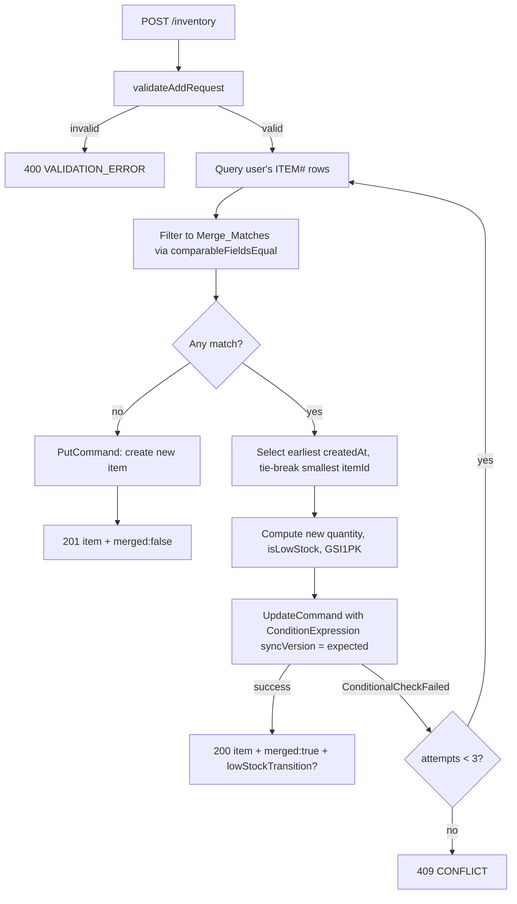
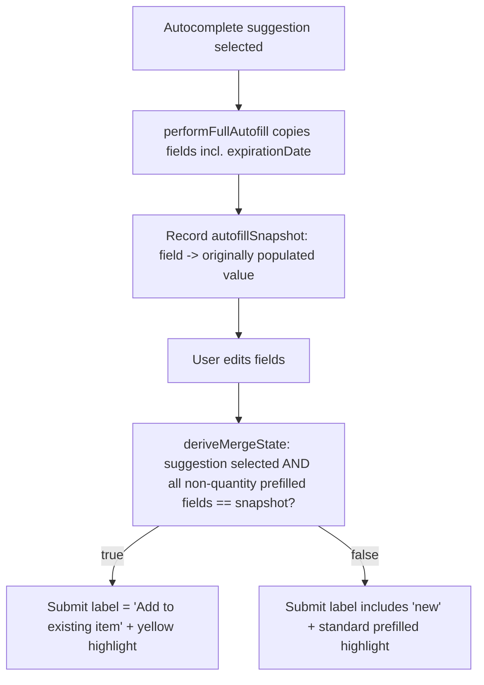
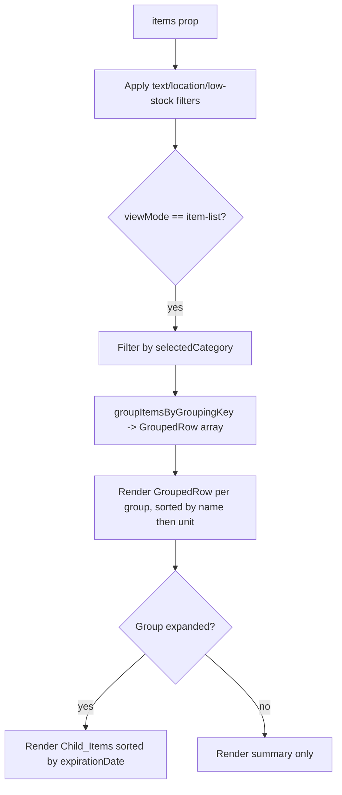

# Design Document: Inventory Merge and Grouping

## Overview

This feature bundles two complementary inventory enhancements that both revolve around the idea of "the same item":

1. **Merge identical items on add (backend-authoritative)** — When an add-item request arrives, the Inventory Lambda searches the user's existing items for a `Merge_Match` (an item equal on every `Comparable_Field`). If one exists, the handler increases that item's `quantity`, recomputes `isLowStock`, bumps `updatedAt`/`syncVersion`, and returns the updated item flagged as a merge. If none exists, it creates a new item flagged as a creation. The Add Item page surfaces the *predicted* outcome reactively (expiration-date autofill, a dynamic submit-button label, and a distinct yellow highlight) but the backend remains the source of truth for the actual merge decision.

2. **Group identical items in the category view (frontend-only)** — Inside the existing category drill-down, items sharing a `Grouping_Key` (`name` + `category` + `unit`) collapse into a single expandable `Grouped_Row` that summarizes total quantity, child count, and low-stock state. Expanding reveals the underlying `InventoryItem`s sorted by expiration date, visually distinguished through indentation, connector lines, and a distinct background. Grouping is a pure client-side UI construct — no database rows are created, merged, or modified.

The two features are deliberately layered. Feature 1 collapses *exact* duplicates at write time (same on all comparable fields). Feature 2 visually groups items that share name + category + unit but legitimately differ in other comparable fields (expiration date, location, brand, etc.), so they appear together while remaining distinct rows.

This design references the shared `InventoryItem` schema, `MutationResponse` contract, API routes, and access patterns defined in `.kiro/steering/data-model.md` and does not redefine them. Unit handling reuses `resolveUnit`, `getUnitLabel`, and `UNIT_METADATA` from `backend/src/types/units.ts` and `frontend/src/types/units.ts`.

### Scope and Affected Modules

| Area | File | Change |
| ---- | ---- | ------ |
| Backend merge logic | `backend/src/handlers/inventory/inventory.ts` | Rework `addInventoryItem` to detect `Merge_Match`, perform `Merge_Operation` with optimistic-locking retry, and return a merge/create indicator |
| Backend comparison helpers | `backend/src/handlers/inventory/inventory.ts` (or extracted `merge.ts`) | New pure functions for comparable-field equality and match selection |
| Mutation response | `MutationResponse` (data-model.md) | Add `merged: boolean` indicator |
| Frontend add form | `frontend/src/pages/AddItemPage/AddItemPage.tsx` | Expiration-date autofill, merge-state derivation, dynamic submit label, yellow highlight |
| Frontend grouping | `frontend/src/components/InventoryList/InventoryList.tsx` | New `groupItemsByGroupingKey` pure function + `GroupedRow` sub-component with expand/collapse |

## Architecture

### Backend Merge Flow



The merge path reuses the table query already proven in `searchInventory`/`listInventory` (`PK = USER#<userId>` AND `begins_with(SK, 'ITEM#')`). Matching, selection, and quantity math are factored into **pure functions** so they can be property-tested without DynamoDB.

### Optimistic Locking

The `Merge_Operation` issues an `UpdateCommand` guarded by `ConditionExpression: 'syncVersion = :expectedVersion'` using the matched item's observed `syncVersion`. On `ConditionalCheckFailedException`, the handler re-queries, re-selects the match, and retries — up to **3 total attempts**. If all attempts fail, the user's inventory is left unchanged and a `409 CONFLICT` error is returned. This mirrors the existing single-table optimistic-locking convention (`syncVersion`) already used by `updateInventoryItem`.

### Frontend Add-Item Merge-State Architecture



A single derived predicate, `isMergeState`, drives both the submit-button label (Requirement 5) and the highlight color (Requirement 6). It is computed synchronously from React state on every render, so it updates well within the 200 ms reactivity budget.

### Frontend Grouping Architecture



The grouping layer is inserted between the existing `categoryFilteredItems` computation and rendering in `InventoryList`. The category-summary view is unchanged; grouping applies only inside the drill-down item list. Expand/collapse state lives in component state keyed by `Grouping_Key` so it survives re-computation when filters change.

## Components and Interfaces

### Backend: Comparable-Field Equality (pure functions)

```typescript
// Comparable fields used for merge matching (quantity and picture excluded)
const STRING_COMPARABLE_FIELDS = [
  'name', 'category', 'barcode', 'brand', 'whereToBuy', 'onlineStoreLink',
] as const;

// Normalize a string comparable field: trim, collapse case. Returns '' for absent/empty.
function normalizeString(value: unknown): string {
  return typeof value === 'string' ? value.trim().toLowerCase() : '';
}

// Equality for a single string field with optional-field semantics:
// absent/empty on both => equal; present on one and absent/empty on other => not equal.
function stringFieldEqual(a: unknown, b: unknown): boolean {
  return normalizeString(a) === normalizeString(b);
}

// expirationDate: compared as exact ISO date string (after trim).
// location: compared as exact identifier (after trim).
// unit: compared by canonical key via resolveUnit().
function comparableFieldsEqual(
  submitted: ComparableFields,
  existing: ComparableFields,
): boolean {
  if (submitted.expirationDate.trim() !== existing.expirationDate.trim()) return false;
  if (submitted.location.trim() !== existing.location.trim()) return false;
  if (resolveUnit(submitted.unit) !== resolveUnit(existing.unit)) return false;
  return STRING_COMPARABLE_FIELDS.every((f) => stringFieldEqual(submitted[f], existing[f]));
}

interface ComparableFields {
  name: string;
  category: string;
  expirationDate: string;
  location: string;
  unit: string;
  barcode?: string;
  brand?: string;
  whereToBuy?: string;
  onlineStoreLink?: string;
}
```

Note: `name` and `category` are compared with the same trim + case-insensitive rule as the other string fields per Requirement 2.7. Grouping on the frontend additionally collapses internal whitespace for `name` (Requirement 7.6); the backend equality rule does not collapse internal whitespace because the requirements specify trim + case-insensitive only for the comparable-field set.

### Backend: Match Selection

```typescript
// Among all Merge_Matches, pick the one with earliest createdAt,
// tie-broken by lexicographically smallest itemId.
function selectMergeMatch(matches: InventoryItem[]): InventoryItem | null {
  if (matches.length === 0) return null;
  return matches.reduce((best, cur) => {
    if (cur.createdAt < best.createdAt) return cur;
    if (cur.createdAt > best.createdAt) return best;
    return cur.itemId < best.itemId ? cur : best;
  });
}
```

### Backend: Quantity Merge and Low-Stock Recompute

```typescript
// Exact arithmetic sum (no rounding/truncation). isLowStock recomputed against threshold.
function applyMerge(existing: InventoryItem, submittedQuantity: number): {
  quantity: number;
  isLowStock: boolean;
  lowStockTransition: boolean;
} {
  const quantity = existing.quantity + submittedQuantity;
  const isLowStock = existing.threshold !== undefined && quantity <= existing.threshold;
  const lowStockTransition = isLowStock !== existing.isLowStock;
  return { quantity, isLowStock, lowStockTransition };
}
```

The `UpdateCommand` sets `quantity`, `isLowStock`, `updatedAt`, `GSI1PK` (LOWSTOCK vs CAT key, consistent with `updateInventoryItem`), and `syncVersion = syncVersion + 1`. `lowStockTransition` is included in the response only when `isLowStock` changed (Requirement 3.3/3.4) — note this differs subtly from the existing update path, which only flags transitions *into* low-stock; here any change in `isLowStock` is reported.

### Backend: Mutation Response Indicator

The shared `MutationResponse` gains a `merged` boolean:

```typescript
interface MutationResponse {
  item: InventoryItem;
  merged: boolean;            // true for Merge_Operation, false for creation
  lowStockTransition?: boolean;
  notification?: { type: string; message: string; itemId: string };
}
```

`addInventoryItem` returns `{ item, merged: false }` with HTTP 201 on creation and `{ item, merged: true, lowStockTransition? }` with HTTP 200 on merge.

### Frontend: Add-Item Merge State

```typescript
// Snapshot of values originally populated by full autofill (excluding quantity).
type AutofillSnapshot = Record<string, string>; // field -> populated value

// A suggestion is "selected" when a full autofill has produced a non-empty snapshot.
function isMergeState(
  snapshot: AutofillSnapshot | null,
  form: Record<string, string>,
): boolean {
  if (!snapshot) return false;
  return Object.entries(snapshot)
    .filter(([field]) => field !== 'quantity')
    .every(([field, original]) => form[field] === original);
}
```

- **Expiration autofill (Requirement 4):** `performFullAutofill` already copies `expirationDate` when the field is empty and moves focus + opens the date picker. The design formalizes this: copy only when the suggestion's `expirationDate` is non-empty AND the field is empty; mark it prefilled; if a user value already exists, leave it untouched and skip focus/picker.
- **Submit label (Requirement 5):** `isMergeState` true → "Add to existing item"; otherwise a label containing "new" (e.g., "Add new item"). No suggestion selected → "Add new item". While submitting → disabled with "Adding…". Quantity is excluded from the predicate.
- **Highlight color (Requirement 6):** When `isMergeState` is true, prefilled fields render with a new **yellow** highlight (`#fef9c3` background, `#854d0e` text → contrast ≈ 8.6:1, ≥ 4.5:1). When false, prefilled fields fall back to the existing blue prefilled style. Editing a field removes its individual prefilled highlight (existing behavior). The highlight is derived from the same `isMergeState` predicate as the submit label.

### Frontend: Grouping (pure function)

```typescript
export interface GroupedRow {
  groupingKey: string;        // canonical composite key
  name: string;               // display name (first child's original name)
  unit: string;               // canonical unit key
  category: string;
  childItems: InventoryItem[]; // sorted by expirationDate, then createdAt, then itemId
  totalQuantity: number;
  childCount: number;
  hasLowStock: boolean;
}

// name normalization for grouping: trim, collapse internal whitespace, lowercase.
function normalizeGroupName(name: string): string {
  return name.trim().replace(/\s+/g, ' ').toLowerCase();
}

export function groupItemsByGroupingKey(items: InventoryItem[]): GroupedRow[] {
  // 1. key = `${normalizeGroupName(name)}|${category-normalized}|${resolveUnit(unit)}`
  // 2. bucket items by key
  // 3. within each group: sort children by expirationDate asc, then createdAt asc, then itemId asc
  // 4. compute totalQuantity (sum), childCount (length), hasLowStock (any child isLowStock)
  // 5. sort groups by normalized name asc, tie-break by canonical unit key asc
}
```

Category is compared/normalized consistently with the existing category drill-down (items in the drill-down already share a category, so category mainly disambiguates if grouping is ever reused outside the drill-down).

### Frontend: GroupedRow Sub-Component

```typescript
interface GroupedRowProps {
  group: GroupedRow;
  expanded: boolean;
  onToggle: () => void;
  locationMap: Record<string, string>;
  removeMode: boolean;
  onRemoveItem?: (itemId: string) => void;
  onItemClick?: (item: InventoryItem) => void;
}
```

The parent row renders:
- `role="button"`, `tabIndex={0}`, `aria-expanded={expanded}`, `aria-controls` pointing at the child container id, min 44×44 touch target.
- Enter/Space toggles, with `preventDefault()` on Space to suppress page scroll (mirrors `CategoryCard` keyboard handling already in the file).
- Summary: total quantity formatted via `formatQuantity` (max 2 decimals, trailing zeros/point stripped) + unit label via `getUnitLabel(unit, total)` (singular iff total === 1), child count, and a low-stock badge when `hasLowStock`.

Child items render inside a region (id referenced by `aria-controls`) only when expanded, reusing `InventoryItemCard` for activation → detail view and low-stock treatment, wrapped with indentation (≥ 16px), a connector-line treatment, and a distinct background.

### InventoryList Integration

`InventoryList` gains expand/collapse state:

```typescript
const [expandedGroups, setExpandedGroups] = useState<Set<string>>(new Set());
```

In `item-list` view, `categoryFilteredItems` is passed through `groupItemsByGroupingKey` (memoized). Groups render via `GroupedRow`. Expansion state is keyed by `groupingKey` so it is preserved across re-computation when filters change (Requirement 8.5); keys that disappear are naturally ignored, and newly appearing groups default to collapsed (Requirement 8.4). When a key with one item is produced, it renders as a single-child group that still toggles (Requirement 8.1).

## Data Models

No DynamoDB schema changes. The feature operates on the existing `InventoryItem` entity and access patterns from `.kiro/steering/data-model.md`.

- **`MutationResponse.merged`** — a new boolean indicator on the existing mutation response (additive, backward-compatible: existing clients ignore it).
- **`GroupedRow`** — a derived, client-side-only view model computed from `InventoryItem[]`. Never persisted or sent to any API.
- **`ComparableFields`** — an internal backend projection of `InventoryItem` fields used purely for comparison.
- **`AutofillSnapshot`** — transient frontend component state recording values populated by autofill.

No new GSI, no new entity types, no migration required. Existing inventory rows remain valid; legacy unit values continue to resolve via `resolveUnit`.

## Correctness Properties

*A property is a characteristic or behavior that should hold true across all valid executions of a system — essentially, a formal statement about what the system should do. Properties serve as the bridge between human-readable specifications and machine-verifiable correctness guarantees.*

These properties target the pure functions of the feature (`comparableFieldsEqual`, `selectMergeMatch`, `applyMerge`, `groupItemsByGroupingKey`, the `isMergeState` predicate) and the components that render their output. They are implemented with `fast-check` at a minimum of 100 iterations each. Several acceptance criteria were classified as examples, edge cases, or static style assertions during prework and are covered by the unit/integration tests in the Testing Strategy rather than by properties.

### Property 1: Comparable-field equality is comprehensive and reflexive

*For any* inventory item, comparing it against itself yields a match, and the match result is independent of the order in which fields are compared. *For any* pair of items that differ in at least one `Comparable_Field` (`name`, `category`, `expirationDate`, `location`, `unit`, `barcode`, `brand`, `whereToBuy`, `onlineStoreLink`) under that field's equality rule — exact ISO string for `expirationDate`, exact identifier for `location`, canonical key (`resolveUnit`) for `unit`, and trim + case-insensitive for the string fields, with optional fields equal only when both are absent/empty — `comparableFieldsEqual` returns false; and *for any* pair that differs only in `quantity` and/or picture, it returns true.

**Validates: Requirements 1.1, 1.2, 1.3, 2.1, 2.2, 2.3, 2.4, 2.5, 2.6, 2.7, 2.8**

### Property 2: Merge match selection is deterministic

*For any* non-empty set of items that all qualify as `Merge_Match`es, `selectMergeMatch` returns the item with the earliest `createdAt`, tie-broken by the lexicographically smallest `itemId`, and this choice is independent of input order.

**Validates: Requirements 1.6**

### Property 3: Add never loses items and changes count by at most one

*For any* submitted item and existing inventory, the resulting item count is unchanged when a `Merge_Match` exists (merge) and increases by exactly one when no `Merge_Match` exists (creation) — never by more than one. When the submission differs from every existing item in at least one `Comparable_Field`, the count increases by exactly one.

**Validates: Requirements 1.4, 1.5**

### Property 4: Quantity is conserved across add operations

*For any* sequence of add operations applied to a user's inventory, the total `quantity` summed across all resulting items equals the sum of all submitted quantities (merges add quantity to an existing item; creations add a new item), with fractional values preserved exactly and no quantity rounded, truncated, lost, or duplicated.

**Validates: Requirements 1.4, 3.1**

### Property 5: Low-stock recomputation and transition reporting are correct

*For any* merge of a submitted quantity into a matched item, the resulting `isLowStock` is true if and only if the item has a defined `threshold` and the resulting `quantity` is less than or equal to that `threshold`; and the mutation response includes a low-stock transition indicator reflecting the new value if and only if `isLowStock` changed.

**Validates: Requirements 3.2, 3.3, 3.4**

### Property 6: Merge increments sync version by exactly one

*For any* `Merge_Operation`, the resulting `syncVersion` equals the matched item's prior `syncVersion` plus exactly 1.

**Validates: Requirements 1.4, 3.5**

### Property 7: Merge-state predicate drives label and highlight, excluding quantity

*For any* selected autocomplete suggestion and any subsequent edits, the `isMergeState` predicate is true if and only if every prefilled field other than `quantity` still equals the value originally populated by autofill; when true the submit label indicates adding to an existing item and prefilled fields use the yellow highlight, when false the label includes the word "new" and prefilled fields use the standard prefilled highlight; editing only the `quantity` field never changes the predicate, label, or highlight.

**Validates: Requirements 5.1, 5.2, 5.5, 6.1, 6.2, 6.5, 6.6**

### Property 8: Expiration autofill copies only into an empty field

*For any* full autofill, the suggestion's `expirationDate` is copied into the expiration field and the field is marked prefilled if and only if the suggestion has a non-empty `expirationDate` and the field was empty; if the field already holds a user-entered value it is left unchanged and not marked prefilled.

**Validates: Requirements 4.1, 4.2, 4.4**

### Property 9: Grouping partitions the displayed items exactly

*For any* list of items, the `Child_Item` sets across all `Grouped_Row`s produced by `groupItemsByGroupingKey` are pairwise disjoint, their union equals the input set, and the sum of child counts equals the input count — so every displayed item is represented in exactly one group (including keys mapping to a single item).

**Validates: Requirements 7.1, 7.3, 7.4, 7.5**

### Property 10: Grouping keys normalize names and units

*For any* two items, they share a `Grouped_Row` if and only if their `name`s are equal after trimming, collapsing internal whitespace, and lower-casing, their `category`s are equal, and their `unit`s resolve to the same canonical key (so legacy and modern unit values group together).

**Validates: Requirements 7.6, 7.7**

### Property 11: Grouped rows are ordered by name then unit

*For any* list of items, the `Grouped_Row`s are ordered by ascending normalized case-insensitive `name`, tie-broken by ascending canonical unit key.

**Validates: Requirements 7.8**

### Property 12: Child items are ordered by expiration

*For any* `Grouped_Row`, its `Child_Item`s are ordered by non-decreasing `expirationDate`, tie-broken by ascending `createdAt` and then ascending `itemId`.

**Validates: Requirements 8.2**

### Property 13: Grouped row summary is correct

*For any* `Grouped_Row`, its summarized total quantity equals the exact sum of its `Child_Item`s' quantities (displayed with at most 2 decimal places and trailing zeros/point removed), its displayed child count equals the number of `Child_Item`s, and its unit is rendered with the singular label when the total equals 1 and the plural label otherwise.

**Validates: Requirements 9.1, 9.2, 9.5, 9.6, 9.7**

### Property 14: Group low-stock indicator correctness

*For any* `Grouped_Row`, the low-stock indicator is shown if and only if at least one of its `Child_Item`s is `Low_Stock`.

**Validates: Requirements 9.3, 9.4**

### Property 15: Expand/collapse toggles children and preserves state

*For any* `Grouped_Row`, activating it toggles between showing and hiding its `Child_Item`s; and *for any* recomputation (e.g., filter change) in which a group's `Grouping_Key` remains present, that group's expanded/collapsed state is preserved.

**Validates: Requirements 8.1, 8.3, 8.5**

## Error Handling

### Backend

- **Validation errors:** `addInventoryItem` keeps the existing `validateAddRequest` checks (required fields, non-negative quantity, valid ISO `expirationDate`, accepted `unit`) and returns `400 VALIDATION_ERROR` before any merge search.
- **Optimistic-locking conflict:** Each `Merge_Operation` is guarded by `ConditionExpression: 'syncVersion = :expectedVersion'`. On `ConditionalCheckFailedException`, the handler re-queries the user's items, re-selects the `Merge_Match`, and retries — up to 3 total attempts. If a match no longer exists after a conflict (e.g., it was deleted), the handler falls through to creation. If all 3 attempts fail, no write is committed and the handler returns `409 CONFLICT` with the standard `ErrorResponse` shape, leaving inventory unchanged (Requirement 1.9).
- **Query/transport failures:** Unexpected DynamoDB errors propagate to the existing top-level `catch`, returning `500 INTERNAL_ERROR` with the `requestId`.
- **Floating-point note:** Quantities are summed with JS number arithmetic, consistent with the rest of the app. Property tests for quantity conservation use exact integer and representable-fraction generators (matching `parseFractionalQuantity` inputs) to avoid asserting on non-representable IEEE-754 results.

### Frontend — Add Item

- **No suggestion selected / cleared field:** `isMergeState` returns false (label includes "new", standard highlights). Clearing a prefilled field removes it from the prefilled set, consistent with existing behavior.
- **Suggestion without expiration:** Field left unchanged, not prefilled, no focus shift, no picker (Requirement 4.5).
- **`showPicker` unsupported:** Wrapped in try/catch (already present) so unsupported browsers still receive focus without throwing.
- **Submission in progress:** Submit button is disabled and shows progress text; the backend remains authoritative, so even if the predicted label said "add to existing" the server may create a new item — the UI reflects the server's returned `merged` indicator after the response.

### Frontend — Grouping

- **Empty / fully filtered list:** No groups are produced; the existing "No items match the current filters." message renders.
- **Stale expansion keys:** Expansion state keyed by `Grouping_Key` ignores keys no longer present; reappearing groups default to collapsed.
- **Single-item groups:** Render as a one-child group that still toggles, ensuring uniform interaction.

## Testing Strategy

### Dual Approach

- **Property-based tests** (`fast-check`, ≥ 100 iterations each) verify the 15 universal properties above against the pure functions and rendered output.
- **Unit/integration tests** cover specific examples, response shapes, accessibility, keyboard interaction, focus side effects, optimistic-locking retry wiring, and static style assertions.

### Property-Based Tests

| Property | Test file |
| -------- | --------- |
| P1–P6 (merge logic) | `backend/src/handlers/inventory/__tests__/inventory.property.test.ts` |
| P7–P8 (add-item merge state) | `frontend/src/pages/AddItemPage/__tests__/AddItemPage.property.test.tsx` |
| P9–P15 (grouping) | `frontend/src/components/InventoryList/__tests__/InventoryList.grouping.property.test.tsx` |

Each property test is tagged with a comment of the form:

```
// Feature: inventory-merge-and-grouping, Property {N}: {property text}
```

Backend property tests exercise the extracted pure functions (`comparableFieldsEqual`, `selectMergeMatch`, `applyMerge`) directly and use an in-memory model of the user's inventory for the count/quantity-conservation properties, so no DynamoDB calls are made. fast-check generators produce `InventoryItem`-shaped records with randomized comparable fields, case/whitespace variants, legacy and modern unit values, optional fields present/absent, and integer plus representable-fraction quantities.

### Unit and Integration Tests

Backend (`inventory.test.ts`):
- Merge returns `merged: true` with the updated item and HTTP 200 (Req 1.7).
- Creation returns `merged: false` with the created item and HTTP 201 (Req 1.8).
- Optimistic-locking: mocked `ConditionalCheckFailedException` once/twice then success → merge applied; three failures → `409 CONFLICT` with no mutation (Req 1.9).
- Only the selected match is modified when multiple matches exist; others unchanged (Req 1.6 wiring).
- `updatedAt` is refreshed on merge (Req 3.5 wiring).

Frontend AddItemPage (`AddItemPage.test.tsx`):
- Autofill moves focus to the expiration field and calls `showPicker` (stubbed) when empty (Req 4.3); does not when a user value exists (Req 4.4); leaves field unchanged when suggestion has no expiration (Req 4.5).
- Label/highlight update synchronously on field change (Req 5.3, 6.3); editing a prefilled field clears its highlight (Req 6.4); no-selection label includes "new" (Req 5.4); submitting disables the button and shows progress (Req 5.6).
- Yellow highlight palette (`#fef9c3` on `#854d0e`) is asserted and its contrast ratio (≈ 8.6:1 ≥ 4.5:1) is documented as a static design fact (Req 6.1).

Frontend InventoryList grouping (`InventoryList.grouping.test.tsx`):
- New groups render collapsed (Req 8.4); Enter/Space toggle and Space prevents default scroll (Req 8.6); `aria-expanded`/`aria-controls` reflect state and child association (Req 8.7).
- Child indentation ≥ 16px, connector lines present, distinct child background, child controls ≥ 44×44 (Req 10.1–10.4).
- Activating a child opens the detail view via `onItemClick` (Req 10.5); low-stock children show the low-stock treatment (Req 10.6).

### Test Configuration

- Runner: Jest (`ts-jest`); jsdom for frontend, node for backend.
- PBT library: `fast-check`, `const TEST_ITERATIONS = 100;` minimum.
- Property tests use the `.property.test.ts(x)` suffix and live in `__tests__/` siblings per the project structure conventions.
- Per the workspace quality standard, all new and pre-existing test, lint, and type-check failures touched by this work must be resolved before the feature is considered complete.
