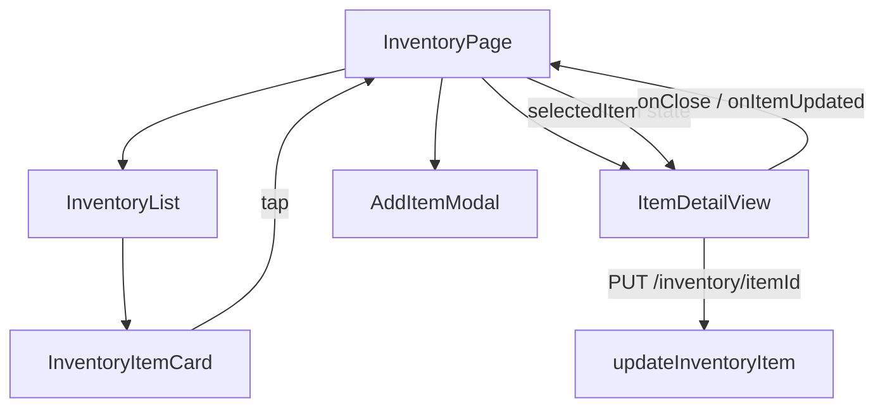
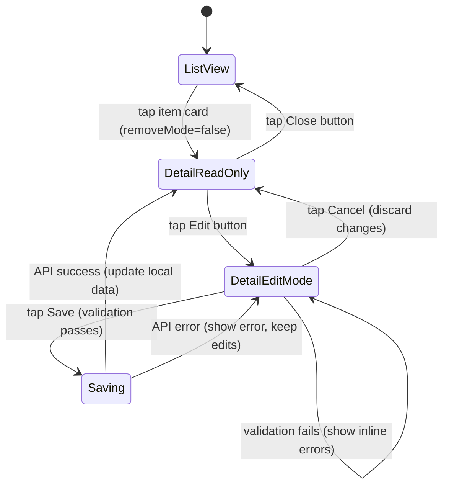

# Technical Design Document: Item Detail View

## Overview

The Item Detail View adds a full-screen detail panel to the Pantry Tracking App that users open by tapping an inventory item card. The panel displays all `InventoryItem` fields (omitting empty optional ones), supports an inline edit mode with validation, and persists changes via `PUT /inventory/{itemId}`. The feature integrates into the existing `InventoryPage` component using state-based rendering (no router), reuses the existing `updateInventoryItem` API function, and follows the app's inline-styles + mobile-first conventions.

### Key Design Decisions

- **State-based panel, not a route**: The detail view is rendered conditionally inside `InventoryPage` based on a `selectedItem` state variable. This is consistent with how `AddItemModal` works and avoids introducing a router dependency.
- **Single component with read/edit modes**: `ItemDetailView` manages its own `mode: 'view' | 'edit'` state internally. This keeps the parent page simple — it only passes the item, locations, and an `onClose`/`onItemUpdated` callback.
- **Validation mirrors AddItemModal**: The same required-field rules (name, category, expirationDate, location, quantity, unit) are reused. This ensures consistency and reduces user confusion.
- **Full-screen overlay**: The detail view renders as a fixed-position panel covering the inventory list, similar to a modal but scrollable. This works well on mobile (320px) through desktop (1920px).

## Architecture

### Component Hierarchy



### State Flow



## Components and Interfaces

### ItemDetailView Component

```typescript
interface ItemDetailViewProps {
  item: InventoryItem;
  locations: StorageLocation[];
  onClose: () => void;
  onItemUpdated: (updatedItem: InventoryItem) => void;
}
```

This is the single new component. It renders:

- **Read-only mode**: All item fields as static text, with optional fields omitted when empty. Displays an Edit button and a Close button.
- **Edit mode**: Editable form inputs pre-populated with current values. Displays Save and Cancel buttons. The Edit button is hidden.

### InventoryPage Changes

`InventoryPage` gains a `selectedItem: InventoryItem | null` state. When non-null, `ItemDetailView` renders on top of the list. The `InventoryItemCard` receives an `onTap` callback that sets `selectedItem` (suppressed when `removeMode` is true).

### InventoryItemCard Changes

The card gets an `onClick` prop. When `removeMode` is false and `onClick` is provided, tapping the card calls `onClick` instead of doing nothing.

```typescript
// Updated props
interface InventoryItemCardProps {
  item: InventoryItem;
  locationName: string;
  removeMode: boolean;
  onRemove?: (itemId: string) => void;
  onClick?: () => void;  // NEW — opens detail view
}
```

### API Layer

No new API functions needed. The existing `updateInventoryItem(itemId, data)` in `frontend/src/api/inventory.ts` already supports `PUT /inventory/{itemId}` and returns `MutationResponse` with `item`, `lowStockTransition`, and `notification`.

### Field Display Rules

| Field | Always shown | Condition |
|-------|-------------|-----------|
| name | ✅ | — |
| category | ✅ | — |
| location (resolved name) | ✅ | — |
| quantity + unit | ✅ | — |
| expirationDate | ✅ | — |
| isLowStock badge | conditional | `isLowStock === true` |
| brand | conditional | `brand` is truthy |
| barcode | conditional | `barcode` is truthy |
| threshold | conditional | `threshold !== undefined` |
| whereToBuy | conditional | `whereToBuy` is truthy |
| onlineStoreLink | conditional | `onlineStoreLink` is truthy |
| pictureUrl | conditional | `pictureUrl` is truthy |
| createdAt | ✅ | formatted as readable date |
| updatedAt | ✅ | formatted as readable date |

### Edit Mode Field Types

| Field | Input type | Notes |
|-------|-----------|-------|
| name | text | required |
| category | text | required |
| location | select | populated from `locations` prop, required |
| quantity | number (min=0) | required, non-negative |
| unit | text | required |
| expirationDate | date | required |
| brand | text | optional |
| barcode | text | optional |
| whereToBuy | text | optional |
| onlineStoreLink | url | optional |
| threshold | number (min=0) | optional |


### Validation Rules

Validation is performed client-side before calling the API. The rules match the existing `AddItemModal` validation:

```typescript
interface EditFormErrors {
  name?: string;
  category?: string;
  expirationDate?: string;
  locationId?: string;
  quantity?: string;
  unit?: string;
}

function validateEditForm(form: EditFormState): EditFormErrors {
  const errors: EditFormErrors = {};
  if (!form.name.trim()) errors.name = 'Product name is required.';
  if (!form.category.trim()) errors.category = 'Category is required.';
  if (!form.expirationDate) errors.expirationDate = 'Expiration date is required.';
  if (!form.locationId) errors.locationId = 'Storage location is required.';
  const qty = Number(form.quantity);
  if (form.quantity === '' || isNaN(qty)) {
    errors.quantity = 'Quantity is required.';
  } else if (qty < 0) {
    errors.quantity = 'Quantity must be non-negative.';
  }
  if (!form.unit.trim()) errors.unit = 'Unit is required.';
  return errors;
}
```

When a field with an error is corrected, the error for that field is cleared immediately (on change).

## Data Models

No new data models are introduced. The feature operates on the existing `InventoryItem` interface and uses the existing `PUT /inventory/{itemId}` endpoint.

### Relevant Existing Types

```typescript
// From InventoryList.tsx
interface InventoryItem {
  itemId: string;
  name: string;
  category: string;
  expirationDate: string;
  location: string;       // locationId
  quantity: number;
  unit: string;
  isLowStock: boolean;
  barcode?: string;
  brand?: string;
  whereToBuy?: string;
  onlineStoreLink?: string;
  pictureUrl?: string;
  threshold?: number;
  createdAt: string;
  updatedAt: string;
}

// From api/inventory.ts
interface MutationResponse {
  item: InventoryItem;
  lowStockTransition?: boolean;
  notification?: { type: string; message: string; itemId: string };
}
```

### Edit Form State

```typescript
interface EditFormState {
  name: string;
  category: string;
  locationId: string;
  quantity: string;       // string for input binding, parsed to number on submit
  unit: string;
  expirationDate: string;
  brand: string;
  barcode: string;
  whereToBuy: string;
  onlineStoreLink: string;
  threshold: string;      // string for input binding, parsed to number on submit
}
```

The form state is initialized from the `InventoryItem` when entering edit mode, converting numeric fields to strings for input binding.


## Correctness Properties

*A property is a characteristic or behavior that should hold true across all valid executions of a system — essentially, a formal statement about what the system should do. Properties serve as the bridge between human-readable specifications and machine-verifiable correctness guarantees.*

### Property 1: Tap Card Opens Detail View

*For any* inventory item in the list (with remove mode disabled), tapping the item card should cause the detail view to render displaying that item's data.

**Validates: Requirements 1.1**

### Property 2: Remove Mode Suppresses Detail Navigation

*For any* inventory item in the list while remove mode is active, tapping the item card should not open the detail view.

**Validates: Requirements 1.2**

### Property 3: Required Fields Always Displayed

*For any* inventory item, the detail view should display the item's name, category, location name, quantity, unit, expiration date, createdAt (formatted as a human-readable date), and updatedAt (formatted as a human-readable date).

**Validates: Requirements 2.1, 2.7, 2.8**

### Property 4: Optional Fields Shown If and Only If Present

*For any* inventory item, each optional field (brand, barcode, threshold, whereToBuy, onlineStoreLink, pictureUrl) should be rendered in the detail view if and only if the field has a truthy value. When onlineStoreLink is present, it should render as an anchor element with `target="_blank"`.

**Validates: Requirements 2.2, 2.3, 2.4, 2.5, 2.6, 2.9, 3.1, 3.2**

### Property 5: Low Stock Badge Matches isLowStock Flag

*For any* inventory item, the detail view should display a low-stock badge if and only if `isLowStock` is `true`.

**Validates: Requirements 5.1, 5.2**

### Property 6: Close Button Dismisses Detail View

*For any* item's detail view, tapping the close button should dismiss the detail view and return to the inventory list.

**Validates: Requirements 4.2**

### Property 7: Edit Mode Pre-Populates Form With Current Values

*For any* inventory item, when the user enters edit mode, every editable form input should be pre-populated with the item's current value.

**Validates: Requirements 7.2**

### Property 8: Cancel Discards Changes and Restores Original Values

*For any* inventory item and any set of edits made in edit mode, tapping Cancel should discard all changes and return to read-only mode displaying the original item values.

**Validates: Requirements 7.4**

### Property 9: All Editable Fields Rendered in Edit Mode

*For any* inventory item in edit mode, the form should render editable inputs for all 11 fields: name, category, location, quantity, unit, expiration date, brand, barcode, whereToBuy, onlineStoreLink, and threshold.

**Validates: Requirements 8.1**

### Property 10: Required Field Validation Rejects Empty Fields

*For any* required field (name, category, expirationDate, location, quantity, unit) that is empty or invalid (non-numeric/negative quantity), submitting the edit form should display a validation error for that field and prevent the API call.

**Validates: Requirements 9.1, 9.2, 9.3, 9.4, 9.5, 9.6**

### Property 11: Correcting a Field Clears Its Validation Error

*For any* field that has a validation error displayed, changing that field's value should immediately clear the error message for that field.

**Validates: Requirements 9.7**

### Property 12: Save Calls API With Correct Data

*For any* valid edit form state, tapping Save should call `updateInventoryItem` with the item's `itemId` and an object containing all edited field values.

**Validates: Requirements 10.2**

### Property 13: Successful Save Updates Data and Exits Edit Mode

*For any* successful save response, the detail view should display a success message, update the displayed item data with the response values, and return to read-only mode.

**Validates: Requirements 10.4**

### Property 14: Save Failure Shows Error and Keeps Edit Mode

*For any* save attempt that fails (API error or network error), the detail view should display an error message and remain in edit mode with the user's edits preserved.

**Validates: Requirements 10.5, 10.6**

### Property 15: Low Stock Notification on Save With Transition

*For any* successful save response that includes `lowStockTransition: true`, the system should display a low-stock notification for the updated item.

**Validates: Requirements 10.7**

## Error Handling

### Validation Errors

- Client-side validation runs before any API call. Each required field (name, category, expirationDate, location, quantity, unit) is checked independently.
- Inline error messages appear below the corresponding input field using `role="alert"` for accessibility.
- Errors are cleared per-field when the user modifies the field value (via the `onChange` handler clearing that field's error).
- Quantity validation rejects empty, non-numeric, and negative values.

### API Errors

- If `updateInventoryItem` throws (HTTP 4xx/5xx), the error message from the response body is displayed in a banner above the form.
- The detail view remains in edit mode so the user can retry or correct data.
- The Save and Cancel buttons are re-enabled after the error.

### Network Errors

- If `fetch` throws a network error (no response), a generic "Network error — please check your connection and try again" message is displayed.
- Same behavior as API errors: edit mode is preserved, buttons re-enabled.

### Loading State

- While the save request is in progress, both Save and Cancel buttons are disabled.
- The Save button text changes to "Saving…" with a loading indicator.
- This prevents double-submission and accidental cancellation during save.

## Testing Strategy

### Property-Based Testing

Property-based tests use `fast-check` (already in the project) with a minimum of 100 iterations per property. Each test is tagged with a comment referencing the design property.

Tag format: `Feature: item-detail-view, Property {number}: {property_text}`

Key properties to implement as PBT:

- **Property 3** (required fields displayed): Generate random `InventoryItem` objects, render `ItemDetailView`, assert all required field values appear in the output.
- **Property 4** (optional fields shown iff present): Generate items with random combinations of optional fields present/absent, verify each optional field's presence in the DOM matches its truthiness.
- **Property 5** (low stock badge): Generate items with random `isLowStock` values, verify badge presence matches the flag.
- **Property 7** (edit mode pre-population): Generate random items, enter edit mode, verify each input value matches the item's field.
- **Property 8** (cancel discards changes): Generate random items and random edit values, make edits, cancel, verify original values are restored.
- **Property 10** (required field validation): Generate form states with random combinations of empty required fields, submit, verify errors appear for exactly the empty fields.
- **Property 11** (error clearing): Generate a field with an error, change its value, verify the error is cleared.

### Unit Testing

Unit tests use Jest + @testing-library/react (already configured). Focus areas:

- **Example tests**: Close button tap dismisses view, Edit button enters edit mode, Cancel returns to read-only mode, Save button calls API.
- **Edge cases**: Item with no optional fields (all omitted), item with all optional fields populated, network error during save, API error during save.
- **Integration**: `InventoryPage` correctly passes `selectedItem` to `ItemDetailView`, remove mode suppresses card tap, successful save updates the inventory list.

### Test File Locations

- `frontend/src/components/ItemDetailView.test.tsx` — unit and example tests
- `frontend/src/components/ItemDetailView.property.test.tsx` — property-based tests
- `frontend/src/pages/InventoryPage.test.tsx` — integration tests for detail view opening/closing (extend existing file)
