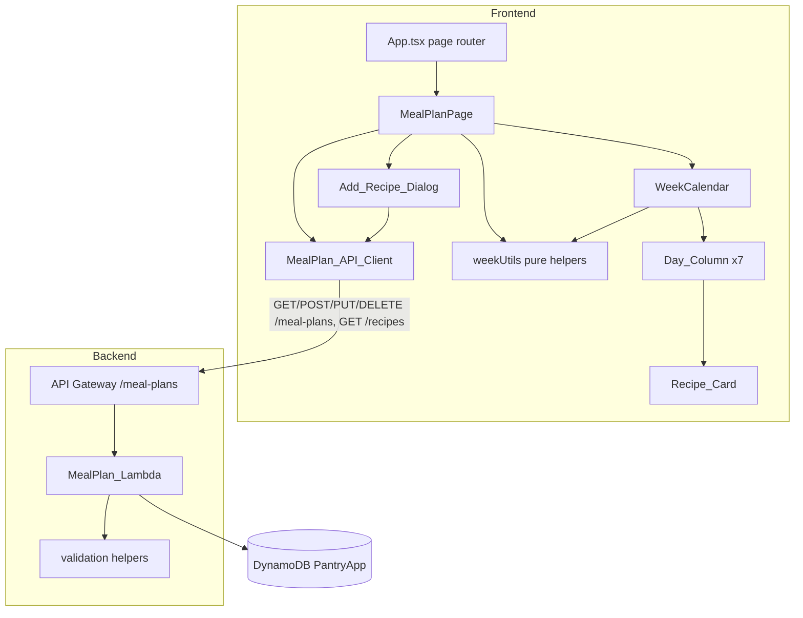

# Design Document

Feature: Meal Planner

## Overview

The Meal Planner lets an authenticated user (Beautiful_User) schedule existing recipes onto specific dates and meal slots (breakfast, lunch, dinner) using a week-focused calendar, and persists those assignments through the `/meal-plans` API. It is Stage 5 of the app pipeline: inventory enables recipes, recipes enable the meal planner, and the meal planner feeds the shopping list.

This design covers two cooperating parts, both defined against the shared contracts in `.kiro/steering/data-model.md`:

1. **MealPlan_Lambda** — the backend handler at `backend/src/handlers/meal-plan/meal-plan.ts` implementing `GET`, `POST`, `PUT`, and `DELETE` for `/meal-plans`, using the existing `PantryApp` DynamoDB single-table design.
2. **Frontend meal planner module** — the `MealPlanPage` (registered as the `meal-plan` `PageId` in `App.tsx`) rendering a 7-day `WeekCalendar`, an `Add_Recipe_Dialog` for assigning recipes, and a `MealPlan_API_Client` at `frontend/src/api/meal-plans/meal-plans.ts`.

The design reuses existing conventions exactly: backend handlers follow the dispatcher/validation/`response()` pattern established by `recipe.ts`; the frontend API client follows the `fetch` + bearer-token pattern of `inventory.ts`; the page follows the state-based page-routing model in `App.tsx` (no router library) and inline-style convention. No new entities, routes, or table indexes are introduced — `MealPlan`, the `/meal-plans` routes, and the `MEAL#<date>#<mealType>#<planId>` sort-key layout already exist in `data-model.md`.

### Key Design Decisions

- **Date math lives in pure, exported helpers.** Week_Start computation, the seven-date sequence, week navigation, range-bound formatting, and assignment sorting are pure functions extracted from React components so they can be unit- and property-tested in isolation. This is the same approach `recipe.ts` takes with `normalizeTags`, `scaleIngredients`, and `computeAvailability`.
- **The calendar is keyed by ISO date strings.** All comparisons use `YYYY-MM-DD` lexicographic ordering, which is equivalent to chronological ordering for that format, avoiding timezone pitfalls of `Date` arithmetic for range queries.
- **Server is the source of truth for assignments.** After a successful `POST`/`DELETE`, the calendar updates from the server response rather than optimistic local mutation, matching the error-handling requirements that demand the card stay visible on failure.
- **Recipe list is fetched lazily** when the `Add_Recipe_Dialog` opens, from the existing `GET /recipes` route, keeping page load fast and the recipe source authoritative.
- **The Add_Recipe_Dialog is a modal**, which is the one sanctioned exception in `structure.md` ("Modals are only acceptable for simple confirmations" — extended here to a small recipe-selection dialog). The primary surface (`MealPlanPage`) remains a full page.

## Architecture



### Request Flow: Viewing a Week

1. `MealPlanPage` mounts, computes `Week_Start` as the Monday of the week containing the current date via `getWeekStart()`.
2. `WeekCalendar` derives seven consecutive ISO dates via `getWeekDates(weekStart)`.
3. `MealPlan_API_Client.fetchMealPlans(startDate, endDate)` calls `GET /meal-plans?startDate=…&endDate=…` with `endDate = addDays(weekStart, 6)`.
4. The handler queries `PK = USER#<userId>` with `begins_with(SK, 'MEAL#')`, filters to the inclusive `[startDate, endDate]` range, and returns the records.
5. The page groups results into Day_Columns by `date` and slot by `mealType`, ordering cards via `sortAssignments()`.

### Request Flow: Adding an Assignment

1. User activates `Add_Recipe_Button` in a Day_Column → `Add_Recipe_Dialog` opens for that date with `breakfast` preselected.
2. Dialog lazily fetches recipes via `GET /recipes` (10s timeout), sorts them alphabetically (case-insensitive).
3. On confirm, `MealPlan_API_Client.createMealPlan({ date, mealType, recipeId, recipeName })` calls `POST /meal-plans`.
4. On success, the new `MealPlan` from the response is inserted into the calendar and the dialog closes; on failure/timeout, an error shows and the dialog stays open with selections retained.

## Components and Interfaces

### Backend: MealPlan_Lambda (`backend/src/handlers/meal-plan/meal-plan.ts`)

Follows the structure of `recipe.ts`: a top-level `handler` dispatcher, `getUserId()`, a shared `response()` helper, and small pure validation functions.

```typescript
// Route dispatcher
export async function handler(event: APIGatewayProxyEvent): Promise<APIGatewayProxyResult>;

// Handlers (private)
async function listMealPlans(userId: string, query: QueryParams): Promise<APIGatewayProxyResult>;
async function createMealPlan(userId: string, body: string | null): Promise<APIGatewayProxyResult>;
async function updateMealPlan(userId: string, planId: string, body: string | null): Promise<APIGatewayProxyResult>;
async function deleteMealPlan(userId: string, planId: string): Promise<APIGatewayProxyResult>;

// Pure validation/helpers (exported for testing)
export const MEAL_TYPES = ['breakfast', 'lunch', 'dinner'] as const;
export type MealType = (typeof MEAL_TYPES)[number];

export function isValidMealType(value: unknown): value is MealType;
export function isValidIsoDate(value: unknown): boolean; // strict YYYY-MM-DD
export function validateDateRange(startDate?: string, endDate?: string): string | null; // error msg or null
export function validateCreateBody(parsed: Record<string, unknown>): string | null;
export function validateUpdateBody(parsed: Record<string, unknown>): string | null;
export function filterByDateRange<T extends { date: string }>(records: T[], startDate: string, endDate: string): T[];
```

Dispatcher logic (mirrors `recipe.ts`):

| Method | planId | Handler |
| ------ | ------ | ------- |
| GET | absent | `listMealPlans` (reads `startDate`/`endDate` query params) |
| POST | absent | `createMealPlan` |
| PUT | present | `updateMealPlan` |
| DELETE | present | `deleteMealPlan` |
| any | — | 401 when `getUserId` is null; 405 otherwise |

Ownership is enforced structurally: every key uses `PK = USER#<userId>`, so a `planId` belonging to another user is not found under the caller's partition and yields 404 (Requirement 7.10). Missing auth yields 401 (Requirement 7.11).

### Frontend: MealPlan_API_Client (`frontend/src/api/meal-plans/meal-plans.ts`)

Follows `inventory.ts`: `getAuthHeaders()` from the Cognito session, `fetch`, and `throw new Error(body.message ?? '…')` on non-ok. Adds a 10-second timeout via `AbortController` (required by Requirements 2.5, 4.10, 5.5, 6.1).

```typescript
export interface MealPlan {
  planId: string;
  date: string; // YYYY-MM-DD
  mealType: 'breakfast' | 'lunch' | 'dinner';
  recipeId: string;
  recipeName: string;
  createdAt: string;
  updatedAt: string;
}

export async function fetchMealPlans(startDate: string, endDate: string): Promise<{ mealPlans: MealPlan[] }>;
export async function createMealPlan(input: CreateMealPlanInput): Promise<{ mealPlan: MealPlan }>;
export async function deleteMealPlan(planId: string): Promise<void>;
export async function fetchRecipesForPlanning(): Promise<{ recipes: PlannableRecipe[] }>; // GET /recipes, 10s timeout

interface CreateMealPlanInput {
  date: string;
  mealType: 'breakfast' | 'lunch' | 'dinner';
  recipeId: string;
  recipeName: string;
}
interface PlannableRecipe {
  recipeId: string;
  name: string;
}
```

### Frontend: Pure helpers (`frontend/src/pages/MealPlanPage/weekUtils.ts`)

Extracted so they are testable without rendering. All operate on ISO `YYYY-MM-DD` strings.

```typescript
export function getWeekStart(reference: Date): string;        // Monday of the week containing `reference`
export function addDays(isoDate: string, days: number): string;
export function getWeekDates(weekStart: string): string[];     // 7 consecutive ISO dates
export function getDayLabel(isoDate: string): string;          // e.g. "Mon"
export function getDayNumber(isoDate: string): number;         // numeric calendar date

export interface Assignment {
  planId: string;
  date: string;
  mealType: 'breakfast' | 'lunch' | 'dinner';
  recipeName: string;
  createdAt: string;
}
// Orders by mealType (breakfast<lunch<dinner), then createdAt ascending within a mealType.
export function sortAssignments(assignments: Assignment[]): Assignment[];
// Groups assignments into a map keyed by ISO date, each value sorted via sortAssignments.
export function groupByDate(assignments: Assignment[], weekDates: string[]): Record<string, Assignment[]>;
```

### Frontend: React components (`frontend/src/pages/MealPlanPage/`)

- **MealPlanPage** — owns `weekStart`, `mealPlans`, `loading`, `error`, dialog state. Orchestrates fetch on mount and on week change; renders `WeekCalendar`; renders `Add_Recipe_Dialog` when open. Registered as the `meal-plan` page (already wired in `App.tsx`).
- **WeekCalendar** — receives `weekDates`, grouped assignments, loading/error flags, and navigation/remove callbacks. Renders seven `Day_Column`s plus previous/next-week controls (disabled while loading).
- **Day_Column** — renders the day label and date number, the ordered `Recipe_Card`s, and the `Add_Recipe_Button` below them.
- **Recipe_Card** — shows recipe name and Meal_Type, with a `Remove_Button` (disabled while its delete is in flight).
- **Add_Recipe_Dialog** — modal with lazily-loaded recipe list (alphabetical, case-insensitive), a Meal_Type selector defaulting to `breakfast`, validation when confirming with no recipe selected, and loading/empty/error states for the recipe fetch.

## Data Models

This feature introduces **no new data models**. It uses the existing `MealPlan` entity, the `CreateMealPlanRequest` interface, and the `/meal-plans` routes from `.kiro/steering/data-model.md`. Summarized here for traceability only:

```typescript
interface MealPlan {
  PK: string;            // USER#<userId>
  SK: string;            // MEAL#<date>#<mealType>#<planId>
  entityType: 'MealPlan';
  planId: string;
  userId: string;
  date: string;          // ISO date (YYYY-MM-DD)
  mealType: 'breakfast' | 'lunch' | 'dinner';
  recipeId: string;
  recipeName: string;    // Denormalized for display
  createdAt: string;
  updatedAt: string;
  syncVersion: number;
}
```

Persistence details:

- **Write key:** `PK = USER#<userId>`, `SK = MEAL#<date>#<mealType>#<planId>`. Encoding `date` and `mealType` into the SK means a `begins_with(SK, 'MEAL#')` query returns assignments already ordered by date then meal-type-string; the handler still applies `filterByDateRange` and the frontend applies `sortAssignments` to guarantee the breakfast→lunch→dinner sequence (which is not alphabetical) and the createdAt tiebreak.
- **List query:** `KeyConditionExpression: 'PK = :pk AND begins_with(SK, :skPrefix)'` with `:skPrefix = 'MEAL#'`, then in-range filter on `date`.
- **POST:** generates `planId` via `randomUUID()`, sets `createdAt`/`updatedAt` to `new Date().toISOString()`, `syncVersion: 1`.
- **PUT:** `UpdateCommand` with `ConditionExpression: 'attribute_exists(PK)'`; updating `date` or `mealType` requires rewriting the SK, so the update is implemented as delete-old-key + put-new-key within the user's partition when those fields change, otherwise an in-place `UpdateCommand`. `updatedAt` is refreshed and `syncVersion` incremented.
- **DELETE:** verifies existence under the user partition (404 if absent), then `DeleteCommand`.

Date-range request/response shape (existing `CreateMealPlanRequest` reused for POST):

```typescript
// GET /meal-plans?startDate=YYYY-MM-DD&endDate=YYYY-MM-DD
interface ListMealPlansResponse { mealPlans: MealPlan[] }
```

## Correctness Properties

*A property is a characteristic or behavior that should hold true across all valid executions of a system — essentially, a formal statement about what the system should do. Properties serve as the bridge between human-readable specifications and machine-verifiable correctness guarantees.*

This feature is well suited to property-based testing: the date math (`getWeekStart`, `getWeekDates`, `addDays`), the assignment ordering (`sortAssignments`), the calendar placement (`groupByDate`), the recipe ordering, and the backend range-filtering and validation are all pure functions with large input spaces and universal invariants. UI states (loading, error, dialog interactions, button wiring) are covered by example-based tests in the Testing Strategy rather than properties.

The requirements document already states three backend properties (numbered 16, 17, 18 there); those are expressed below by validation target, with the requirement clause references as the source of truth. Each property maps back to the requirements it validates.

### Property 1: Week_Start is the Monday of the reference week

*For any* reference `Date`, `getWeekStart(reference)` returns an ISO date that (a) falls on a Monday, (b) is on or before the reference date, and (c) is no more than six days before the reference date.

**Validates: Requirements 1.2**

### Property 2: A week spans seven consecutive dates from Week_Start

*For any* ISO `weekStart`, `getWeekDates(weekStart)` returns exactly seven valid `YYYY-MM-DD` dates where each date equals `addDays(weekStart, i)` for `i = 0..6`, so the first date equals `weekStart` and the seventh (last) equals `addDays(weekStart, 6)` — the `endDate` used for the range query.

**Validates: Requirements 1.1, 2.1**

### Property 3: Week navigation is an exact ±7-day shift and round-trips

*For any* ISO `weekStart`, advancing to the next week yields `addDays(weekStart, 7)` and returning to the previous week yields `addDays(weekStart, -7)`, and advancing then returning (or returning then advancing) restores the original `weekStart`.

**Validates: Requirements 3.2, 3.3**

### Property 4: Assignment ordering is by meal type then creation time

*For any* list of assignments for a single day, `sortAssignments` returns a permutation of the input ordered first by Meal_Type in the sequence breakfast, lunch, dinner, and within the same Meal_Type ordered by `createdAt` ascending.

**Validates: Requirements 1.4**

### Property 5: Each assignment is placed under its own date

*For any* set of assignments and any seven-date week, `groupByDate` places every assignment whose `date` is in the week under the key equal to that assignment's `date` and under no other date, and places no assignment whose `date` is outside the week.

**Validates: Requirements 2.3**

### Property 6: Available recipes are ordered alphabetically, case-insensitively, with no loss

*For any* list of recipes returned by `GET /recipes`, the dialog's displayed list is a permutation of the input that includes every recipe exactly once and is ordered by recipe name using a case-insensitive comparison.

**Validates: Requirements 6.3**

### Property 7: Meal plan CRUD persistence (round trip)

*For any* valid MealPlan data, creating an assignment via `POST /meal-plans` and then retrieving it via `GET /meal-plans` with a date range that includes the assignment's `date` returns a MealPlan with matching `date`, `mealType`, `recipeId`, and `recipeName` and a generated `planId` with `createdAt`/`updatedAt` timestamps. Updating via `PUT /meal-plans/{planId}` causes a subsequent read to reflect the changed fields with a refreshed `updatedAt`; deleting via `DELETE /meal-plans/{planId}` causes a subsequent `GET` over the same range to omit that assignment.

**Validates: Requirements 7.1, 7.4, 7.7, 7.9**

### Property 8: Date range query bounds are inclusive and exact

*For any* set of MealPlan records and any `startDate`/`endDate` pair, `GET /meal-plans` returns exactly the records whose `date` is greater than or equal to `startDate` and less than or equal to `endDate`, excludes all records whose `date` falls outside that inclusive range, and returns an empty collection when no record falls in range.

**Validates: Requirements 7.1, 7.2**

### Property 9: Invalid meal type is rejected without persistence

*For any* `POST /meal-plans` request whose `mealType` is not one of `breakfast`, `lunch`, or `dinner`, the MealPlan_Lambda returns a 400 validation error and does not persist a MealPlan.

**Validates: Requirements 7.5**

### Property 10: Invalid create or update bodies are rejected without persistence

*For any* `POST` body that is missing or has a non-`YYYY-MM-DD` `date`, a missing `recipeId`, or a missing `recipeName`, and *for any* `PUT` body that has an invalid `mealType`, a non-`YYYY-MM-DD` `date`, or an empty `recipeId` or `recipeName`, the MealPlan_Lambda returns a 400 validation error and persists no changes.

**Validates: Requirements 7.6, 7.8**

### Property 11: Date-range query parameters are validated

*For any* `GET /meal-plans` request whose `startDate` or `endDate` is missing, is not a `YYYY-MM-DD` ISO date, or whose `endDate` is before `startDate`, the MealPlan_Lambda returns a 400 validation error and returns no MealPlan records.

**Validates: Requirements 7.3**

## Error Handling

### Backend (MealPlan_Lambda)

Follows the `recipe.ts` convention: validation returns a 400 `{ error: 'VALIDATION_ERROR', message, details }` before any write; the dispatcher is wrapped in try/catch returning 500 `{ error: 'INTERNAL_ERROR', message, requestId }` on unexpected errors.

| Condition | Response |
| --------- | -------- |
| Missing/invalid auth (no `getUserId`) | 401 `UNAUTHORIZED` |
| Missing/invalid `startDate`/`endDate`, or `endDate < startDate` | 400 `VALIDATION_ERROR` (no records) |
| Invalid `mealType` on POST/PUT | 400 `VALIDATION_ERROR` (no persist) |
| Missing/invalid `date`, missing `recipeId`/`recipeName` on POST | 400 `VALIDATION_ERROR` (no persist) |
| Empty `recipeId`/`recipeName` or invalid `date` on PUT | 400 `VALIDATION_ERROR` (no persist) |
| `planId` not under caller's partition (GET/PUT/DELETE) | 404 `NOT_FOUND` (via `attribute_exists` condition / get check) |
| Method without matching route | 405 `METHOD_NOT_ALLOWED` |
| Unexpected DynamoDB/runtime error | 500 `INTERNAL_ERROR` with `requestId` |

### Frontend

- **Network/HTTP errors:** `MealPlan_API_Client` throws `Error(body.message ?? fallback)`; callers map this to user-visible error UI.
- **Timeouts (10s):** each client call uses an `AbortController` with a 10-second timer; an abort is treated identically to a failure (Requirements 2.5, 4.10, 5.5, 6.5).
- **Week load failure (2.5):** prior state retained, no partial data, error message + retry control; retry re-issues the same range (2.6).
- **Initial load failure (1.9):** all seven Day_Columns still render with Add_Recipe_Buttons and no cards, plus an error indication.
- **Add failure (4.9/4.10):** dialog stays open, selection retained, error shown.
- **Remove failure (5.5–5.7):** card stays visible, Remove_Button re-enabled, error shown.
- **Recipe fetch failure (6.5):** error replaces the list with a retry control; no partial/stale list.

## Testing Strategy

The feature uses a dual approach: property-based tests for the pure logic and example-based unit tests for UI states, interactions, error handling, and API wiring.

### Property-Based Tests

- **Library:** `fast-check` (already used across the project; do not implement PBT from scratch).
- **Iterations:** minimum 100 runs per property (`{ numRuns: 100 }`), matching existing tests like `recipe.property.test.ts`.
- **Tagging:** each property test carries a comment in the form `Feature: meal-planner, Property {number}: {property_text}`.
- **Placement:**
  - Backend logic (Properties 7–11): `backend/src/handlers/meal-plan/__tests__/meal-plan.property.test.ts`, mocking `@aws-sdk/lib-dynamodb` with an in-memory store (the `mockSend` pattern from `recipe.property.test.ts`) so CRUD round-trips run without real AWS calls.
  - Frontend date/sort logic (Properties 1–5): `frontend/src/pages/MealPlanPage/__tests__/weekUtils.property.test.ts`.
  - Recipe ordering (Property 6): `frontend/src/pages/MealPlanPage/__tests__/AddRecipeDialog.property.test.tsx` (or a pure `sortRecipes` helper tested in `weekUtils.property.test.ts`).
- **Generators:** ISO dates within a bounded range; meal types from `['breakfast','lunch','dinner']` plus arbitrary strings for negative cases; assignment arrays with random `createdAt`; recipe arrays with mixed-case names including duplicates-by-case and Unicode.

| Property | Test location |
| -------- | ------------- |
| 1 Week_Start is Monday | `weekUtils.property.test.ts` |
| 2 Seven consecutive dates | `weekUtils.property.test.ts` |
| 3 Navigation round trip | `weekUtils.property.test.ts` |
| 4 Assignment ordering | `weekUtils.property.test.ts` |
| 5 Grouping by date | `weekUtils.property.test.ts` |
| 6 Recipe alphabetical ordering | `AddRecipeDialog.property.test.tsx` |
| 7 CRUD round trip | `meal-plan.property.test.ts` |
| 8 Date range bounds | `meal-plan.property.test.ts` |
| 9 Meal type validation | `meal-plan.property.test.ts` |
| 10 Invalid body rejected | `meal-plan.property.test.ts` |
| 11 Query-param validation | `meal-plan.property.test.ts` |

### Unit Tests (example-based)

- **Backend** (`meal-plan.test.ts`): 401 with no auth (7.11); 404 for PUT/DELETE on a foreign/absent `planId` (7.10); 405 for unmatched routes; representative 200 success shapes for each verb; PUT that changes `date`/`mealType` rewrites the SK correctly.
- **Frontend page/components** (`MealPlanPage.test.tsx`, `WeekCalendar.test.tsx`, `AddRecipeDialog.test.tsx`):
  - Initial render shows seven columns with day labels/numbers (1.3) and empty columns show only the Add_Recipe_Button (1.6, 1.7).
  - Loading indicator during fetch (1.8, 2.2); previous week's data not shown while loading (2.2).
  - Error state renders seven columns + add buttons + error (1.9); week-load failure shows error + retry, retry refetches same range (2.5, 2.6).
  - Week navigation controls present, disabled while loading (3.1, 3.5); changing week refetches with new start/seventh date (3.4).
  - Add flow: opening dialog bound to date (4.1), recipe list shown (4.2), meal-type options and `breakfast` default (4.3, 4.4), confirm posts correct payload (4.5), success adds card and closes (4.7), dismiss creates nothing (4.8), no-selection validation blocks POST (4.6), POST failure/timeout keeps dialog open with retained selection (4.9, 4.10), empty recipes disables confirm with message (4.11).
  - Recipe fetch: loading state (6.2), empty-state message (6.4), error + retry without stale list (6.5).
  - Remove flow: labeled Remove_Button (5.1), DELETE called with `planId` (5.2), button disabled mid-delete (5.3), success removes card (5.4), failure/timeout keeps card, re-enables button, shows error (5.5–5.7).
- **API client** (`meal-plans.test.ts`): correct URLs/methods/query encoding, bearer header attached, 10-second `AbortController` timeout wiring, error message extraction from response bodies.

### E2E (Playwright)

`e2e/meal-planner.spec.ts` (one file per feature, per `structure.md`): view the current week, add a recipe to a day, see the card appear ordered correctly, navigate weeks, and remove a recipe — against mocked auth (`e2e/mocks/cognitoClient.ts`).
