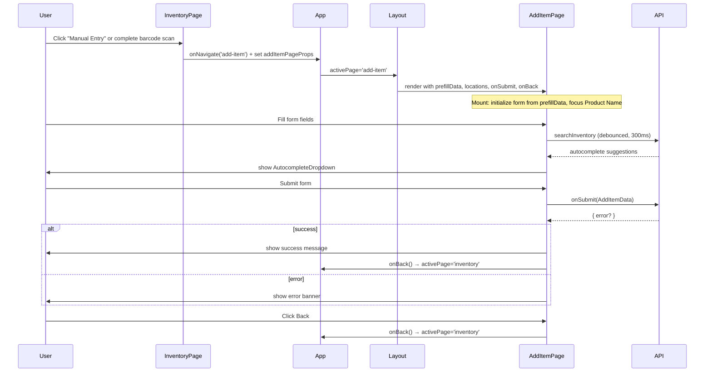
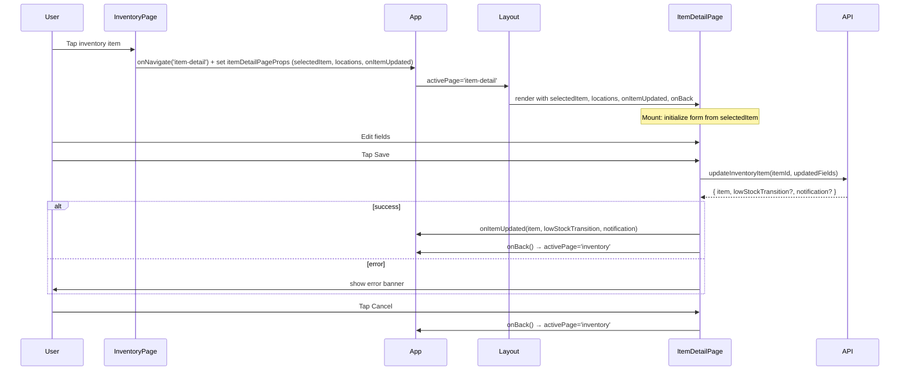

# Design Document: Add Item Page

## Overview

This feature replaces two existing overlay components with dedicated full-page components:

1. `AddItemPage` replaces `AddItemModal` — the form for adding a new inventory item.
2. `ItemDetailPage` replaces `ItemDetailView` — the form for editing an existing inventory item.

The motivation is mobile UX: overlays on small screens are cramped, fight the virtual keyboard, and are hard to scroll. Full pages give forms room to breathe and integrate naturally with the existing state-based routing in `Layout`.

Both pages follow the same pattern: a scrollable form area above a fixed `Action_Bar` at the bottom of the viewport, with a back button in the header. Both are transient `PageId` values — valid routing destinations but not shown in the bottom nav.

The migration is additive: `AddItemModal` and `ItemDetailView` remain in the codebase until their respective page replacements are fully wired in.

## Architecture

### State-Based Routing Extension

The app uses a simple state-based router: `App` holds `activePage: PageId`, passes it to `Layout`, and `Layout` renders the appropriate content. `add-item` is added as a transient page — it is a valid `PageId` but is not a top-level nav destination.

```
App (activePage state)
└── Layout (renders active page, shows bottom nav for top-level pages only)
    ├── InventoryPage  ← sets activePage='add-item' instead of opening modal
    │                    sets activePage='item-detail' instead of rendering ItemDetailView overlay
    ├── AddItemPage    ← new, rendered when activePage='add-item'
    ├── ItemDetailPage ← new, rendered when activePage='item-detail'
    ├── RecipesPage
    ├── MealPlanPage
    └── ShoppingListPage
```

Because `AddItemPage` needs `prefillData`, `locations`, and `onSubmit` — data owned by `InventoryPage` — these are threaded through `App` as shared state alongside `activePage`. When `InventoryPage` triggers navigation to `add-item`, it also sets this shared state. `App` passes it as props to `AddItemPage`.

### Component Architecture

```
AddItemPage
├── Page Header (back button + title)
├── Scrollable Form Content
│   ├── Error/Success Banners
│   ├── Required Fields
│   │   ├── Product Name (+ AutocompleteDropdown)
│   │   ├── Category (+ AutocompleteDropdown)
│   │   ├── Expiration Date
│   │   ├── Storage Location (select)
│   │   ├── Quantity
│   │   └── Unit (select)
│   └── Optional Fields
│       ├── Barcode (+ AutocompleteDropdown + lookup indicator)
│       ├── Brand (+ AutocompleteDropdown)
│       ├── Where to Buy (+ AutocompleteDropdown)
│       ├── Online Store Link (+ AutocompleteDropdown)
│       └── Picture (file input)
└── Action Bar (fixed bottom)
    ├── Cancel / Back button
    └── Submit (Add) button

ItemDetailPage
├── Page Header (item name title)
├── Low Stock Badge (conditional)
├── Item Picture (conditional)
├── Scrollable Form Content
│   ├── Error Banner (API failure)
│   ├── Required Fields
│   │   ├── Product Name
│   │   ├── Category
│   │   ├── Storage Location (select)
│   │   ├── Quantity
│   │   ├── Unit (select)
│   │   └── Expiration Date
│   └── Optional Fields
│       ├── Brand
│       ├── Barcode
│       ├── Where to Buy
│       ├── Online Store Link
│       └── Low-Stock Threshold
└── Action Bar (fixed bottom, 72px)
    ├── Cancel button → onBack()
    └── Save button → updateInventoryItem → onBack()
```

### Data Flow





## Components and Interfaces

### AddItemPage Props

```typescript
// frontend/src/pages/AddItemPage.tsx

export interface AddItemPageProps {
  onBack: () => void;
  onSubmit: (item: AddItemData) => Promise<{ error?: string }>;
  locations: StorageLocation[];
  prefillData?: {
    name?: string;
    brand?: string;
    category?: string;
    barcode?: string;
  };
}
```

`AddItemData` is re-exported from `AddItemModal` (or moved to a shared location) so both components share the same type.

### Layout Changes

`PageId` is extended to include `'add-item'` and `'item-detail'`:

```typescript
// frontend/src/components/Layout.tsx
export type PageId = 'inventory' | 'recipes' | 'meal-plan' | 'shopping-list' | 'add-item' | 'item-detail';
```

`Layout` renders `add-item` and `item-detail` in the main content area but does NOT add either to `NAV_ITEMS`. The bottom nav continues to show only the four top-level destinations.

`Layout` receives the page content as `children` (unchanged). `App` is responsible for rendering the correct page component as children based on `activePage`.

### App Changes

`App` holds additional shared state for the add-item page and item-detail page:

```typescript
interface AddItemPageState {
  prefillData?: { name?: string; brand?: string; category?: string; barcode?: string };
  locations: StorageLocation[];
  onSubmit: (item: AddItemData) => Promise<{ error?: string }>;
}

interface ItemDetailPageState {
  selectedItem: InventoryItem | null;
  locations: StorageLocation[];
  onItemUpdated: (
    updatedItem: InventoryItem,
    lowStockTransition?: boolean,
    notification?: { type: string; message: string; itemId: string },
  ) => void;
}
```

When `activePage === 'add-item'`, `App` renders `AddItemPage` and passes the shared state as props. When `activePage === 'item-detail'`, `App` renders `ItemDetailPage` and passes `selectedItem`, `locations`, and `onItemUpdated` as props. When either page calls `onBack`, `App` sets `activePage` back to `'inventory'`.

### InventoryPage Changes

`InventoryPage` receives `onNavigate: (page: PageId) => void` as a prop (already threaded through `Layout` → `App`). The two places that currently open `AddItemModal` are changed:

- `handleAddMenuSelect('manual')` → calls `onNavigate('add-item')` and sets prefill/submit state
- `handleBarcodeDetected(result)` → calls `onNavigate('add-item')` and sets prefill/submit state

Additionally, the place that currently renders `ItemDetailView` as an overlay is changed:

- Item tap / `handleItemSelect(item)` → calls `onNavigate('item-detail')` and sets `selectedItem` in App shared state

`AddItemModal` and `ItemDetailView` usage in `InventoryPage` are removed once their respective page replacements are wired in.

### AutocompleteDropdown

No changes needed. `AddItemPage` uses the existing `AutocompleteDropdown` component identically to how `AddItemModal` uses it.

### AddItemPage Internal State

Identical to `AddItemModal`'s internal state, minus the modal-specific state (`isOpen`, focus trap):

```typescript
// Form values
const [form, setForm] = useState(INITIAL_FORM);
const [pictureFile, setPictureFile] = useState<File | null>(null);

// Validation
const [errors, setErrors] = useState<FormErrors>({});
const [submitError, setSubmitError] = useState<string | null>(null);
const [successMessage, setSuccessMessage] = useState<string | null>(null);
const [submitting, setSubmitting] = useState(false);

// Autofill
const [prefilledFields, setPrefilledFields] = useState<Set<string>>(new Set());
const [userEditedFields, setUserEditedFields] = useState<Set<string>>(new Set());
const [lookupLoading, setLookupLoading] = useState(false);
const [lookupError, setLookupError] = useState<string | null>(null);
const [lastLookupBarcode, setLastLookupBarcode] = useState<string | null>(null);

// Autocomplete dropdowns (one entry per field)
const [autocompleteDropdowns, setAutocompleteDropdowns] = useState<Record<string, DropdownState>>({...});

// Refs for debounce timers and abort controllers
const debounceTimers = useRef<Record<string, NodeJS.Timeout>>({});
const abortControllers = useRef<Record<string, AbortController>>({});
```

### ItemDetailPage Props

```typescript
// frontend/src/pages/ItemDetailPage.tsx

export interface ItemDetailPageProps {
  item: InventoryItem;
  locations: StorageLocation[];
  onBack: () => void;
  onItemUpdated: (
    updatedItem: InventoryItem,
    lowStockTransition?: boolean,
    notification?: { type: string; message: string; itemId: string },
  ) => void;
}
```

`ItemDetailPage` calls `updateInventoryItem` from `frontend/src/api/inventory` directly (same as `ItemDetailView`). The `onItemUpdated` callback is invoked after a successful save so `App`/`InventoryPage` can update their local state.

### ItemDetailPage Internal State

Mirrors `ItemDetailView`'s internal state, minus the overlay/panel mechanics:

```typescript
// Form values — initialized from item prop on mount
const [editForm, setEditForm] = useState<EditFormState>(initEditForm(item));

// Validation
const [errors, setErrors] = useState<EditFormErrors>({});
const [submitError, setSubmitError] = useState<string | null>(null);
const [saving, setSaving] = useState(false);
```

`EditFormState` and `EditFormErrors` are re-exported from `ItemDetailView` (or moved to `frontend/src/types/`) so both components share the same types. `validateEditForm` and `initEditForm` are likewise shared.

## Data Models

No new data models are introduced. `AddItemPage` uses the same types as `AddItemModal`:

- `AddItemData` — form submission payload (re-exported from `AddItemModal` or moved to `frontend/src/types/`)
- `StorageLocation` — from `frontend/src/api/locations`
- `InventoryItem` — from `frontend/src/components/InventoryList`
- `InventorySearchResponse` / `BarcodeLookupResponse` — from `frontend/src/api/inventory`

`ItemDetailPage` uses the same types as `ItemDetailView`:

- `EditFormState` / `EditFormErrors` — re-exported from `ItemDetailView` (or moved to `frontend/src/types/`)
- `validateEditForm` / `initEditForm` — shared helper functions
- `StorageLocation` — from `frontend/src/api/locations`
- `InventoryItem` — from `frontend/src/components/InventoryList`
- `updateInventoryItem` — from `frontend/src/api/inventory`

### Autofill Highlight Constants

```typescript
const AUTOFILL_STYLES = {
  prefilled: {
    backgroundColor: '#e0f2fe',
    borderColor: '#0284c7',
  },
  userEdited: {
    backgroundColor: '#ffffff',
    borderColor: '#d1d5db',
  },
};
```

### Action Bar Height

The `Action_Bar` height is fixed at `72px`. The scrollable form content area applies `paddingBottom: 72` to ensure no content is obscured when scrolled to the bottom.

## Correctness Properties

*A property is a characteristic or behavior that should hold true across all valid executions of a system — essentially, a formal statement about what the system should do. Properties serve as the bridge between human-readable specifications and machine-verifiable correctness guarantees.*

### Property 1: Validation rejects incomplete required fields

*For any* subset of required fields (name, category, expirationDate, locationId, quantity, unit) left empty, submitting the form SHALL produce a field-level error for each empty field and SHALL NOT call `onSubmit`.

**Validates: Requirements 2.3**

### Property 2: Valid submission passes all entered values to onSubmit

*For any* valid combination of form field values (all required fields non-empty and valid), submitting the form SHALL call `onSubmit` exactly once with an `AddItemData` object whose fields match the entered values.

**Validates: Requirements 2.4**

### Property 3: onSubmit error string appears in banner

*For any* error string returned by `onSubmit`, that exact string SHALL appear in the error banner at the top of the form.

**Validates: Requirements 2.5**

### Property 4: Locations prop populates Storage Location select

*For any* non-empty array of `StorageLocation` objects passed as the `locations` prop, every location SHALL appear as a selectable option in the Storage Location select element.

**Validates: Requirements 2.7**

### Property 5: prefillData initializes fields with autofill highlight

*For any* `prefillData` object with one or more non-empty string fields (name, brand, category, barcode), the corresponding form inputs SHALL be initialized with those values on mount AND each initialized field SHALL have the autofill highlight style applied.

**Validates: Requirements 3.2, 3.3**

### Property 6: Editing a prefilled field removes its autofill highlight

*For any* field initialized from `prefillData`, after the user modifies or clears that field, the autofill highlight style SHALL be removed from that field and SHALL remain on all other still-unedited prefilled fields.

**Validates: Requirements 3.4, 3.5**

### Property 7: Autocomplete search threshold

*For any* autocomplete field and input string, a search request SHALL be triggered if and only if the string length meets the field's minimum threshold (barcode: 3, name: 3, category: 1, brand: 1, whereToBuy: 1, onlineStoreLink: 3).

**Validates: Requirements 4.1, 4.2**

### Property 8: Full autofill populates all available fields

*For any* `InventoryItem` selected from the barcode or name autocomplete dropdown, ALL fields present in the item (name, category, brand, unit, location, whereToBuy, onlineStoreLink, barcode) SHALL be populated in the form, and each populated field SHALL receive the autofill highlight style.

**Validates: Requirements 4.3**

### Property 9: Single autofill sets only the selected field

*For any* value selected from the category, brand, whereToBuy, or onlineStoreLink autocomplete dropdown, ONLY that specific field SHALL change; all other form fields SHALL remain unchanged.

**Validates: Requirements 4.4**

### Property 10: External barcode lookup triggered for 8+ char barcodes with no local results

*For any* barcode string of 8 or more characters that returns zero local autocomplete results, the external barcode lookup API SHALL be called exactly once.

**Validates: Requirements 4.5**

### Property 11: All interactive elements meet 44px touch target

*For any* interactive element rendered by `AddItemPage` (inputs, selects, buttons), its `minHeight` style SHALL be at least 44px.

**Validates: Requirements 5.2**

### Property 12: Required fields have correct ARIA attributes

*For any* required field rendered by `AddItemPage`, it SHALL have `aria-required="true"`. After a failed submission, each field with a validation error SHALL have `aria-invalid="true"`.

**Validates: Requirements 5.5**

### Property 13: ItemDetailPage form initializes from Selected_Item

*For any* `InventoryItem`, when `ItemDetailPage` mounts with that item as the `item` prop, every form field (name, category, locationId, quantity, unit, expirationDate, brand, barcode, whereToBuy, onlineStoreLink, threshold) SHALL be initialized to the corresponding value from the item.

**Validates: Requirements 7.1, 7.2**

### Property 14: ItemDetailPage header reflects item state

*For any* `InventoryItem`, the page header SHALL display the item's name. When `isLowStock` is true the low-stock badge SHALL be present; when `isLowStock` is false the badge SHALL be absent. When `pictureUrl` is non-empty an `` with that `src` SHALL be rendered; when `pictureUrl` is absent no `` SHALL be rendered.

**Validates: Requirements 7.3, 7.4**

### Property 15: ItemDetailPage validation rejects incomplete required fields

*For any* subset of required fields (name, category, expirationDate, locationId, quantity, unit) left empty, activating Save SHALL produce a field-level error for each empty field, SHALL NOT call `updateInventoryItem`, and SHALL set `aria-invalid="true"` on each errored field.

**Validates: Requirements 7.5, 7.10**

### Property 16: ItemDetailPage valid save calls updateInventoryItem with correct values

*For any* valid combination of edited field values, activating Save SHALL call `updateInventoryItem` exactly once with the item's `itemId` and an update payload whose fields match the entered values.

**Validates: Requirements 7.6**

### Property 17: ItemDetailPage save error appears in banner

*For any* error thrown by `updateInventoryItem`, the error message string SHALL appear in the error banner at the top of the form, and `onBack` SHALL NOT be called.

**Validates: Requirements 7.8**

### Property 18: ItemDetailPage Cancel navigates back without saving

*For any* `ItemDetailPage` state (regardless of form edits), activating Cancel SHALL call `onBack` and SHALL NOT call `updateInventoryItem`.

**Validates: Requirements 8.6**

## Error Handling

### Validation Errors
- Client-side validation runs on submit before calling `onSubmit`
- Each required field gets an independent error message rendered adjacent to the field
- `aria-invalid="true"` is set on each errored field
- Errors are cleared per-field as the user types in that field

### Submit Errors
- If `onSubmit` returns `{ error: string }`, the error is shown in a banner at the top of the form
- The banner uses `role="alert"` for screen reader announcement
- The banner is cleared when the user edits any field

### Barcode Lookup Errors
- Network/API failures show an inline error adjacent to the Barcode field
- The error is cleared when the user modifies the barcode field
- Lookup failures are non-blocking — the user can continue filling the form manually

### Autocomplete Errors
- Autocomplete search failures are silent (dropdown simply stays hidden)
- In-flight requests are cancelled via `AbortController` when a new keystroke fires for the same field
- Debounce timers and abort controllers are cleaned up on component unmount

### Navigation / Back
- Clicking Back or the back button calls `onBack()` immediately without validation
- Any in-flight requests are cancelled on unmount (cleanup in `useEffect` return)
- No confirmation dialog is shown before discarding unsaved data (consistent with the rest of the app)

### ItemDetailPage Error Handling

**Validation Errors**
- Client-side validation runs on Save before calling `updateInventoryItem`
- Each required field gets an independent error message rendered adjacent to the field
- `aria-invalid="true"` is set on each errored field
- Errors are cleared per-field as the user types in that field

**Save Errors**
- `updateInventoryItem` is called inside a try/catch
- `TypeError` (network failure) → "Network error — please check your connection and try again"
- Other `Error` instances → `err.message`
- Unknown throws → "An unexpected error occurred"
- The error is shown in a banner with `role="alert"` at the top of the form
- The page does not navigate away on error; the user can correct and retry

**Navigation / Cancel**
- Clicking Cancel calls `onBack()` immediately without validation or confirmation
- The `saving` state disables both Save and Cancel buttons during an in-flight request to prevent double-submission or premature navigation

## Testing Strategy

### Unit Tests (`AddItemPage.test.tsx`)

Focus on specific behaviors, edge cases, and integration points:

- Renders all required and optional field labels
- Populates Storage Location select from `locations` prop
- Initializes fields from `prefillData` on mount
- Focuses Product Name field on mount
- Shows field-level errors on invalid submit
- Does not call `onSubmit` when validation fails
- Calls `onSubmit` with correct data on valid submit
- Shows error banner when `onSubmit` returns an error
- Shows success message and calls `onBack` on successful submit
- Calls `onBack` when back button is clicked without submitting
- Renders Submit and Cancel buttons inside the Action Bar
- Displays "Looking up…" indicator during barcode lookup
- Displays inline error when barcode lookup fails

### Property-Based Tests (`AddItemPage.property.test.tsx`)

Uses `fast-check`. Each test runs a minimum of 100 iterations.

**Property 1 — Validation rejects incomplete required fields**
```
// Feature: add-item-page, Property 1: Validation rejects incomplete required fields
fc.assert(fc.property(
  fc.subarray(['name','category','expirationDate','locationId','quantity','unit'], { minLength: 1 }),
  (emptyFields) => { /* fill all required fields except emptyFields, submit, verify errors */ }
), { numRuns: 100 });
```

**Property 2 — Valid submission passes all entered values to onSubmit**
```
// Feature: add-item-page, Property 2: Valid submission passes all entered values to onSubmit
fc.assert(fc.property(
  fc.record({ name: fc.string({minLength:1}), category: fc.string({minLength:1}), ... }),
  (formData) => { /* fill form, submit, verify onSubmit called with matching data */ }
), { numRuns: 100 });
```

**Property 3 — onSubmit error string appears in banner**
```
// Feature: add-item-page, Property 3: onSubmit error string appears in banner
fc.assert(fc.property(
  fc.string({ minLength: 1 }),
  (errorMsg) => { /* submit with onSubmit returning errorMsg, verify banner contains it */ }
), { numRuns: 100 });
```

**Property 4 — Locations prop populates Storage Location select**
```
// Feature: add-item-page, Property 4: Locations prop populates Storage Location select
fc.assert(fc.property(
  fc.array(fc.record({ locationId: fc.uuid(), name: fc.string({minLength:1}), ... }), { minLength: 1 }),
  (locations) => { /* render with locations, verify each appears as an option */ }
), { numRuns: 100 });
```

**Property 5 — prefillData initializes fields with autofill highlight**
```
// Feature: add-item-page, Property 5: prefillData initializes fields with autofill highlight
fc.assert(fc.property(
  fc.record({ name: fc.option(fc.string({minLength:1})), brand: fc.option(fc.string({minLength:1})), ... }),
  (prefillData) => { /* render with prefillData, verify fields initialized and highlighted */ }
), { numRuns: 100 });
```

**Property 6 — Editing a prefilled field removes its autofill highlight**
```
// Feature: add-item-page, Property 6: Editing a prefilled field removes its autofill highlight
fc.assert(fc.property(
  fc.record({ prefillData: ..., fieldToEdit: fc.constantFrom('name','brand','category','barcode') }),
  ({ prefillData, fieldToEdit }) => { /* render, edit fieldToEdit, verify highlight removed only from that field */ }
), { numRuns: 100 });
```

**Property 7 — Autocomplete search threshold**
```
// Feature: add-item-page, Property 7: Autocomplete search threshold
fc.assert(fc.property(
  fc.record({
    field: fc.constantFrom('barcode','name','category','brand','whereToBuy','onlineStoreLink'),
    input: fc.string({ minLength: 0, maxLength: 20 }),
  }),
  ({ field, input }) => { /* type input into field, verify search called iff length >= threshold */ }
), { numRuns: 100 });
```

**Property 8 — Full autofill populates all available fields**
```
// Feature: add-item-page, Property 8: Full autofill populates all available fields
fc.assert(fc.property(
  fc.record({ name: fc.string({minLength:1}), category: fc.string({minLength:1}), brand: fc.option(fc.string()), ... }),
  (item) => { /* simulate selecting item from name/barcode dropdown, verify all non-empty fields populated */ }
), { numRuns: 100 });
```

**Property 9 — Single autofill sets only the selected field**
```
// Feature: add-item-page, Property 9: Single autofill sets only the selected field
fc.assert(fc.property(
  fc.record({
    field: fc.constantFrom('category','brand','whereToBuy','onlineStoreLink'),
    value: fc.string({ minLength: 1 }),
  }),
  ({ field, value }) => { /* simulate selecting value from single-field dropdown, verify only that field changed */ }
), { numRuns: 100 });
```

**Property 10 — External barcode lookup triggered for 8+ char barcodes with no local results**
```
// Feature: add-item-page, Property 10: External barcode lookup triggered for 8+ char barcodes
fc.assert(fc.property(
  fc.string({ minLength: 8, maxLength: 20 }).filter(s => /^\d+$/.test(s)),
  (barcode) => { /* mock empty local results, type barcode, verify lookupBarcode called */ }
), { numRuns: 100 });
```

**Property 11 — All interactive elements meet 44px touch target**
```
// Feature: add-item-page, Property 11: All interactive elements meet 44px touch target
fc.assert(fc.property(
  fc.array(fc.record({ locationId: fc.uuid(), name: fc.string({minLength:1}) }), { minLength: 1 }),
  (locations) => { /* render with locations, query all inputs/selects/buttons, verify minHeight >= 44 */ }
), { numRuns: 100 });
```

**Property 12 — Required fields have correct ARIA attributes**
```
// Feature: add-item-page, Property 12: Required fields have correct ARIA attributes
fc.assert(fc.property(
  fc.subarray(['name','category','expirationDate','locationId','quantity','unit'], { minLength: 1 }),
  (emptyFields) => { /* submit with emptyFields empty, verify aria-required on all required, aria-invalid on errored */ }
), { numRuns: 100 });
```

### End-to-End Tests (`e2e/add-item-page.spec.ts`)

- Navigate from InventoryPage to AddItemPage via Manual Entry
- Navigate from InventoryPage to AddItemPage after barcode scan (with prefill)
- Complete form submission and verify item appears in inventory
- Back navigation returns to InventoryPage without submitting
- Bottom nav remains visible and functional while on AddItemPage

### Unit Tests (`ItemDetailPage.test.tsx`)

Focus on specific behaviors, edge cases, and integration points:

- Renders all required and optional field labels
- Initializes all fields from the `item` prop on mount
- Populates Storage Location select from `locations` prop
- Shows low-stock badge when `item.isLowStock` is true; hides it when false
- Renders item picture when `item.pictureUrl` is present; omits it when absent
- Shows field-level errors on invalid Save (empty required fields)
- Does not call `updateInventoryItem` when validation fails
- Calls `updateInventoryItem` with correct itemId and payload on valid Save
- Shows error banner when `updateInventoryItem` throws
- Calls `onBack` after successful save
- Calls `onBack` when Cancel is clicked without saving
- Disables Save and Cancel buttons while saving; shows "Saving…" label
- Renders Save and Cancel buttons inside the Action Bar

### Property-Based Tests (`ItemDetailPage.property.test.tsx`)

Uses `fast-check`. Each test runs a minimum of 100 iterations.

**Property 13 — ItemDetailPage form initializes from Selected_Item**
```
// Feature: add-item-page, Property 13: ItemDetailPage form initializes from Selected_Item
fc.assert(fc.property(
  fc.record({ itemId: fc.uuid(), name: fc.string({minLength:1}), category: fc.string({minLength:1}), ... }),
  (item) => { /* render with item, verify each form field has the item's value */ }
), { numRuns: 100 });
```

**Property 14 — ItemDetailPage header reflects item state**
```
// Feature: add-item-page, Property 14: ItemDetailPage header reflects item state
fc.assert(fc.property(
  fc.record({
    isLowStock: fc.boolean(),
    pictureUrl: fc.option(fc.webUrl()),
    name: fc.string({minLength:1}),
    ...
  }),
  (item) => { /* render, verify name in header, badge presence matches isLowStock, img presence matches pictureUrl */ }
), { numRuns: 100 });
```

**Property 15 — ItemDetailPage validation rejects incomplete required fields**
```
// Feature: add-item-page, Property 15: ItemDetailPage validation rejects incomplete required fields
fc.assert(fc.property(
  fc.subarray(['name','category','expirationDate','locationId','quantity','unit'], { minLength: 1 }),
  (emptyFields) => { /* clear emptyFields, click Save, verify errors shown and updateInventoryItem not called */ }
), { numRuns: 100 });
```

**Property 16 — ItemDetailPage valid save calls updateInventoryItem with correct values**
```
// Feature: add-item-page, Property 16: ItemDetailPage valid save calls updateInventoryItem with correct values
fc.assert(fc.property(
  fc.record({ name: fc.string({minLength:1}), category: fc.string({minLength:1}), ... }),
  (formData) => { /* fill form with formData, click Save, verify updateInventoryItem called with matching payload */ }
), { numRuns: 100 });
```

**Property 17 — ItemDetailPage save error appears in banner**
```
// Feature: add-item-page, Property 17: ItemDetailPage save error appears in banner
fc.assert(fc.property(
  fc.string({ minLength: 1 }),
  (errorMsg) => { /* mock updateInventoryItem to throw Error(errorMsg), save, verify banner contains errorMsg */ }
), { numRuns: 100 });
```

**Property 18 — ItemDetailPage Cancel navigates back without saving**
```
// Feature: add-item-page, Property 18: ItemDetailPage Cancel navigates back without saving
fc.assert(fc.property(
  fc.record({ name: fc.string({minLength:1}), ... }),
  (item) => { /* render with item, edit some fields, click Cancel, verify onBack called and updateInventoryItem not called */ }
), { numRuns: 100 });
```

### End-to-End Tests (`e2e/item-detail-page.spec.ts`)

- Navigate from InventoryPage to ItemDetailPage by tapping an inventory item
- All fields are pre-populated with the tapped item's values
- Edit fields and save — verify updated values appear in inventory list
- Save error is shown in banner without navigating away
- Cancel returns to InventoryPage without saving changes
- Bottom nav remains visible and functional while on ItemDetailPage
