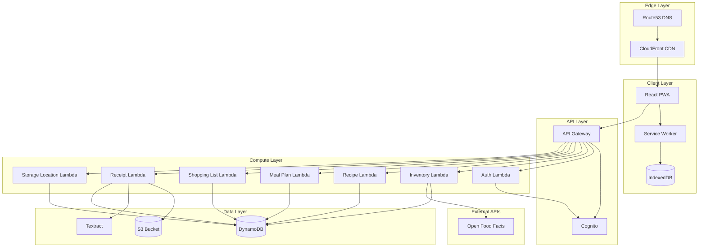
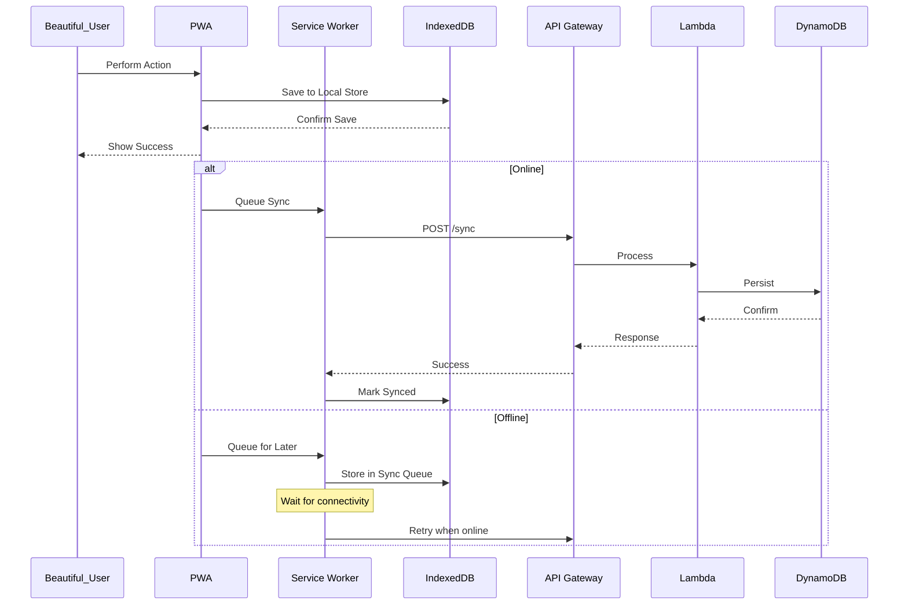
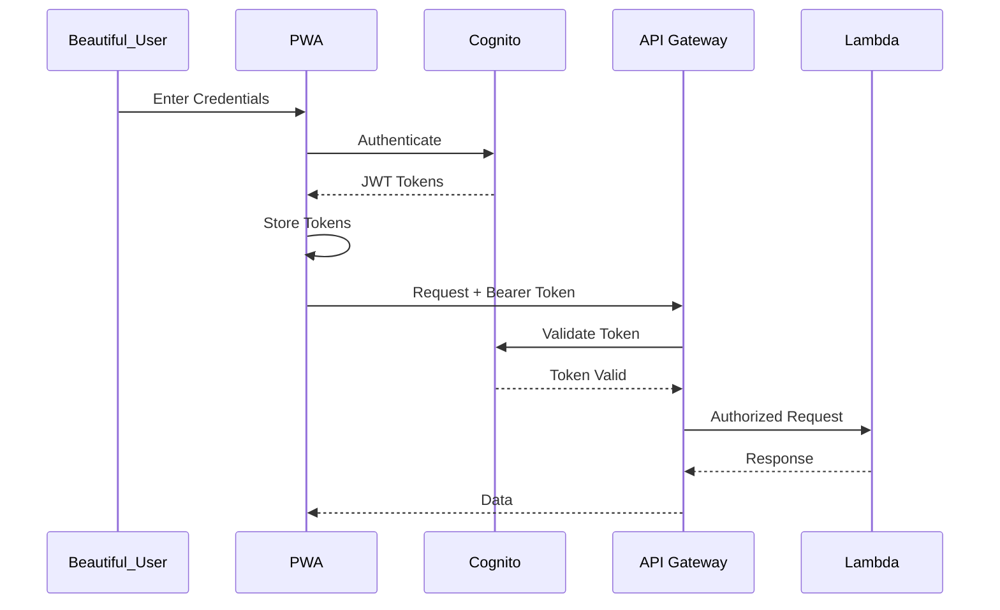

# Technical Design Document: Pantry Tracking App

## Overview

The Pantry Tracking App is an offline-first Progressive Web Application (PWA) that enables a beautiful user to manage household inventory across user-defined storage locations, plan meals, and generate shopping lists. Each beautiful user starts with a default "Pantry" location and can add, rename, and remove locations to match their household setup. The system uses a serverless AWS architecture with React frontend, providing seamless offline functionality through service workers and IndexedDB. The UI is optimized for ease of adding and removing items, with two prominent buttons dominating the main screen.

### Key Design Goals

- **Offline-first**: Full functionality without internet, with automatic sync when online
- **Mobile-optimized**: Touch-friendly PWA installable on smartphones, with prominent Add/Remove buttons
- **Scalable**: Serverless architecture that scales with user demand
- **Secure**: AWS Cognito authentication with per-user data isolation
- **User-Manageable Storage Locations**: Beautiful users can create, rename, and remove storage locations to match their household setup (default: "Pantry")

### Technology Stack

| Layer | Technology |
|-------|------------|
| Frontend | React PWA, Service Workers, IndexedDB |
| API | AWS API Gateway (REST) |
| Compute | AWS Lambda (Node.js) |
| Database | DynamoDB |
| Storage | S3 (receipt photos, item pictures) |
| Auth | AWS Cognito |
| OCR | AWS Textract |
| CDN | CloudFront |
| DNS | Route53 |
| IaC | AWS CDK |

## Architecture

### High-Level Architecture



### Offline-First Data Flow



### Authentication Flow



## Components and Interfaces

### Frontend Components

#### 1. Authentication Module
- **AuthProvider**: React context for auth state management
- **LoginForm**: Email/password and social login UI
- **SignupForm**: New beautiful user registration
- **TokenManager**: JWT token refresh and storage

#### 2. Main UI Module
- **MainScreen**: Displays two prominent Add/Remove buttons dominating the UI
- **AddButton**: Large, touch-friendly button providing quick access to all item entry methods (manual, barcode, receipt)
- **RemoveButton**: Large, touch-friendly button providing quick access to item removal
- **OnlineIndicator**: Shows connection status

#### 3. Inventory Module
- **InventoryList**: Displays all inventory items with filtering/sorting
- **QuickFilterInput**: Text input for real-time filtering by product name
- **CategorySelector**: Dropdown/chip selector for filtering by category
- **LocationFilter**: Filter by storage location using the beautiful user's defined storage locations
- **InventoryItemCard**: Individual item display with quick actions
- **AddItemModal**: Manual item entry form with all fields
- **BarcodeScanner**: Camera-based barcode scanning using QuaggaJS
- **ReceiptUploader**: Photo capture/upload for receipt OCR
- **StorageLocationManager**: UI for managing storage locations (add, rename, remove)
- **LowStockBadge**: Visual indicator for threshold alerts
- **InAppNotification**: Displays low-stock notifications within the app

#### 4. Recipe Module
- **RecipeList**: Recipe collection with search
- **RecipeDetail**: Full recipe view with ingredient availability
- **RecipeEditor**: Create/edit recipe form
- **IngredientAvailability**: Shows inventory match status across all storage locations

#### 5. Meal Planning Module
- **MealCalendar**: Weekly/monthly calendar view
- **MealSlot**: Breakfast/lunch/dinner assignment UI

#### 6. Shopping List Module
- **ShoppingListGenerator**: Date range selector and generation
- **ShoppingList**: Editable shopping list
- **ShoppingItem**: Individual item with quantity

#### 7. Sync Module
- **SyncManager**: Coordinates offline/online sync
- **SyncQueue**: Manages pending operations
- **ConflictResolver**: Handles sync conflicts (last-write-wins)

### Backend Lambda Functions

#### 1. Auth Lambda
```typescript
// POST /auth/verify - Verify Cognito token
interface VerifyRequest {
  token: string;
}
interface VerifyResponse {
  userId: string;
  email: string;
  valid: boolean;
}
```

#### 2. Inventory Lambda
```typescript
// GET /inventory - List all inventory items
interface ListInventoryResponse {
  items: InventoryItem[];
  lastEvaluatedKey?: string;
}

// POST /inventory - Add inventory item
interface AddInventoryRequest {
  name: string;
  category: string;
  expirationDate: string;  // ISO date, required
  locationId: string;  // References a user's StorageLocation ID
  quantity: number;
  unit: string;
  barcode?: string;
  brand?: string;
  whereToBuy?: string;
  onlineStoreLink?: string;
  pictureUrl?: string;
  threshold?: number;
}

// PUT /inventory/{itemId} - Update inventory item
interface UpdateInventoryRequest {
  name?: string;
  category?: string;
  expirationDate?: string;
  locationId?: string;  // References a user's StorageLocation ID
  quantity?: number;
  unit?: string;
  barcode?: string;
  brand?: string;
  whereToBuy?: string;
  onlineStoreLink?: string;
  pictureUrl?: string;
  threshold?: number;
}

// DELETE /inventory/{itemId} - Remove inventory item

// GET /inventory/low-stock - Get items at or below threshold
interface LowStockResponse {
  items: InventoryItem[];
}

// POST /inventory/barcode-lookup - Lookup product by barcode
interface BarcodeLookupRequest {
  barcode: string;
}
interface BarcodeLookupResponse {
  found: boolean;
  product?: ProductInfo;
}
```

#### 3. Recipe Lambda
```typescript
// GET /recipes - List all recipes
// POST /recipes - Create recipe
interface CreateRecipeRequest {
  name: string;
  ingredients: RecipeIngredient[];
  instructions: string;
  sourceUrl?: string;
}

// GET /recipes/{recipeId} - Get recipe with availability
interface RecipeWithAvailability {
  recipe: Recipe;
  ingredientAvailability: IngredientStatus[];
  missingCount: number;
}

// PUT /recipes/{recipeId} - Update recipe
// DELETE /recipes/{recipeId} - Delete recipe
```

#### 5. Meal Plan Lambda
```typescript
// GET /meal-plans?startDate={date}&endDate={date} - Get meal plans
// POST /meal-plans - Create meal assignment
interface CreateMealPlanRequest {
  date: string;       // ISO date
  mealType: 'breakfast' | 'lunch' | 'dinner';
  recipeId: string;
  recipeName: string; // Denormalized for display
}

// PUT /meal-plans/{planId} - Update assignment
// DELETE /meal-plans/{planId} - Remove assignment
```

#### 6. Shopping List Lambda
```typescript
// POST /shopping-list/generate - Generate shopping list
interface GenerateShoppingListRequest {
  startDate: string;
  endDate: string;
}
interface ShoppingListResponse {
  items: ShoppingItem[];
  dateRange: { start: string; end: string };
}

// PUT /shopping-list - Update shopping list (manual edits)
interface UpdateShoppingListRequest {
  items: ShoppingItem[];
}
```

#### 7. Receipt Lambda
```typescript
// POST /receipts/upload - Get presigned URL for upload
interface UploadUrlResponse {
  uploadUrl: string;
  receiptId: string;
}

// POST /receipts/{receiptId}/process - Trigger OCR processing
interface ProcessReceiptResponse {
  status: 'processing' | 'completed' | 'failed';
  items?: ExtractedItem[];
  error?: string;
}

// GET /receipts/{receiptId}/status - Check processing status
```

#### 8. Storage Location Lambda
```typescript
// GET /locations - List user's storage locations
interface ListLocationsResponse {
  locations: StorageLocation[];
}

// POST /locations - Create a new storage location
interface CreateLocationRequest {
  name: string;  // Must be unique per user
}
interface CreateLocationResponse {
  location: StorageLocation;
}

// PUT /locations/{locationId} - Rename a storage location
interface RenameLocationRequest {
  name: string;  // Must be unique per user
}

// DELETE /locations/{locationId} - Remove a storage location
// Returns 400 if location contains inventory items
// Returns 400 if it is the user's last remaining location
```

#### 9. Sync Lambda
```typescript
// POST /sync - Batch sync operations
interface SyncRequest {
  operations: SyncOperation[];
  lastSyncTimestamp: number;
}
interface SyncOperation {
  type: 'create' | 'update' | 'delete';
  entity: 'inventoryItem' | 'recipe' | 'mealPlan' | 'storageLocation';
  data: any;
  clientTimestamp: number;
}
interface SyncResponse {
  applied: SyncResult[];
  conflicts: ConflictResult[];
  serverTimestamp: number;
}
```

### API Gateway Routes

| Method | Path | Lambda | Auth |
|--------|------|--------|------|
| POST | /auth/verify | Auth | No |
| GET | /inventory | Inventory | Yes |
| POST | /inventory | Inventory | Yes |
| PUT | /inventory/{itemId} | Inventory | Yes |
| DELETE | /inventory/{itemId} | Inventory | Yes |
| GET | /inventory/low-stock | Inventory | Yes |
| POST | /inventory/barcode-lookup | Inventory | Yes |
| GET | /recipes | Recipe | Yes |
| POST | /recipes | Recipe | Yes |
| GET | /recipes/{recipeId} | Recipe | Yes |
| PUT | /recipes/{recipeId} | Recipe | Yes |
| DELETE | /recipes/{recipeId} | Recipe | Yes |
| GET | /meal-plans | MealPlan | Yes |
| POST | /meal-plans | MealPlan | Yes |
| PUT | /meal-plans/{planId} | MealPlan | Yes |
| DELETE | /meal-plans/{planId} | MealPlan | Yes |
| POST | /shopping-list/generate | ShoppingList | Yes |
| PUT | /shopping-list | ShoppingList | Yes |
| POST | /receipts/upload | Receipt | Yes |
| POST | /receipts/{receiptId}/process | Receipt | Yes |
| GET | /receipts/{receiptId}/status | Receipt | Yes |
| GET | /locations | StorageLocation | Yes |
| POST | /locations | StorageLocation | Yes |
| PUT | /locations/{locationId} | StorageLocation | Yes |
| DELETE | /locations/{locationId} | StorageLocation | Yes |
| POST | /sync | Sync | Yes |


## Data Models

### DynamoDB Table Design

The application uses a single-table design pattern for efficient querying and reduced costs.

#### Primary Table: `PantryApp`

| Attribute | Type | Description |
|-----------|------|-------------|
| PK | String | Partition Key (e.g., `USER#<userId>`) |
| SK | String | Sort Key (e.g., `ITEM#<itemId>`) |
| GSI1PK | String | GSI1 Partition Key |
| GSI1SK | String | GSI1 Sort Key |
| entityType | String | Entity discriminator |
| data | Map | Entity-specific attributes |
| createdAt | String | ISO timestamp |
| updatedAt | String | ISO timestamp |
| syncVersion | Number | Optimistic locking version |

#### Access Patterns

| Access Pattern | PK | SK | Index |
|----------------|----|----|-------|
| Get beautiful user's inventory items | `USER#<userId>` | `ITEM#` (begins_with) | Main |
| Get single inventory item | `USER#<userId>` | `ITEM#<itemId>` | Main |
| Get beautiful user's recipes | `USER#<userId>` | `RECIPE#` (begins_with) | Main |
| Get single recipe | `USER#<userId>` | `RECIPE#<recipeId>` | Main |
| Get meal plans by date | `USER#<userId>` | `MEAL#<date>#` (begins_with) | Main |
| Get items by category | `USER#<userId>#CAT#<category>` | `ITEM#` | GSI1 |
| Get low-stock items | `USER#<userId>#LOWSTOCK` | `ITEM#<itemId>` | GSI1 |
| Get items by location | `USER#<userId>#LOC#<location>` | `ITEM#<itemId>` | GSI1 |
| Get user's storage locations | `USER#<userId>` | `LOCATION#` (begins_with) | Main |

### Entity Schemas

#### InventoryItem
```typescript
interface InventoryItem {
  PK: string;           // USER#<userId>
  SK: string;           // ITEM#<itemId>
  entityType: 'InventoryItem';
  itemId: string;
  userId: string;
  barcode?: string;
  name: string;
  category: string;
  expirationDate: string;  // ISO date, REQUIRED
  location: string;       // StorageLocation locationId
  quantity: number;
  unit: string;
  brand?: string;
  whereToBuy?: string;
  onlineStoreLink?: string;
  pictureUrl?: string;     // S3 URL for item picture
  threshold?: number;
  isLowStock: boolean;
  createdAt: string;
  updatedAt: string;
  syncVersion: number;
  
  // GSI1 for category queries
  GSI1PK?: string;      // USER#<userId>#CAT#<category> or USER#<userId>#LOC#<location>
  GSI1SK?: string;      // ITEM#<itemId>
}
```

#### StorageLocation
```typescript
interface StorageLocation {
  PK: string;           // USER#<userId>
  SK: string;           // LOCATION#<locationId>
  entityType: 'StorageLocation';
  locationId: string;
  userId: string;
  name: string;         // User-facing display name, unique per user
  createdAt: string;
  updatedAt: string;
  syncVersion: number;
}
```

#### Recipe
```typescript
interface Recipe {
  PK: string;           // USER#<userId>
  SK: string;           // RECIPE#<recipeId>
  entityType: 'Recipe';
  recipeId: string;
  userId: string;
  name: string;
  ingredients: RecipeIngredient[];
  instructions: string;
  sourceUrl?: string;   // Optional link to original recipe page
  createdAt: string;
  updatedAt: string;
  syncVersion: number;
}

interface RecipeIngredient {
  name: string;
  quantity: number;
  unit: string;
  inventoryItemId?: string; // Optional link to inventory item
}
```

#### MealPlan
```typescript
interface MealPlan {
  PK: string;           // USER#<userId>
  SK: string;           // MEAL#<date>#<mealType>#<planId>
  entityType: 'MealPlan';
  planId: string;
  userId: string;
  date: string;         // ISO date (YYYY-MM-DD)
  mealType: 'breakfast' | 'lunch' | 'dinner';
  recipeId: string;
  recipeName: string;   // Denormalized for display
  createdAt: string;
  updatedAt: string;
  syncVersion: number;
}
```

#### Receipt
```typescript
interface Receipt {
  PK: string;           // USER#<userId>
  SK: string;           // RECEIPT#<receiptId>
  entityType: 'Receipt';
  receiptId: string;
  userId: string;
  s3Key: string;
  status: 'uploaded' | 'processing' | 'completed' | 'failed';
  extractedItems?: ExtractedItem[];
  errorMessage?: string;
  createdAt: string;
  updatedAt: string;
}

interface ExtractedItem {
  name: string;
  quantity?: number;
  price?: number;
  confidence: number;
}
```

#### SyncQueue (IndexedDB - Client Side)
```typescript
interface SyncQueueItem {
  id: string;
  operation: 'create' | 'update' | 'delete';
  entityType: 'inventoryItem' | 'recipe' | 'mealPlan' | 'storageLocation';
  entityId: string;
  data: any;
  timestamp: number;
  retryCount: number;
  status: 'pending' | 'syncing' | 'failed';
}
```

### S3 Bucket Structure

```
pantry-app-storage-{env}/
├── receipts/
│   └── {userId}/
│       └── {receiptId}.{jpg|png}
├── inventory-items/
│   └── {userId}/
│       └── {itemId}.{jpg|png}
└── exports/
    └── {userId}/
        └── {exportId}.json
```

### IndexedDB Schema (Client-Side)

```typescript
// Database: PantryAppDB
// Version: 2

interface PantryAppDB {
  inventoryItems: {
    key: string;        // itemId
    value: InventoryItem;
    indexes: {
      byCategory: string;
      byLocation: string;
      byLowStock: boolean;
      byExpirationDate: string;
      bySyncVersion: number;
    };
  };
  recipes: {
    key: string;        // recipeId
    value: Recipe;
    indexes: {
      byName: string;
      bySyncVersion: number;
    };
  };
  mealPlans: {
    key: string;        // planId
    value: MealPlan;
    indexes: {
      byDate: string;
      bySyncVersion: number;
    };
  };
  syncQueue: {
    key: string;        // id
    value: SyncQueueItem;
    indexes: {
      byStatus: string;
      byTimestamp: number;
    };
  };
  storageLocations: {
    key: string;        // locationId
    value: StorageLocation;
    indexes: {
      byName: string;
      bySyncVersion: number;
    };
  };
  metadata: {
    key: string;        // 'lastSync', 'userId', etc.
    value: any;
  };
}
```


## Correctness Properties

*A property is a characteristic or behavior that should hold true across all valid executions of a system—essentially, a formal statement about what the system should do. Properties serve as the bridge between human-readable specifications and machine-verifiable correctness guarantees.*

### Property 1: Item Addition Persistence

*For any* valid inventory item data (name, category, expirationDate, location, quantity, unit), when the item is added to the inventory (via barcode confirmation, manual entry, or receipt confirmation), querying the inventory should return an item with matching data.

**Validates: Requirements 2.6, 3.2, 4.6**

### Property 2: Item Deletion Removes from Inventory

*For any* inventory item that exists in the inventory, when the beautiful user confirms deletion, the item should no longer appear in the inventory item list.

**Validates: Requirements 5.4**

### Property 3: Quantity Update Round-Trip

*For any* inventory item and any valid positive quantity value, updating the item's quantity and then retrieving the item should return the updated quantity value.

**Validates: Requirements 6.1**

### Property 4: Low Stock Threshold Invariant

*For any* inventory item with a defined threshold, the item's `isLowStock` flag should be `true` if and only if `quantity <= threshold`.

**Validates: Requirements 7.2**

### Property 5: Low Stock List Accuracy

*For any* beautiful user's inventory, the low-stock items view should contain exactly the set of items where `isLowStock` is `true`, with no items missing and no extra items included.

**Validates: Requirements 7.3**

### Property 6: Low Stock In-App Notification Trigger

*For any* inventory item that transitions to low-stock status (quantity falls at or below threshold), the system should generate an in-app notification for the beautiful user.

**Validates: Requirements 7.5**

### Property 7: Combined Filter Correctness

*For any* inventory list and any combination of text filter, category filter, and location filter, the filtered results should contain exactly the items that satisfy all active filter criteria simultaneously: name contains the text filter string (case-insensitive), category matches the selected category, and location matches the selected location.

**Validates: Requirements 8.2, 8.3, 8.4, 8.5**

### Property 8: Validation Error for Missing Required Fields

*For any* inventory item submission missing one or more required fields (name, category, expirationDate, location, quantity, or unit), the system should reject the submission and return validation errors indicating which fields are missing.

**Validates: Requirements 3.3**

### Property 9: Image Storage with Reference

*For any* uploaded image (receipt photo or item picture), the image should be stored in S3 and the corresponding DynamoDB record should contain the S3 key reference.

**Validates: Requirements 3.5, 4.1, 17.3**

### Property 10: Recipe CRUD Persistence

*For any* valid recipe data, creating a recipe and then retrieving it should return matching data. Updating a recipe should persist the changes. Deleting a recipe should remove it from the collection.

**Validates: Requirements 10.1, 10.3, 10.4, 10.5**

### Property 11: Recipe Requires Ingredients

*For any* recipe creation or update attempt, if the ingredients list is empty or any ingredient lacks a quantity or unit, the operation should be rejected with a validation error.

**Validates: Requirements 10.2**

### Property 12: Ingredient Availability Calculation

*For any* recipe ingredient and inventory state (across all storage locations), the availability status should be:
- "available" if total inventory quantity >= required quantity
- "partial" if 0 < total inventory quantity < required quantity
- "missing" if total inventory quantity = 0 or ingredient not in inventory

**Validates: Requirements 11.1, 11.2, 11.3**

### Property 13: Missing Ingredient Count Accuracy

*For any* recipe, the total missing ingredient count should equal the number of ingredients with status "partial" or "missing".

**Validates: Requirements 11.4**

### Property 16: Meal Plan CRUD Persistence

*For any* valid meal plan assignment (date, mealType, recipeId, recipeName), creating the assignment should persist all data, and retrieving meal plans for that date should return the assignment. Updating or deleting should reflect accordingly.

**Validates: Requirements 13.2, 13.3, 13.4**

### Property 17: Shopping List Ingredient Aggregation

*For any* date range with meal plans, the generated shopping list should contain the sum of all ingredient quantities from all recipes assigned to meals in that range, aggregated by ingredient name and unit.

**Validates: Requirements 14.2**

### Property 18: Shopping List Inventory Subtraction

*For any* shopping list item, the required quantity should equal max(0, total recipe quantity - available inventory quantity). When inventory quantity >= total required quantity, the ingredient should be excluded from the shopping list entirely.

**Validates: Requirements 14.3, 14.5**

### Property 19: Offline CRUD Operations

*For any* CRUD operation (create, read, update, delete) on inventory items, recipes, or meal plans performed while offline, the operation should succeed locally and the data should be accessible from IndexedDB.

**Validates: Requirements 15.2**

### Property 20: Sync Queue Persistence

*For any* data modification performed while offline, a corresponding sync queue entry should be created with the operation type, entity type, entity data, and timestamp.

**Validates: Requirements 15.3**

### Property 21: Sync on Reconnection

*For any* pending sync queue entries, when connectivity is restored, all queued operations should be sent to the backend and, upon success, removed from the queue.

**Validates: Requirements 15.4**

### Property 22: Conflict Resolution Last-Write-Wins

*For any* sync conflict where the same entity was modified both locally and on the server, the modification with the more recent timestamp should be preserved.

**Validates: Requirements 15.5**

### Property 23: Authentication Scope Isolation

*For any* authenticated beautiful user, API requests should only return data where the `userId` matches the authenticated beautiful user's ID. No cross-user data access should be possible.

**Validates: Requirements 1.2**

### Property 24: Unauthenticated Access Denial

*For any* request to a protected API endpoint without a valid authentication token, the request should be rejected with a 401 Unauthorized response.

**Validates: Requirements 1.4**

### Property 25: Authentication Failure Error Display

*For any* authentication attempt that fails (invalid credentials, expired token, network error), an error message describing the failure reason should be returned/displayed.

**Validates: Requirements 1.3**

### Property 26: Threshold Setting Persistence

*For any* inventory item and valid threshold value, setting the threshold and retrieving the item should return the set threshold value.

**Validates: Requirements 7.1**

### Optional Property 27: Amazon Cart Link Generation

*For any* set of selected low-stock items (when web store integration is enabled), the generated Amazon cart link should contain product identifiers for all selected items.

**Validates: Optional Requirements 1.2**

### Optional Property 28: Push Notification Trigger

*For any* inventory item that transitions to low-stock status (when push notifications are enabled), a push notification should be triggered according to the beautiful user's configured preferences.

**Validates: Optional Requirements 2.2**

### Optional Property 29: Recipe URL Extraction

*For any* valid recipe URL from a supported website (when recipe import is enabled), the extraction should return structured data containing recipe name, ingredients list, and instructions.

**Validates: Optional Requirements 3.2**

### Property 30: Storage Location Add with Uniqueness

*For any* beautiful user and any location name, adding a storage location should succeed if and only if no existing location for that user has the same name (case-insensitive). When the add succeeds, the location should appear in the user's location list.

**Validates: Requirements 18.2, 18.7**

### Property 31: Storage Location Removal Guard

*For any* beautiful user and any storage location, removing the location should succeed if and only if the location contains no inventory items AND it is not the user's last remaining location. When removal is rejected, the location should remain unchanged in the user's list.

**Validates: Requirements 18.4, 18.5, 18.6**

### Property 32: Storage Location Rename Round-Trip

*For any* existing storage location and any new unique name, renaming the location and then retrieving it should return the updated name.

**Validates: Requirements 18.3**

### Property 33: Storage Location Creation Order

*For any* sequence of storage locations created by a beautiful user, retrieving the location list should return them in the order they were created.

**Validates: Requirements 18.8**


## Error Handling

### Frontend Error Handling

#### Network Errors
- **Offline Detection**: Service worker detects network unavailability and switches to offline mode
- **Retry Logic**: Failed API calls are queued with exponential backoff (1s, 2s, 4s, 8s, max 30s)
- **User Feedback**: Toast notifications indicate offline status and pending sync count

#### Validation Errors
- **Form Validation**: Client-side validation before submission with inline error messages for all required fields (name, category, expirationDate, location, quantity, unit)
- **API Validation Errors**: Display field-specific errors returned from backend (400 responses)
- **Format**: `{ field: string, message: string }[]`
- **Storage Location Errors**: Display inline errors for duplicate location names, non-empty location removal, and last-location removal attempts

#### Authentication Errors
- **Token Expiry**: Automatic token refresh via Cognito; redirect to login if refresh fails
- **Invalid Credentials**: Display error message from Cognito with retry option
- **Session Timeout**: Prompt re-authentication with preserved navigation state

#### Camera/Hardware Errors
- **Permission Denied**: Display instructions to enable camera permissions
- **Camera Unavailable**: Offer manual entry as fallback
- **Barcode Scan Failure**: Timeout after 30s with option to retry or enter manually

### Backend Error Handling

#### Lambda Error Responses

```typescript
interface ErrorResponse {
  statusCode: number;
  body: {
    error: string;
    message: string;
    details?: any;
    requestId: string;
  };
}

const ErrorCodes = {
  VALIDATION_ERROR: 400,
  UNAUTHORIZED: 401,
  FORBIDDEN: 403,
  NOT_FOUND: 404,
  CONFLICT: 409,
  RATE_LIMITED: 429,
  INTERNAL_ERROR: 500,
  SERVICE_UNAVAILABLE: 503,
};
```

#### DynamoDB Errors
- **ConditionalCheckFailed**: Return 409 Conflict for optimistic locking failures
- **ProvisionedThroughputExceeded**: Return 429 with retry-after header
- **ValidationException**: Return 400 with field details

#### S3 Errors
- **NoSuchKey**: Return 404 for missing receipts/images
- **AccessDenied**: Return 403 with re-authentication prompt
- **Upload Failures**: Return presigned URL error with retry option

#### Textract Errors
- **InvalidS3ObjectException**: Return 400 with message about image format
- **UnsupportedDocumentException**: Return 400 suggesting clearer photo
- **Throttling**: Queue for retry with exponential backoff

#### External API Errors (Open Food Facts)
- **Rate Limiting**: Cache responses, implement request queuing
- **Service Unavailable**: Return partial data with warning, allow manual entry
- **Not Found**: Return empty result, prompt manual entry

### Sync Conflict Resolution

```typescript
interface ConflictResolution {
  strategy: 'last-write-wins';
  
  resolve(local: SyncOperation, server: Entity): Entity {
    if (local.clientTimestamp > server.updatedAt) {
      return applyOperation(server, local);
    }
    return server; // Server wins
  }
}
```

### Error Logging

- **Client-Side**: Errors logged to console in development; sent to CloudWatch via API in production
- **Server-Side**: All errors logged to CloudWatch with request ID, user ID (hashed), and stack trace
- **Alerting**: CloudWatch alarms for error rate > 1% or 5xx responses > 10/minute

## Testing Strategy

### Testing Approach

This application uses a dual testing approach combining unit tests for specific examples and edge cases with property-based tests for universal correctness guarantees.

### Unit Testing

**Framework**: Jest (frontend and backend)

**Focus Areas**:
- Component rendering and user interactions
- API endpoint request/response handling
- Edge cases (empty inputs, boundary values, zero quantity prompts, error states)
- Integration points (Cognito, S3, Textract mocks)

**Example Test Cases**:
- Login form displays error on invalid credentials
- Barcode scanner falls back to manual entry on failure
- Receipt OCR shows extracted items for review
- Calendar displays meal assignments correctly
- Shopping list excludes fully-stocked items
- Filter input filters items by name in real-time
- Category selector filters items by category
- Location filter shows only items at selected location
- Add button provides access to manual, barcode, and receipt entry methods
- Remove button presents quick item selection interface
- Default "Pantry" location is created for new user accounts
- Adding a location with a duplicate name shows validation error
- Removing a location with items shows error message
- Removing the last remaining location is prevented
- Renaming a location persists the new name

### Property-Based Testing

**Framework**: fast-check (JavaScript/TypeScript)

**Configuration**:
- Minimum 100 iterations per property test
- Seed logging for reproducibility
- Shrinking enabled for minimal failing examples
- Each correctness property MUST be implemented by a SINGLE property-based test
- Each test MUST be tagged with: **Feature: pantry-tracking-app, Property {number}: {property_text}**

**Property Test Implementation Pattern**:

```typescript
import fc from 'fast-check';

// Feature: pantry-tracking-app, Property 4: Low Stock Threshold Invariant
describe('Low Stock Threshold Invariant', () => {
  it('isLowStock flag equals quantity <= threshold for all items', () => {
    fc.assert(
      fc.property(
        fc.record({
          quantity: fc.integer({ min: 0, max: 1000 }),
          threshold: fc.integer({ min: 0, max: 100 }),
        }),
        ({ quantity, threshold }) => {
          const item = createInventoryItem({ quantity, threshold });
          const expectedLowStock = quantity <= threshold;
          return item.isLowStock === expectedLowStock;
        }
      ),
      { numRuns: 100 }
    );
  });
});

// Feature: pantry-tracking-app, Property 7: Combined Filter Correctness
describe('Combined Filter Correctness', () => {
  it('filtered results satisfy all active filter criteria', () => {
    fc.assert(
      fc.property(
        fc.array(arbitraryInventoryItem(), { minLength: 0, maxLength: 50 }),
        fc.option(fc.string({ minLength: 1, maxLength: 20 })),
        fc.option(fc.constantFrom('dairy', 'produce', 'meat', 'pantry', 'frozen', 'beverages')),
        fc.option(fc.string({ minLength: 1, maxLength: 30 })),  // location filter (user-defined)
        (items, textFilter, categoryFilter, locationFilter) => {
          const results = applyFilters(items, { text: textFilter, category: categoryFilter, location: locationFilter });
          return results.every(item => {
            const matchesText = !textFilter || item.name.toLowerCase().includes(textFilter.toLowerCase());
            const matchesCategory = !categoryFilter || item.category === categoryFilter;
            const matchesLocation = !locationFilter || item.location === locationFilter;
            return matchesText && matchesCategory && matchesLocation;
          });
        }
      ),
      { numRuns: 100 }
    );
  });
});

// Feature: pantry-tracking-app, Property 12: Ingredient Availability Calculation
describe('Ingredient Availability Calculation', () => {
  it('availability status correctly reflects inventory vs required quantity', () => {
    fc.assert(
      fc.property(
        fc.integer({ min: 0, max: 100 }), // inventory quantity
        fc.integer({ min: 1, max: 100 }), // required quantity
        (inventoryQty, requiredQty) => {
          const status = calculateAvailability(inventoryQty, requiredQty);
          if (inventoryQty >= requiredQty) return status === 'available';
          if (inventoryQty > 0) return status === 'partial';
          return status === 'missing';
        }
      ),
      { numRuns: 100 }
    );
  });
});

// Feature: pantry-tracking-app, Property 17: Shopping List Ingredient Aggregation
describe('Shopping List Aggregation', () => {
  it('aggregates all recipe ingredients across meal plans', () => {
    fc.assert(
      fc.property(
        fc.array(arbitraryMealPlan(), { minLength: 1, maxLength: 10 }),
        (mealPlans) => {
          const shoppingList = generateShoppingList(mealPlans, {});
          const expectedTotals = manuallyAggregateIngredients(mealPlans);
          return shoppingListMatchesExpected(shoppingList, expectedTotals);
        }
      ),
      { numRuns: 100 }
    );
  });
});
```

### Test Data Generators (Arbitraries)

```typescript
// Inventory Item Generator
const arbitraryInventoryItem = () => fc.record({
  name: fc.string({ minLength: 1, maxLength: 100 }),
  category: fc.constantFrom('dairy', 'produce', 'meat', 'pantry', 'frozen', 'beverages'),
  expirationDate: fc.date({ min: new Date('2024-01-01'), max: new Date('2026-12-31') })
    .map(d => d.toISOString().split('T')[0]),
  location: fc.string({ minLength: 1, maxLength: 30 }),  // User-defined storage location ID
  quantity: fc.integer({ min: 0, max: 10000 }),
  unit: fc.constantFrom('g', 'kg', 'ml', 'L', 'oz', 'lb', 'count'),
  barcode: fc.option(fc.stringMatching(/^[0-9]{8,13}$/)),
  brand: fc.option(fc.string({ minLength: 1, maxLength: 50 })),
  threshold: fc.option(fc.integer({ min: 0, max: 100 })),
});

// Recipe Ingredient Generator
const arbitraryIngredient = () => fc.record({
  name: fc.string({ minLength: 1, maxLength: 50 }),
  quantity: fc.float({ min: 0.1, max: 1000 }),
  unit: fc.constantFrom('g', 'kg', 'ml', 'L', 'cup', 'tbsp', 'tsp', 'count'),
});

// Recipe Generator
const arbitraryRecipe = () => fc.record({
  name: fc.string({ minLength: 1, maxLength: 100 }),
  ingredients: fc.array(arbitraryIngredient(), { minLength: 1, maxLength: 20 }),
  instructions: fc.string({ minLength: 10, maxLength: 5000 }),
  sourceUrl: fc.option(fc.webUrl()),
});

// Meal Plan Generator
const arbitraryMealPlan = () => fc.record({
  date: fc.date({ min: new Date('2024-01-01'), max: new Date('2025-12-31') })
    .map(d => d.toISOString().split('T')[0]),
  mealType: fc.constantFrom('breakfast', 'lunch', 'dinner'),
  recipeId: fc.uuid(),
  recipeName: fc.string({ minLength: 1, maxLength: 100 }),
});

// Storage Location Generator
const arbitraryStorageLocation = () => fc.record({
  locationId: fc.uuid(),
  name: fc.string({ minLength: 1, maxLength: 50 }),
  createdAt: fc.date({ min: new Date('2024-01-01'), max: new Date('2026-12-31') })
    .map(d => d.toISOString()),
});

// Unique Location Name List Generator (for testing ordering and uniqueness)
const arbitraryUniqueLocationNames = () =>
  fc.uniqueArray(fc.string({ minLength: 1, maxLength: 50 }), {
    minLength: 1,
    maxLength: 10,
    comparator: (a, b) => a.toLowerCase() === b.toLowerCase(),
  });
```

### Test Coverage Requirements

| Area | Unit Test Coverage | Property Tests |
|------|-------------------|----------------|
| Inventory CRUD | 80% | Properties 1-3, 8, 9, 26 |
| Low Stock | 80% | Properties 4-6 |
| Filtering | 80% | Property 7 |
| Recipe Management | 80% | Properties 10-13 |
| Meal Planning | 80% | Property 16 |
| Shopping List | 80% | Properties 17-18 |
| Offline/Sync | 70% | Properties 19-22 |
| Authentication | 80% | Properties 23-25 |
| Storage Location Management | 80% | Properties 30-33 |
| Optional Features | 60% | Properties 27-29 |

### Integration Testing

**Approach**: Test API endpoints with mocked AWS services

**Tools**:
- aws-sdk-mock for DynamoDB, S3, Cognito, Textract
- supertest for API endpoint testing
- LocalStack for local AWS service emulation (optional)

### End-to-End Testing

**Framework**: Playwright

**Critical User Flows**:
1. Sign up → Add item via barcode → View inventory
2. Add item manually with all fields → Verify in list with filters
3. Create recipe → Plan meal → Generate shopping list
4. Offline add item → Go online → Verify sync
5. Upload receipt → Review extracted items → Confirm add
6. Set threshold → Reduce quantity → Verify low-stock notification

### CI/CD Pipeline Testing

```yaml
# GitHub Actions workflow
test:
  - npm run test:unit        # Jest unit tests
  - npm run test:property    # fast-check property tests
  - npm run test:integration # API integration tests
  - npm run test:e2e         # Playwright E2E tests
  - npm run lint
  - npm run type-check
```
