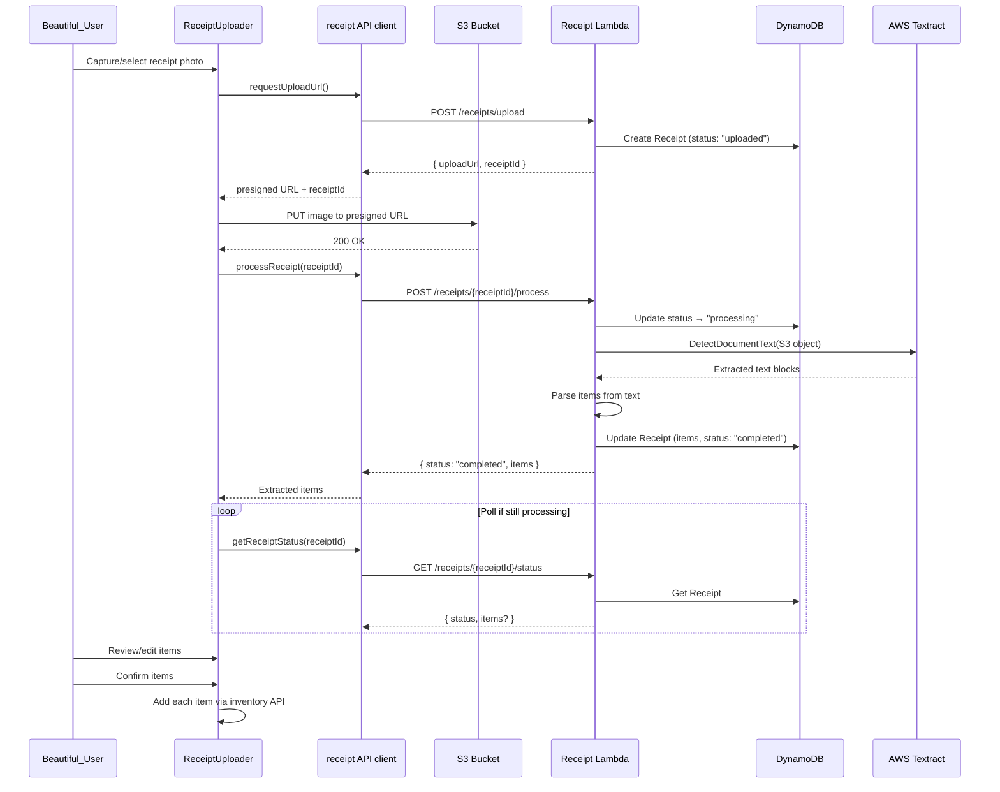
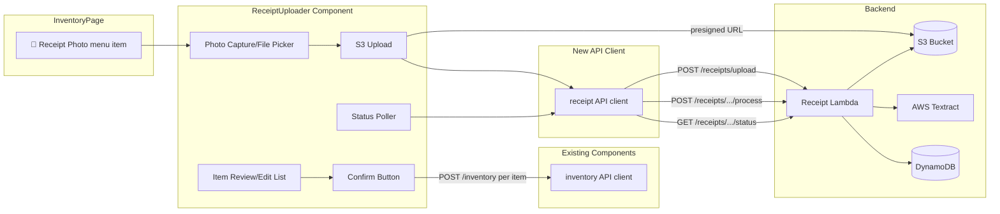

# Technical Design Document: Receipt OCR

## Overview

This feature adds receipt OCR to the Pantry Tracking App, allowing users to photograph supermarket receipts and automatically extract item data using AWS Textract. The feature spans three layers: a frontend ReceiptUploader component for photo capture/upload and item review, a new Receipt Lambda for presigned URL generation and Textract orchestration, and CDK infrastructure additions for the Lambda and API Gateway routes.

The flow is: user captures/uploads a receipt image → image is uploaded to S3 via presigned URL → Textract extracts text → backend parses item names and quantities → user reviews, edits, and confirms extracted items → confirmed items are added to inventory via the existing inventory API.

Data models (Receipt, ExtractedItem) and API contracts (receipt routes, request/response interfaces) are defined in `.kiro/steering/data-model.md`.

### Key Design Decisions

- **Presigned URL upload** — the frontend uploads directly to S3 using a presigned PUT URL, avoiding Lambda payload size limits and reducing latency
- **Synchronous Textract** — uses `DetectDocumentText` (synchronous API) since receipts are single-page documents; avoids the complexity of async Textract jobs with SNS notifications
- **New Receipt Lambda** — separate from the Inventory Lambda to isolate Textract permissions and keep handler responsibilities focused
- **Polling for status** — the frontend polls `GET /receipts/{receiptId}/status` at 2-second intervals while processing, with a maximum of 30 polls (60 seconds timeout)
- **Line-based text parsing** — Textract returns LINE blocks; the parser identifies item lines by matching patterns like "item name + quantity/price" and filters out subtotals, tax lines, and store headers
- **Review before add** — extracted items are presented for user review/editing before being added to inventory, ensuring data quality

### Technology Choices

| Concern | Choice | Rationale |
|---------|--------|-----------|
| OCR | AWS Textract `DetectDocumentText` | Managed service, good accuracy on printed receipts, synchronous for single pages |
| Image upload | S3 presigned PUT URL | Direct browser-to-S3 upload, no Lambda payload limits |
| Status polling | 2s interval, max 30 polls | Balances responsiveness with API cost; Textract typically completes in 3-10s |
| Text parsing | Custom line-based parser | Receipt formats vary; a heuristic parser with confidence scoring is more flexible than rigid templates |
| Frontend testing | Jest + @testing-library/react + fast-check | Matches existing test stack |
| Backend testing | Jest + fast-check | Matches existing test stack |

## Architecture

### Receipt Upload and Processing Flow



### Component Integration



## Components and Interfaces

### Frontend Components

#### ReceiptUploader

New component at `frontend/src/components/ReceiptUploader.tsx`.

```typescript
interface ReceiptUploaderProps {
  isOpen: boolean;
  onClose: () => void;
  onItemsConfirmed: (count: number) => void;
  locations: StorageLocation[];
}

interface ReviewItem {
  name: string;
  quantity: number;
  confidence: number;
  excluded: boolean;       // user can remove items from the list
  locationId: string;      // user picks location per item or bulk
  category: string;        // user fills in category
  expirationDate: string;  // user fills in expiration date
  unit: string;            // defaults to 'Unit'
}
```

Responsibilities:
- Renders a modal overlay with step-based UI: (1) Capture, (2) Processing, (3) Review
- **Capture step**: Shows file input accepting `image/*` with `capture="environment"` for mobile camera. Displays image preview after selection.
- **Processing step**: Calls `requestUploadUrl()`, uploads image to S3 via presigned URL, calls `processReceipt()`, polls status at 2s intervals. Shows a spinner/progress indicator.
- **Review step**: Displays extracted items in an editable list. Each item shows name (editable), quantity (editable), confidence badge, and a remove button. User can add manual items. Bulk location/category/expiration selectors at the top apply defaults to all items.
- **Confirm**: Iterates over non-excluded items, calls `addInventoryItem()` for each. Shows success count or per-item error indicators.
- Offers "Retry" and "Enter Manually" fallback when processing fails.

#### InventoryPage Changes

The existing `InventoryPage` already has a "🧾 Receipt Photo" menu item in the add menu. Wire it to open the ReceiptUploader:

```typescript
// New state
const [receiptUploaderOpen, setReceiptUploaderOpen] = useState(false);

// In handleAddMenuSelect:
if (method === 'receipt') {
  setReceiptUploaderOpen(true);
}

// Callback when items are confirmed
const handleReceiptItemsConfirmed = (count: number) => {
  setReceiptUploaderOpen(false);
  loadInventory(); // refresh list
  // show notification: `${count} items added from receipt`
};
```

### Backend: Receipt Lambda

New Lambda handler at `backend/src/handlers/receipt.ts`.

```typescript
// POST /receipts/upload
async function createUploadUrl(userId: string): Promise<APIGatewayProxyResult> {
  // 1. Generate receiptId (uuid)
  // 2. Build s3Key: `receipts/${userId}/${receiptId}.jpg`
  // 3. Generate presigned PUT URL (5 min expiry, content-type image/*)
  // 4. Create Receipt entity in DynamoDB with status "uploaded"
  // 5. Return { uploadUrl, receiptId }
}

// POST /receipts/{receiptId}/process
async function processReceipt(
  userId: string,
  receiptId: string,
): Promise<APIGatewayProxyResult> {
  // 1. Fetch Receipt from DynamoDB, verify ownership
  // 2. Update status to "processing"
  // 3. Call Textract DetectDocumentText with S3 object
  // 4. Parse LINE blocks into ExtractedItem[]
  // 5. Update Receipt with items and status "completed"
  // 6. Return { status, items }
  // On error: update status to "failed" with errorMessage
}

// GET /receipts/{receiptId}/status
async function getReceiptStatus(
  userId: string,
  receiptId: string,
): Promise<APIGatewayProxyResult> {
  // 1. Fetch Receipt from DynamoDB, verify ownership
  // 2. Return { status, items?, errorMessage? }
}
```

#### Receipt Text Parser

Internal module for parsing Textract output into structured items:

```typescript
interface TextractBlock {
  BlockType: string;
  Text?: string;
  Confidence?: number;
}

function parseReceiptLines(blocks: TextractBlock[]): ExtractedItem[] {
  // 1. Filter to LINE blocks only
  // 2. For each line, attempt to match item patterns:
  //    - "Item Name    $X.XX" → name + price
  //    - "Item Name  Qty X  $X.XX" → name + quantity + price
  //    - "2x Item Name  $X.XX" → quantity + name + price
  // 3. Filter out non-item lines (subtotal, tax, total, store name, date, etc.)
  //    using keyword blocklist: ['subtotal', 'total', 'tax', 'change', 'cash', 'card', 'visa', 'mastercard', etc.]
  // 4. Default quantity to 1 when not detected
  // 5. Assign confidence from Textract block confidence
  // 6. Return ExtractedItem[]
}
```

### API Client

New file at `frontend/src/api/receipts.ts`:

```typescript
export async function requestUploadUrl(): Promise<{ uploadUrl: string; receiptId: string }> {
  const headers = await getAuthHeaders();
  const res = await fetch(`${API_URL}/receipts/upload`, { method: 'POST', headers });
  if (!res.ok) throw new Error('Failed to get upload URL');
  return res.json();
}

export async function uploadReceiptImage(uploadUrl: string, file: File): Promise<void> {
  const res = await fetch(uploadUrl, {
    method: 'PUT',
    headers: { 'Content-Type': file.type },
    body: file,
  });
  if (!res.ok) throw new Error('Failed to upload receipt image');
}

export async function processReceipt(receiptId: string): Promise<ProcessReceiptResponse> {
  const headers = await getAuthHeaders();
  const res = await fetch(`${API_URL}/receipts/${receiptId}/process`, {
    method: 'POST',
    headers,
  });
  if (!res.ok) throw new Error('Failed to start receipt processing');
  return res.json();
}

export async function getReceiptStatus(receiptId: string): Promise<{
  status: 'uploaded' | 'processing' | 'completed' | 'failed';
  items?: ExtractedItem[];
  errorMessage?: string;
}> {
  const headers = await getAuthHeaders();
  const res = await fetch(`${API_URL}/receipts/${receiptId}/status`, { headers });
  if (!res.ok) throw new Error('Failed to get receipt status');
  return res.json();
}
```

### Infrastructure Changes

Additions to `infrastructure/src/pantry-stack.ts`:

```typescript
// ─── Receipt Lambda ─────────────────────────────────────────────
const receiptLambda = new NodejsFunction(this, 'ReceiptLambda', {
  functionName: 'PantryReceiptFunction',
  runtime: lambda.Runtime.NODEJS_18_X,
  handler: 'handler',
  entry: path.join(__dirname, '../../backend/src/handlers/receipt.ts'),
  environment: {
    TABLE_NAME: this.table.tableName,
    STORAGE_BUCKET: this.storageBucket.bucketName,
  },
  timeout: cdk.Duration.seconds(30),  // Textract can take several seconds
  memorySize: 512,
});

this.table.grantReadWriteData(receiptLambda);
this.storageBucket.grantReadWrite(receiptLambda);

// Textract permissions
receiptLambda.addToRolePolicy(new iam.PolicyStatement({
  actions: ['textract:DetectDocumentText'],
  resources: ['*'],
}));

// API Gateway: /receipts routes (authenticated)
const receiptsResource = this.api.root.addResource('receipts');
const receiptIntegration = new apigateway.LambdaIntegration(receiptLambda);

receiptsResource.addMethod('POST', receiptIntegration, authMethodOptions);  // upload

const receiptIdResource = receiptsResource.addResource('{receiptId}');
const processResource = receiptIdResource.addResource('process');
processResource.addMethod('POST', receiptIntegration, authMethodOptions);

const statusResource = receiptIdResource.addResource('status');
statusResource.addMethod('GET', receiptIntegration, authMethodOptions);
```

## Data Models

This feature uses existing data models defined in the [data-model steering file](../../steering/data-model.md). No new DynamoDB entities are introduced beyond what is already defined there.

### Referenced Models

- **Receipt**: DynamoDB entity with PK `USER#<userId>`, SK `RECEIPT#<receiptId>`, tracking status through `uploaded → processing → completed | failed`, with `extractedItems` array and optional `errorMessage`.
- **ExtractedItem**: Structured object with `name`, optional `quantity`, optional `price`, and `confidence` score.
- **UploadUrlResponse**: `{ uploadUrl: string; receiptId: string }` returned by `POST /receipts/upload`.
- **ProcessReceiptResponse**: `{ status, items?, error? }` returned by `POST /receipts/{receiptId}/process`.

### S3 Storage Path

Receipt images are stored at `receipts/{userId}/{receiptId}.{jpg|png}` in the existing `pantry-app-storage` S3 bucket, as defined in the data-model steering file.

### Frontend ReviewItem (Component-Local)

The `ReviewItem` interface (defined in the ReceiptUploader component section above) is local to the frontend review UI and not persisted. It extends `ExtractedItem` with user-editable fields (`excluded`, `locationId`, `category`, `expirationDate`, `unit`) needed for the review-before-add flow.


## Correctness Properties

*A property is a characteristic or behavior that should hold true across all valid executions of a system — essentially, a formal statement about what the system should do. Properties serve as the bridge between human-readable specifications and machine-verifiable correctness guarantees.*

### Property 1: Upload Creates Receipt with Correct S3 Key

*For any* authenticated user, when `POST /receipts/upload` is called, the response should contain a valid presigned URL and a receiptId, and a Receipt entity should exist in DynamoDB with status `"uploaded"` and an s3Key matching the pattern `receipts/{userId}/{receiptId}.jpg`.

**Validates: Requirements 1.1, 1.2, 1.3**

### Property 2: Receipt Processing Lifecycle

*For any* Receipt entity with status `"uploaded"` and a valid S3 image, when processing is triggered via `POST /receipts/{receiptId}/process`, the Receipt status should transition to `"processing"` and then to `"completed"`, and the completed Receipt should contain a non-null `extractedItems` array.

**Validates: Requirements 2.2, 2.4**

### Property 3: Receipt Text Parser Extracts Items from LINE Blocks

*For any* set of Textract LINE blocks containing text that matches item patterns (e.g., "Item Name $X.XX" or "Qty x Item Name $X.XX"), the parser should return an ExtractedItem for each matching line with a non-empty `name` and a `confidence` score between 0 and 100. Lines matching the non-item keyword blocklist (subtotal, total, tax, etc.) should be excluded from the result.

**Validates: Requirements 2.3**

### Property 4: Processing Failure Sets Error State

*For any* Receipt where Textract fails or returns no usable text, the Receipt entity status should be updated to `"failed"` and the `errorMessage` field should contain a non-empty descriptive string.

**Validates: Requirements 2.5**

### Property 5: Extracted Items Display All Required Fields

*For any* list of ExtractedItems, the rendered review UI should display each item's name, quantity, and confidence score. The rendered output for each item should contain all three pieces of information.

**Validates: Requirements 4.1**

### Property 6: Review List Add and Remove

*For any* review item list of length N, removing an item should produce a list of length N-1 that does not contain the removed item. Adding a manually entered item should produce a list of length N+1 that contains the new item.

**Validates: Requirements 4.3, 4.4**

### Property 7: Confirm Adds Exactly Non-Excluded Items

*For any* review item list where some items are marked as excluded, confirming the list should result in exactly `count(non-excluded items)` calls to the inventory API, and the success message should display that same count.

**Validates: Requirements 5.1, 5.2**

## Error Handling

### Frontend Error Handling

| Error Condition | Behavior | User Experience |
|----------------|----------|-----------------|
| Presigned URL request fails | `requestUploadUrl()` throws | Display error message "Failed to prepare upload. Please try again." with retry button |
| S3 upload fails (network error, timeout) | `uploadReceiptImage()` throws | Display error message "Upload failed. Please check your connection and try again." with retry button that requests a new presigned URL |
| S3 upload fails (403 expired URL) | Presigned URL expired (5 min TTL) | Request a new presigned URL automatically and retry the upload once |
| Processing request fails | `processReceipt()` throws | Display error message with retry button |
| Polling timeout (60s) | Max 30 polls reached without terminal status | Stop polling, display "Processing is taking longer than expected" with retry option |
| Status returns "failed" | Receipt entity has `errorMessage` | Display the error message from the backend, offer "Retry" and "Enter Manually" buttons |
| Individual item add fails during confirm | `addInventoryItem()` throws for specific items | Mark failed items with error indicator, show count of successful/failed, offer retry for failed items only |
| All items fail during confirm | Every `addInventoryItem()` call fails | Display "Failed to add items" error with retry button for all items |
| File too large | File size check before upload (>10MB) | Display "Image is too large. Please use a smaller image." before attempting upload |
| Invalid file type | File type check before upload | Display "Please select a JPG or PNG image." |

### Backend Error Handling

| Error Condition | Behavior | HTTP Response |
|----------------|----------|---------------|
| Unauthenticated request | No valid userId from Cognito token | 401 `{ error: 'UNAUTHORIZED', message: 'Authentication required' }` |
| Receipt not found | receiptId doesn't exist or belongs to different user | 404 `{ error: 'NOT_FOUND', message: 'Receipt not found' }` |
| Receipt not in uploadable state | Process called on already-processing/completed receipt | 400 `{ error: 'INVALID_STATE', message: 'Receipt is already being processed' }` |
| S3 presigned URL generation fails | S3 SDK error | 500 `{ error: 'INTERNAL_ERROR', message: 'Failed to generate upload URL' }` |
| Textract InvalidS3ObjectException | Image format not supported | Update Receipt to failed, return `{ status: 'failed', error: 'Image format not supported. Please upload a JPG or PNG.' }` |
| Textract UnsupportedDocumentException | Document type not supported | Update Receipt to failed, return `{ status: 'failed', error: 'Could not read this image. Please try a clearer photo.' }` |
| Textract ThrottlingException | Service rate limit | Retry once with 2s backoff; if still throttled, update Receipt to failed with retry-friendly message |
| Textract returns no LINE blocks | Empty or unreadable image | Update Receipt to failed, return `{ status: 'failed', error: 'No text could be extracted. Please try a clearer photo.' }` |
| Parser finds no items in extracted text | Text extracted but no item patterns matched | Update Receipt to completed with empty items array; frontend shows "No items found" with manual entry option |
| DynamoDB write fails | ConditionalCheckFailed or other DDB error | 500 `{ error: 'INTERNAL_ERROR', message: 'Failed to save receipt data' }` |

## Testing Strategy

### Unit Tests

Unit tests verify specific scenarios and edge cases using Jest + @testing-library/react (frontend) and Jest (backend).

**Backend unit tests** (`backend/src/handlers/receipt.test.ts`):
- Upload endpoint returns presigned URL and receiptId, creates Receipt in DynamoDB
- Upload endpoint returns 401 for unauthenticated requests
- Process endpoint updates status to "processing" and calls Textract
- Process endpoint returns 404 for non-existent receipt
- Process endpoint returns 400 for receipt not in "uploaded" status
- Process endpoint handles Textract InvalidS3ObjectException → failed status
- Process endpoint handles Textract UnsupportedDocumentException → failed status
- Process endpoint handles Textract returning no LINE blocks → failed status
- Status endpoint returns current receipt status and items
- Status endpoint returns 404 for non-existent receipt
- Status endpoint enforces user ownership (can't read another user's receipt)

**Backend parser unit tests** (`backend/src/handlers/receipt.test.ts`):
- Parser extracts item name and price from "Item Name $X.XX" format
- Parser extracts quantity from "2x Item Name $X.XX" format
- Parser filters out subtotal, total, tax, and payment lines
- Parser defaults quantity to 1 when not detected
- Parser handles empty LINE blocks array → empty result

**Frontend unit tests** (`frontend/src/components/ReceiptUploader.test.tsx`):
- ReceiptUploader renders file input accepting images (Req 1.4)
- ReceiptUploader shows image preview after file selection
- ReceiptUploader shows processing spinner during upload/OCR
- ReceiptUploader displays extracted items in review step (Req 4.1)
- ReceiptUploader allows editing item name and quantity (Req 4.2)
- ReceiptUploader allows removing items from review list (Req 4.3)
- ReceiptUploader allows adding manual items to review list (Req 4.4)
- ReceiptUploader shows error and retry on upload failure (Req 1.5)
- ReceiptUploader shows error and retry/manual fallback on processing failure (Req 6.1, 6.2)
- ReceiptUploader stops polling on "completed" status (Req 3.2)
- ReceiptUploader stops polling on "failed" status (Req 3.3)
- ReceiptUploader shows success count after confirm (Req 5.2)
- ReceiptUploader marks failed items and offers retry (Req 5.3)

**Frontend API client unit tests** (`frontend/src/api/receipts.test.ts`):
- `requestUploadUrl` sends POST to correct URL
- `uploadReceiptImage` sends PUT with correct content-type and body
- `processReceipt` sends POST to correct URL with receiptId
- `getReceiptStatus` sends GET to correct URL with receiptId
- All functions throw on non-2xx responses

### Property-Based Tests

Property-based tests use fast-check to verify universal properties across generated inputs. Each test runs a minimum of 100 iterations.

**Backend property tests** (`backend/src/handlers/receipt.property.test.ts`):

- **Feature: receipt-ocr, Property 1: Upload Creates Receipt with Correct S3 Key**
  Generate random userIds and verify that calling the upload handler always creates a Receipt entity with status "uploaded" and an s3Key matching `receipts/{userId}/{receiptId}.jpg`.

- **Feature: receipt-ocr, Property 3: Receipt Text Parser Extracts Items from LINE Blocks**
  Generate random sets of Textract LINE blocks (mix of item lines matching patterns and non-item lines from the blocklist). Verify the parser returns ExtractedItems only for item-pattern lines, each with non-empty name and confidence in [0, 100], and excludes all blocklist lines.

- **Feature: receipt-ocr, Property 4: Processing Failure Sets Error State**
  Generate random Textract error types (InvalidS3ObjectException, UnsupportedDocumentException, empty blocks). Verify the handler always sets Receipt status to "failed" with a non-empty errorMessage.

**Frontend property tests** (`frontend/src/components/ReceiptUploader.property.test.tsx`):

- **Feature: receipt-ocr, Property 5: Extracted Items Display All Required Fields**
  Generate random arrays of ExtractedItems with varying names, quantities, and confidence scores. Verify the rendered review list contains each item's name, quantity, and confidence.

- **Feature: receipt-ocr, Property 6: Review List Add and Remove**
  Generate random review item lists and random add/remove operations. Verify that removing an item decreases length by 1 and the item is gone, and adding an item increases length by 1 and the item is present.

- **Feature: receipt-ocr, Property 7: Confirm Adds Exactly Non-Excluded Items**
  Generate random review item lists with random excluded flags. Verify that confirming results in exactly `count(non-excluded)` inventory API calls and the displayed success count matches.
