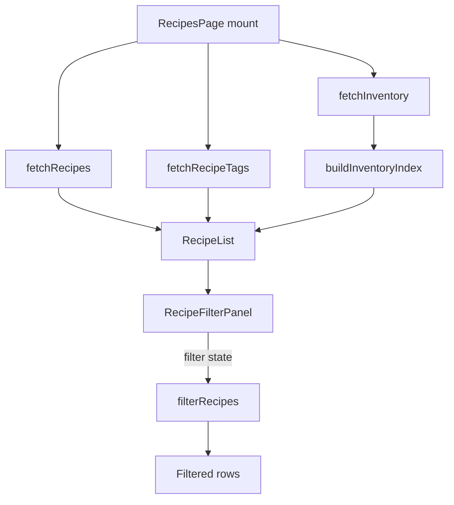

# Design Document: Recipe Search & Filter

## Overview

This feature adds a `RecipeFilterPanel` to the Recipes page hosting four new filters that compose additively with the existing name-search input and tag-cloud filter from `recipe-categories`:

1. Maximum prep time (minutes)
2. Maximum cook time (minutes)
3. Maximum total time (minutes)
4. "Only recipes I can make now" toggle (every ingredient has status `available`)

The four time fields and the ingredient-availability calculation already exist on the Recipe entity. The work is contained to the frontend; no backend, API, or data-model changes are introduced. The reasoning for keeping the derivation on the client is summarised below and developed in **Ingredient Availability on the List View**.

1. **Two new focused modules under `frontend/src/api/recipes/`**:
   - `availability.ts` — `InventoryIndex`, `buildInventoryIndex`, `computeAllAvailable` (the all-ingredients-available predicate, mirror of the backend's `computeAvailability` `missingCount === 0` check).
   - `filter.ts` — `RecipeFilters`, `filterRecipes` (the `Recipe_Filter` from the requirements), `validateMaxTimeInput`, `EMPTY_FILTERS`.
   These sit next to the existing `recipes.ts` and reuse `computeTotalTime` from there. Splitting them keeps each module small and focused on one concern (availability derivation vs. filter composition), and makes the property tests trivial to colocate.
2. **New component `RecipeFilterPanel`** — three numeric inputs, one toggle, a "Clear filters" action, inline validation errors.
3. **`RecipeList`** — composes the new panel with the existing search input and tag cloud. Adds an `inventoryIndex` prop and threads filter state through `filterRecipes`. Reuses `computeTotalTime` for the total-time predicate (same helper that drives the per-row time badge).
4. **`RecipesPage`** — fetches the user's inventory once on mount (in parallel with the recipes list and tags fetches), passes the resulting `inventoryIndex` down to `RecipeList`.

---

## Architecture

```
RecipesPage
├── (mount) fires in parallel:
│     fetchRecipes()           ← inside RecipeList
│     fetchRecipeTags()        ← existing, RecipesPage state
│     fetchInventory()         ← NEW: RecipesPage state, builds inventoryIndex
├── RecipeList
│   ├── search input          (existing)
│   ├── TagCloud              (existing)
│   ├── RecipeFilterPanel     ← NEW
│   └── filtered list         ← uses filterRecipes(recipes, filters, inventoryIndex)
├── RecipeDetail              (unchanged)
└── RecipeEditor              (unchanged)

frontend/src/api/recipes/
├── recipes.ts                 (existing — keeps computeTotalTime, scaleIngredients, fetchRecipes, …)
├── availability.ts           ← NEW: InventoryIndex, buildInventoryIndex, computeAllAvailable
└── filter.ts                 ← NEW: RecipeFilters, filterRecipes (the Recipe_Filter), validateMaxTimeInput
```



### Why the filter logic is a pure function

The acceptance criteria for this feature express universal predicates: "for any list of recipes and any filter values...". A single pure `filterRecipes` function makes those properties directly executable as fast-check property tests (`Recipe_Filter` in the requirements). The component layer only owns input state and dispatches to the pure helper.

---

## Components and Interfaces

### 1. New pure helpers under `frontend/src/api/recipes/`

The new helpers are split into two focused modules instead of being piled onto `recipes.ts`. `availability.ts` owns the inventory-index data structure and the all-available predicate; `filter.ts` owns the filter shape and the composition logic. Both are pure (no React, no I/O) so they can be unit-tested and property-tested in isolation.

#### `frontend/src/api/recipes/availability.ts`

A lightweight pre-computed lookup of total quantity per ingredient name (lowercase). Built once per inventory fetch on `RecipesPage` and passed down to `RecipeList`.

```typescript
/** Map of lowercase ingredient name -> total inventory quantity across all storage locations. */
export type InventoryIndex = Map<string, number>;

/**
 * Builds a name -> totalQuantity map from the user's inventory.
 * Sums quantities across all storage locations (matches backend computeAvailability).
 * Pure function. Does not mutate inputs.
 */
export function buildInventoryIndex(items: { name: string; quantity: number }[]): InventoryIndex {
  const index: InventoryIndex = new Map();
  for (const item of items) {
    const key = item.name.toLowerCase();
    index.set(key, (index.get(key) ?? 0) + item.quantity);
  }
  return index;
}
```

#### `computeAllAvailable`

Mirrors the backend `computeAvailability` logic for the list view. Returns `true` iff every ingredient has total available ≥ required (i.e., `missingCount === 0`).

```typescript
/**
 * Returns true iff every ingredient on the recipe has total inventory >= required.
 * Empty ingredient lists return true (vacuous truth) — this matches Requirement 5.4
 * indirectly: if a recipe has no ingredients, it cannot have any partial/missing ones.
 * Recipes with at least one ingredient on an empty inventory always return false.
 *
 * Pure function. Does not mutate inputs.
 */
export function computeAllAvailable(
  ingredients: RecipeIngredient[],
  inventoryIndex: InventoryIndex,
): boolean {
  for (const ing of ingredients) {
    const available = inventoryIndex.get(ing.name.toLowerCase()) ?? 0;
    if (available < ing.quantity) return false;
  }
  return true;
}
```

This is the same predicate used by the backend, just with a precomputed index for O(1) lookup. Equivalence: `computeAllAvailable(ingredients, buildInventoryIndex(items))` is `true` iff `computeAvailability(ingredients, items).missingCount === 0`. Property 4 below pins this equivalence as a fast-check property so that any future drift between the two implementations fails the test suite.

#### `frontend/src/api/recipes/filter.ts`

```typescript
export interface RecipeFilters {
  /** Lowercased name substring; empty string means no constraint. */
  nameQuery: string;
  /** Tags that the recipe must contain (AND across tags). Empty array means no constraint. */
  activeTags: string[];
  /** Inclusive upper bound on prepTime (minutes). undefined means no constraint. */
  maxPrepTime?: number;
  /** Inclusive upper bound on cookTime (minutes). undefined means no constraint. */
  maxCookTime?: number;
  /** Inclusive upper bound on totalTime (minutes). undefined means no constraint. */
  maxTotalTime?: number;
  /** When true, only include recipes whose ingredients are all available. */
  onlyAllAvailable: boolean;
}

/**
 * Filters a recipe list using the active filter values. Pure function. Does not mutate inputs.
 * Result is a subset of `recipes` and preserves input order.
 *
 * Uses AND across all active filters. Each individual filter:
 *  - nameQuery: case-insensitive substring match on recipe.name
 *  - activeTags: every tag in activeTags must be in recipe.tags
 *  - maxPrepTime: recipe.prepTime !== undefined && recipe.prepTime <= maxPrepTime
 *  - maxCookTime: recipe.cookTime !== undefined && recipe.cookTime <= maxCookTime
 *  - maxTotalTime: computeTotalTime(prepTime, cookTime) !== undefined && total <= maxTotalTime
 *  - onlyAllAvailable: computeAllAvailable(recipe.ingredients, inventoryIndex) === true
 */
export function filterRecipes(
  recipes: Recipe[],
  filters: RecipeFilters,
  inventoryIndex: InventoryIndex,
): Recipe[] {
  const q = filters.nameQuery.trim().toLowerCase();
  return recipes.filter((r) => {
    if (q !== '' && !r.name.toLowerCase().includes(q)) return false;
    if (filters.activeTags.length > 0) {
      const tags = r.tags ?? [];
      if (!filters.activeTags.every((t) => tags.includes(t))) return false;
    }
    if (filters.maxPrepTime !== undefined) {
      if (r.prepTime === undefined || r.prepTime > filters.maxPrepTime) return false;
    }
    if (filters.maxCookTime !== undefined) {
      if (r.cookTime === undefined || r.cookTime > filters.maxCookTime) return false;
    }
    if (filters.maxTotalTime !== undefined) {
      const total = computeTotalTime(r.prepTime, r.cookTime);
      if (total === undefined || total > filters.maxTotalTime) return false;
    }
    if (filters.onlyAllAvailable) {
      if (!computeAllAvailable(r.ingredients, inventoryIndex)) return false;
    }
    return true;
  });
}
```

### 2. New component: `RecipeFilterPanel`

File: `frontend/src/pages/RecipesPage/RecipeFilterPanel.tsx`

A self-contained, controlled component. It owns no domain state — only the raw string inputs and their inline validation errors. The parent (`RecipeList`) holds the resolved numeric/boolean filter values that drive `filterRecipes`.

```typescript
export interface RecipeFilterPanelValue {
  /** Raw text in the prep-time input — e.g. '', '15', '-1' */
  maxPrepTimeInput: string;
  /** Raw text in the cook-time input */
  maxCookTimeInput: string;
  /** Raw text in the total-time input */
  maxTotalTimeInput: string;
  /** "Only recipes I can make now" toggle */
  onlyAllAvailable: boolean;
}

export interface RecipeFilterPanelProps {
  value: RecipeFilterPanelValue;
  onChange: (next: RecipeFilterPanelValue) => void;
  /** When true, all controls are in their inactive state (used to disable Clear filters). */
  isAllInactive: boolean;
  /** Action to reset every control to its inactive state. */
  onClear: () => void;
}
```

**Layout (mobile-first, single column on narrow screens, two columns on wider screens):**

```
┌─────────────────────────────────────────┐
│ Filters                  [Clear filters]│
├─────────────────────────────────────────┤
│ Max prep time (min)   [____]            │
│ Max cook time (min)   [____]            │
│ Max total time (min)  [____]            │
│ ☐ Only recipes I can make now           │
└─────────────────────────────────────────┘
```

**Validation behaviour (per Requirements 2.3, 3.3, 4.3):**

For each of the three time inputs, the component performs the following on every change:

```typescript
function validateMaxTimeInput(raw: string): { value?: number; error?: string } {
  if (raw === '') return {}; // no constraint, no error
  const n = Number(raw);
  if (!Number.isInteger(n) || n < 0) {
    return { error: 'Enter a non-negative whole number.' };
  }
  return { value: n };
}
```

When `error` is set, the input renders an inline `<p style={fieldError}>` message below it. The component still calls `onChange` (so the user's literal input is preserved), but the parent's resolved filter for that field is `undefined` (no constraint), as if the field were empty. This matches "SHALL NOT apply the filter until the value is corrected or cleared".

**Resolving raw input → filter value (lives in `RecipeList`):**

```typescript
const resolved: RecipeFilters = {
  nameQuery: search,
  activeTags: activeTagFilters,
  maxPrepTime: validateMaxTimeInput(panel.maxPrepTimeInput).value,
  maxCookTime: validateMaxTimeInput(panel.maxCookTimeInput).value,
  maxTotalTime: validateMaxTimeInput(panel.maxTotalTimeInput).value,
  onlyAllAvailable: panel.onlyAllAvailable,
};
```

**Clear filters (Requirement 8):**

`onClear` resets the panel value to:

```typescript
const EMPTY_PANEL_VALUE: RecipeFilterPanelValue = {
  maxPrepTimeInput: '',
  maxCookTimeInput: '',
  maxTotalTimeInput: '',
  onlyAllAvailable: false,
};
```

`isAllInactive` is `true` iff all three input strings are empty AND `onlyAllAvailable === false`. The "Clear filters" button is `disabled` when `isAllInactive` (Requirement 8.2). Note: this disabled-state is independent of the search input and tag cloud — those have their own clear affordances and aren't owned by `RecipeFilterPanel`.

**Toggle (Requirement 1.5):**

Rendered as a labelled checkbox with `min-height: 44px` to match the project's mobile tap-target standard. The label "Only recipes I can make now" comes after the checkbox and is wrapped in `<label>` so tapping anywhere on the row toggles it.

**Styling:** Inline `React.CSSProperties` per project convention. Reuses the existing `tagCloudButtonInactive`/`tagCloudButtonActive` palette (`#dbeafe`/`#1e40af`) for the toggle's active state to keep visual cohesion with the tag cloud. Validation error style matches the existing `RecipeEditor` `fieldError` style (`#dc2626`, font-size `0.8125rem`).

**Accessibility:**

- Each numeric input has a visible `<label>` and an `aria-describedby` pointing to its error message id when the error is present.
- The toggle is a real `<input type="checkbox">` inside its `<label>`, so screen readers announce it as a checkbox.
- The "Clear filters" button has visible text and uses `disabled` to convey state — no extra `aria-disabled` needed.
- The panel root has `role="region"` and `aria-label="Recipe filters"` so assistive tech can locate it.

### 3. Updated `RecipeList`

File: `frontend/src/pages/RecipesPage/RecipeList.tsx`

**Props change:**

```typescript
interface RecipeListProps {
  onSelect: (recipeId: string) => void;
  onNew: () => void;
  allTags: string[];
  tagsLoading: boolean;
  inventoryIndex: InventoryIndex;   // NEW
  inventoryLoading: boolean;        // NEW (for loading state of the all-available toggle)
}
```

**State additions:**

```typescript
const [panel, setPanel] = useState<RecipeFilterPanelValue>(EMPTY_PANEL_VALUE);
```

The existing `search` and `activeTagFilters` state stay in `RecipeList` unchanged. Filter state resets when the user navigates away from the list view, because `RecipesPage` unmounts `RecipeList` when switching to `detail` / `editor-*`. This satisfies Requirement 1.7 without any extra logic.

**Render order between the existing search input/tag cloud and the recipe list:**

```
1. Title + "New Recipe" button         (existing)
2. Search input                        (existing)
3. Tag cloud                           (existing)
4. RecipeFilterPanel                   (NEW — placed below tag cloud)
5. Filtered recipe list / empty state  (existing, now using filterRecipes)
```

**Derived value:**

```typescript
const filtered = useMemo(() => {
  const filters: RecipeFilters = {
    nameQuery: search,
    activeTags: activeTagFilters,
    maxPrepTime: validateMaxTimeInput(panel.maxPrepTimeInput).value,
    maxCookTime: validateMaxTimeInput(panel.maxCookTimeInput).value,
    maxTotalTime: validateMaxTimeInput(panel.maxTotalTimeInput).value,
    onlyAllAvailable: panel.onlyAllAvailable,
  };
  return filterRecipes(recipes, filters, inventoryIndex);
}, [recipes, search, activeTagFilters, panel, inventoryIndex]);
```

The existing inline `recipes.filter(...).filter(...)` chain is removed in favour of the single call to `filterRecipes`. This keeps all filter logic in one tested place.

**`isAnyFilterActive`** (used to decide which empty-state message to show):

```typescript
const isAnyFilterActive =
  search.trim() !== '' ||
  activeTagFilters.length > 0 ||
  panel.maxPrepTimeInput !== '' ||
  panel.maxCookTimeInput !== '' ||
  panel.maxTotalTimeInput !== '' ||
  panel.onlyAllAvailable;
```

**Empty state (per Requirement 7):**

```tsx
{filtered.length === 0 && (
  <div style={styles.emptyState} role="status">
    {recipes.length === 0 ? (
      <p style={styles.statusText}>No recipes yet. Tap "New Recipe" to add one.</p>
    ) : isAnyFilterActive ? (
      <p style={styles.statusText}>No recipes match the selected filters.</p>
    ) : (
      <p style={styles.statusText}>No recipes match your search.</p>
    )}
  </div>
)}
```

The unified message "No recipes match the selected filters." replaces the previous tag-only message ("No recipes match the selected tags.") because the new requirement is broader (Requirement 7.1) and the tag-only branch is now subsumed. The "No recipes yet." branch is preserved verbatim (Requirement 7.2).

**Inventory loading**: when `inventoryLoading === true` and the user activates `onlyAllAvailable`, the toggle still works visually but the filter result reflects the empty index (every recipe with ≥1 ingredient is excluded). This is acceptable for the brief loading window. We do not block the UI on inventory load; the inventory fetch fires in parallel with the recipes fetch, so for the typical user-perceived flow both are ready by the time the user reaches for a filter. If desired, the toggle can render a small inline "Loading inventory…" hint while `inventoryLoading` is `true` — this is a low-cost polish detail and is included in the design (see `RecipeFilterPanel` props extension below).

To support the loading hint, `RecipeFilterPanelProps` is extended with one optional flag:

```typescript
inventoryLoading?: boolean; // when true, the all-available row shows an inline "Loading inventory…" hint
```

### 4. Updated `RecipesPage`

File: `frontend/src/pages/RecipesPage/RecipesPage.tsx`

**State additions:**

```typescript
const [inventoryIndex, setInventoryIndex] = useState<InventoryIndex>(new Map());
const [inventoryLoading, setInventoryLoading] = useState(true);
```

**Mount effect:** the existing `refreshTags()` call stays. A new effect fetches the inventory in parallel and builds the index. We do not refresh inventory on every recipe save — inventory is independent of recipes. We do, however, refresh it when the page mounts again (i.e., the user navigates to the Recipes page), which already happens because `RecipesPage` unmounts when switching to a different top-level page.

```typescript
useEffect(() => {
  let cancelled = false;
  setInventoryLoading(true);
  fetchInventory()
    .then((res) => {
      if (cancelled) return;
      setInventoryIndex(buildInventoryIndex(res.items));
    })
    .catch(() => {
      // silent fail — onlyAllAvailable filter will show no recipes if used,
      // which is the same behaviour as an empty inventory
    })
    .finally(() => {
      if (!cancelled) setInventoryLoading(false);
    });
  return () => {
    cancelled = true;
  };
}, []);
```

`inventoryIndex` and `inventoryLoading` are passed to `RecipeList` only (Editor and Detail don't need them).

### Ingredient Availability on the List View

`missingCount` is *derived state* from two source datasets: `recipe.ingredients` and the user's current inventory. The design question is: where should we compute the derivation?

The general rule is to compute derived state where the source state lives, and not to persist it. Both source datasets already live on the client — recipes are loaded by `RecipesPage`, inventory is loaded by `InventoryPage` and cached in IndexedDB by the offline-first design. Inventory is mutated frequently from the client (add, remove, quantity edits), so any backend-computed `missingCount` would be stale the instant a user touches an item, requiring either a refetch or a cache-invalidation scheme.

Three options were considered:

| Option | API calls | Latency at 500 recipes | Other costs |
|--------|-----------|------------------------|-------------|
| (A) Fetch each recipe individually via `GET /recipes/{id}` | 1 + N | 500 round-trips | Massive over-fetch; breaks the 200 ms budget; doesn't work offline |
| (B) Add a server-computed `missingCount` to `GET /recipes` | 1 | 1 round-trip | Couples Recipe response to live Inventory state at the API layer; value is structurally stale on the next inventory mutation; doesn't work offline (the source-of-truth values for inventory in IndexedDB would be ignored) |
| (C) Fetch inventory once, derive on client | 2 (recipes + inventory, in parallel) | 1 round-trip | Frontend mirror of the backend `computeAvailability` predicate; pinned by Property 4 |

**We pick (C)** for the following reasons:

1. **Source state lives on the client.** Both `recipe.ingredients` and the inventory are already in the client; deriving where the inputs live avoids round-tripping to a server only to compute something the client could compute itself.
2. **Naturally reactive.** When inventory changes, the `useMemo` over `inventoryIndex` re-runs and the filter result updates without any cache invalidation plumbing.
3. **Offline-first by construction.** This is a PWA whose Recipes page already works against locally cached recipes. A server-derived `missingCount` would either be unavailable offline or return a stale value from the last sync, even though the IndexedDB inventory store has the accurate value.
4. **Decouples persistence from a transient view concern.** `missingCount` is not part of the Recipe entity; folding it into the Recipe response shape would couple two independent entities (Recipe and Inventory) at the API layer.
5. **Cheap to compute.** O(R × ingredients) `Map.get` lookups — see the performance analysis below — comfortably under the 200 ms budget at the stated scale.

The legitimate cost of (C) is duplication: the backend already implements the predicate in `computeAvailability`. Two ways to manage that drift:

- **Now (in this feature):** the frontend `computeAllAvailable` is pinned to the backend's `missingCount === 0` semantics by Property 4 — any future divergence in either implementation fails the property test on the same generated inputs.
- **Later (separate spec):** if domain logic continues to drift towards being shared between frontend and backend, extract a `shared/` workspace alongside the existing `frontend`/`backend`/`infrastructure` packages and move `computeAvailability` and `computeTotalTime` there. This is out of scope for this feature; it's a project-structure change that warrants its own spec.

**Performance analysis.** With 500 recipes averaging ~10 ingredients and 500 inventory items:

- `buildInventoryIndex` is O(I) — 500 ops, runs once per inventory fetch (~µs scale).
- `computeAllAvailable` is O(ingredients) per recipe with `Map.get` lookups.
- A full filter pass at the worst case is 500 × 10 = 5000 map lookups + comparisons, comfortably below 1 ms in V8.
- Total per-keystroke filter cost (all six filters active) is dominated by the `onlyAllAvailable` branch and stays well within the 200 ms budget (Requirement 9.1).

`useMemo` over `[recipes, search, activeTagFilters, panel, inventoryIndex]` ensures we only re-filter on a relevant dependency change.

---

## Data Models

This feature introduces no DynamoDB, API, or shared-type changes. The only new types are frontend-only:

```typescript
// frontend/src/api/recipes/availability.ts
export type InventoryIndex = Map<string, number>;

// frontend/src/api/recipes/filter.ts
export interface RecipeFilters {
  nameQuery: string;
  activeTags: string[];
  maxPrepTime?: number;
  maxCookTime?: number;
  maxTotalTime?: number;
  onlyAllAvailable: boolean;
}

// frontend/src/pages/RecipesPage/RecipeFilterPanel.tsx
export interface RecipeFilterPanelValue {
  maxPrepTimeInput: string;
  maxCookTimeInput: string;
  maxTotalTimeInput: string;
  onlyAllAvailable: boolean;
}
```

The existing `Recipe`, `RecipeIngredient`, and `InventoryItem` types are reused unchanged.

---


## Correctness Properties

*A property is a characteristic or behavior that should hold true across all valid executions of a system — essentially, a formal statement about what the system should do. Properties serve as the bridge between human-readable specifications and machine-verifiable correctness guarantees.*

The following properties cover the testable acceptance criteria in `requirements.md`. Each property is universally quantified and references the originating requirements. The set was derived through prework (per-criterion classification) and a property-reflection pass that consolidated redundant predicates — for example, the three time-filter inclusion criteria are merged into one three-branch property because they share the same predicate shape.

### Property 1: Filter result is a subset of the input

*For any* list of recipes, any inventory index, and any combination of filter values, the result of `filterRecipes(recipes, filters, inventoryIndex)` SHALL be a subset of `recipes` (every recipe in the result also appears in the input).

**Validates: Requirements 2.1, 3.1, 4.1, 5.1, 6.1**

### Property 2: All filters inactive returns the full list unchanged

*For any* list of recipes and any inventory index, applying `filterRecipes` with the all-inactive filter value (empty `nameQuery`, empty `activeTags`, all `max*Time` undefined, `onlyAllAvailable === false`) SHALL return the input list unchanged — same recipes, same order.

**Validates: Requirements 2.2, 3.2, 4.2, 5.2, 6.2**

### Property 3: Time filter inclusion predicate (prep, cook, total)

*For any* list of recipes, any non-negative integer `V`, and any inventory index, when `filterRecipes` is invoked with only one of the three time filters active:

- With only `maxPrepTime = V` active, a recipe SHALL appear in the result if and only if `recipe.prepTime !== undefined && recipe.prepTime <= V`.
- With only `maxCookTime = V` active, a recipe SHALL appear in the result if and only if `recipe.cookTime !== undefined && recipe.cookTime <= V`.
- With only `maxTotalTime = V` active, a recipe SHALL appear in the result if and only if `computeTotalTime(recipe.prepTime, recipe.cookTime) !== undefined && computeTotalTime(recipe.prepTime, recipe.cookTime) <= V`.

The total-time branch uses the same `computeTotalTime` helper as the per-row time badge, satisfying Requirement 4.5 by construction.

**Validates: Requirements 2.1, 2.4, 3.1, 3.4, 4.1, 4.4, 4.5**

### Property 4: All-available inclusion predicate

*For any* list of recipes, any inventory items list `I`, and any recipe, when `filterRecipes` is invoked with only `onlyAllAvailable = true` active and `inventoryIndex = buildInventoryIndex(I)`, a recipe SHALL appear in the result if and only if `computeAllAvailable(recipe.ingredients, inventoryIndex)` returns `true`. Equivalently, the recipe SHALL appear if and only if for every ingredient on the recipe the sum of inventory quantities for matching (case-insensitive) inventory items is greater than or equal to the ingredient's required quantity.

This predicate is equivalent to the backend's `missingCount === 0` check on `computeAvailability(recipe.ingredients, I)`. Recipes with no ingredients are vacuously included; recipes with at least one ingredient against an empty inventory are excluded (covering Requirement 5.4).

**Validates: Requirements 5.1, 5.3, 5.4, 5.5**

### Property 5: AND conjunction correctness

*For any* list of recipes, any inventory index, and any combination of filter values, `filterRecipes(recipes, filters, inventoryIndex)` SHALL equal the intersection (preserving input order) of the per-filter results — i.e., `r ∈ result` iff `r` independently satisfies every active filter.

This subsumes Requirement 6.3 (composition with the existing name search and tag cloud) because `nameQuery` and `activeTags` are filters on the same `RecipeFilters` object and are conjoined the same way as the new ones.

**Validates: Requirements 6.1, 6.3**

### Property 6: Filter idempotence

*For any* list of recipes, any inventory index, and any filter value `f`, applying `filterRecipes` twice SHALL produce the same result as applying it once: `filterRecipes(filterRecipes(recipes, f, idx), f, idx)` equals `filterRecipes(recipes, f, idx)`.

**Validates: Requirements 2.1, 3.1, 4.1, 5.1, 6.1**

### Property 7: Inventory index sums correctly per lowercase name

*For any* list of inventory items `I` and any string `name`, `buildInventoryIndex(I).get(name.toLowerCase())` SHALL equal the sum of `item.quantity` for every item in `I` whose `item.name.toLowerCase()` equals `name.toLowerCase()`. When no items match, the result SHALL be `undefined` (and `computeAllAvailable` SHALL treat that as `0` available).

This is the on-client mirror of the backend `computeAvailability` aggregation step that sums across all storage locations (Requirement 5.5).

**Validates: Requirement 5.5**

### Property 8: Invalid time inputs are not applied as filters

*For any* raw input string `s` that is non-empty and does not represent a non-negative integer (e.g. `"-1"`, `"1.5"`, `"abc"`), `validateMaxTimeInput(s)` SHALL return `{ value: undefined, error: <non-empty string> }`. Consequently, when such a value is held in the panel state, the corresponding `RecipeFilters.max*Time` SHALL resolve to `undefined`, and `filterRecipes` SHALL behave as if that field were empty (no constraint applied) — leaving the recipe set determined solely by the other active filters.

**Validates: Requirements 2.3, 3.3, 4.3**

### Property 9: Clear filters resets the panel

*For any* `RecipeFilterPanelValue` `v`, the `onClear` handler SHALL produce a panel value equal to `EMPTY_PANEL_VALUE` — `maxPrepTimeInput === ''`, `maxCookTimeInput === ''`, `maxTotalTimeInput === ''`, and `onlyAllAvailable === false`.

**Validates: Requirements 1.6, 8.1**

### Property 10: Clear filters disabled iff all controls inactive

*For any* `RecipeFilterPanelValue` `v`, the `disabled` attribute on the "Clear filters" button SHALL equal `v.maxPrepTimeInput === '' && v.maxCookTimeInput === '' && v.maxTotalTimeInput === '' && !v.onlyAllAvailable`.

**Validates: Requirement 8.2**

---

## Error Handling

| Condition | Layer | Behaviour |
|-----------|-------|-----------|
| User types a negative number, decimal, or non-numeric string in a time input | `RecipeFilterPanel` | Inline error message rendered below the input ("Enter a non-negative whole number."). The user's literal input is preserved so they can correct it. The corresponding resolved `RecipeFilters.max*Time` is `undefined`, so the filter is not applied (Requirements 2.3, 3.3, 4.3). |
| `fetchInventory()` rejects (network failure, 401, etc.) | `RecipesPage` | Silent fail. `inventoryIndex` stays as the initial empty `Map`, `inventoryLoading` becomes `false`. The `onlyAllAvailable` toggle still works but excludes every recipe with at least one ingredient (matches the empty-inventory semantics of Requirement 5.4). The other three filters work normally. |
| `fetchRecipes()` rejects | `RecipeList` | Existing error handling unchanged — the `error` state renders an inline error banner. Filters render but have nothing to filter. |
| `inventoryLoading === true` and user activates the all-available toggle | `RecipeFilterPanel` | The toggle activates immediately. The inline "Loading inventory…" hint is shown next to the toggle while the fetch is in flight. The filter result during that brief window may exclude recipes that are actually available; once inventory loads, the result settles correctly without user action (the `useMemo` dependency on `inventoryIndex` triggers a re-filter). |
| Recipe in `recipes` has `tags` undefined or `ingredients` empty | `filterRecipes` | `(recipe.tags ?? [])` handles missing tags. An empty ingredients array is vacuously "all available" — for the all-available toggle, such recipes are included; for other filters, they are evaluated per the same predicates as any other recipe. |
| The user enters a number larger than `Number.MAX_SAFE_INTEGER` | `RecipeFilterPanel` | `Number.isInteger(Number(s))` is `false` for values outside that range, so this is rejected as invalid input — same path as a decimal. |

No new HTTP error paths are introduced because the feature does not call any new endpoints.

---

## Testing Strategy

### Property-based testing applicability

PBT is appropriate here. The core deliverable is a **pure filter function** (`filterRecipes`) plus two pure helpers (`buildInventoryIndex`, `computeAllAvailable`) whose correctness is naturally expressed as universal predicates over recipe lists, inventory states, and filter values. The acceptance criteria are dominated by "for any recipes and any filter values" statements that map cleanly to fast-check generators.

PBT does **not** apply to:

- The static structural assertions in Requirement 1 (which inputs and labels exist) — these are EXAMPLE tests.
- The exact wording of empty-state messages (Requirement 7) — EXAMPLE tests.
- The lifecycle reset behaviour in Requirement 1.7 — covered by an EXAMPLE test that drives a navigation cycle.
- The 200ms perf budget in Requirement 9.1 — addressed by the algorithmic analysis above; no automated SMOKE/perf test is added because Jest+jsdom is unsuitable for measuring real-device latency. (The performance budget is enforced by review against the algorithmic analysis: O(R × max-ingredients) with `Map.get` lookups stays well under 200ms at the stated 500-recipe scale.)

### PBT library and configuration

- **Library**: fast-check (already used in this project — see `frontend/src/components/InventoryList/__tests__/InventoryList.property.test.tsx` for the established pattern).
- **Iterations**: minimum 100 per property (`{ numRuns: 100 }` on each `fc.assert`).
- **Tagging**: each property test is tagged with `// Feature: recipe-search-filter, Property N: <title>` to link back to this design.

### Unit tests (example-based)

#### `frontend/src/api/recipes/__tests__/availability.test.ts` (new file)

- `buildInventoryIndex` produces an empty Map for an empty input
- `buildInventoryIndex` lowercases names — items `"Eggs"` and `"eggs"` are merged
- `computeAllAvailable` returns `true` for an empty ingredient list (vacuous)
- `computeAllAvailable` returns `false` when any ingredient's required exceeds the index value

#### `frontend/src/api/recipes/__tests__/filter.test.ts` (new file)

- `filterRecipes` with all-inactive filters returns the input unchanged
- `filterRecipes` with `nameQuery` filters case-insensitively on `name`
- `filterRecipes` honours `activeTags` (AND across tags) — sanity that the existing tag-filter logic is preserved
- `filterRecipes` excludes recipes with `prepTime === undefined` when `maxPrepTime` is set
- `filterRecipes` excludes recipes with `cookTime === undefined` when `maxCookTime` is set
- `filterRecipes` excludes recipes with neither `prepTime` nor `cookTime` when `maxTotalTime` is set (Requirement 4.4)
- `filterRecipes` with `onlyAllAvailable: true` and an empty index excludes every recipe with at least one ingredient (Requirement 5.4)
- `validateMaxTimeInput` returns `{}` for empty input, `{ value: n }` for a non-negative integer, and `{ error }` for negatives, decimals, and non-numeric strings

#### `frontend/src/pages/RecipesPage/__tests__/RecipeFilterPanel.test.tsx` (new file)

- Renders the four labelled controls and the "Clear filters" button (Requirements 1.2–1.6)
- Typing a valid value calls `onChange` with the new raw input
- Typing `"-1"` shows the inline error message and the corresponding error helper returns `{ value: undefined, error }` (Requirement 2.3)
- Typing `"1.5"` shows the inline error message (Requirements 2.3, 3.3, 4.3)
- Toggling "Only recipes I can make now" calls `onChange` with `onlyAllAvailable: true`
- Clicking "Clear filters" calls `onClear`
- "Clear filters" is `disabled` when `isAllInactive === true` and enabled otherwise (Requirement 8.2)
- When `inventoryLoading === true`, the "Loading inventory…" hint renders next to the toggle

#### `frontend/src/pages/RecipesPage/__tests__/RecipeList.test.tsx` (additions to existing file)

- The filter panel renders below the tag cloud and above the recipe list (Requirement 1.1 — structural placement check via DOM order)
- Setting `maxPrepTime` to `"15"` excludes recipes with `prepTime > 15` and recipes with no `prepTime`
- Setting `maxCookTime` excludes accordingly
- Setting `maxTotalTime` excludes accordingly, using `computeTotalTime`
- Activating "Only recipes I can make now" with a non-empty `inventoryIndex` excludes recipes with at least one missing or partial ingredient
- When all filters exclude every recipe and the recipe list is non-empty, the message "No recipes match the selected filters." is shown (Requirement 7.1)
- When `recipes.length === 0`, the existing "No recipes yet." message is shown and the filter empty-result message is NOT shown (Requirement 7.2)

#### `frontend/src/pages/RecipesPage/__tests__/RecipesPage.test.tsx` (additions; create file if missing)

- On mount, `fetchInventory` is called in parallel with `fetchRecipes` and `fetchRecipeTags`
- Navigating to detail then back to list resets the filter inputs to empty (Requirement 1.7)
- A failed `fetchInventory` does not throw and the page continues to render normally (silent-fail behaviour)

### Property-based tests

#### `frontend/src/api/recipes/__tests__/filter.property.test.ts` (new file)

Each of the following is implemented as a single fast-check property test with `numRuns: 100`. Generators are local helpers that build well-typed `Recipe`, `RecipeIngredient`, and `InventoryItem` skeletons (only fields used by the helpers need to be populated; other required fields can be filled with arbitrary fixed values to keep the generators small). Properties 1–6 and 8 live in this file. Property 7 (which only depends on `buildInventoryIndex`) lives in a sibling `availability.property.test.ts`.

Helpers used in generators:

- `recipeArb()` — `fc.record({ recipeId: fc.uuid(), name: fc.string(), tags: fc.array(fc.string()), ingredients: ingredientArrayArb, prepTime: fc.option(fc.nat({ max: 1000 }), { nil: undefined }), cookTime: fc.option(fc.nat({ max: 1000 }), { nil: undefined }), ... })`
- `ingredientArb()` — `fc.record({ name: fc.string({ minLength: 1, maxLength: 30 }), quantity: fc.float({ min: 0, max: 1000, noNaN: true }), unit: fc.constant('Gram') })`
- `inventoryItemArb()` — `fc.record({ name: fc.string({ minLength: 1, maxLength: 30 }), quantity: fc.float({ min: 0, max: 1000, noNaN: true }), ... })`
- `filtersArb()` — `fc.record({ nameQuery: fc.string(), activeTags: fc.array(fc.string()), maxPrepTime: fc.option(fc.nat({ max: 10000 }), { nil: undefined }), maxCookTime: fc.option(fc.nat({ max: 10000 }), { nil: undefined }), maxTotalTime: fc.option(fc.nat({ max: 10000 }), { nil: undefined }), onlyAllAvailable: fc.boolean() })`

```typescript
// Feature: recipe-search-filter, Property 1: Filter result is a subset of the input
fc.assert(fc.property(
  fc.array(recipeArb()),
  fc.array(inventoryItemArb()),
  filtersArb(),
  (recipes, inv, filters) => {
    const idx = buildInventoryIndex(inv);
    const result = filterRecipes(recipes, filters, idx);
    return result.every((r) => recipes.includes(r));
  }
), { numRuns: 100 });

// Feature: recipe-search-filter, Property 2: All filters inactive returns full list unchanged
fc.assert(fc.property(
  fc.array(recipeArb()),
  fc.array(inventoryItemArb()),
  (recipes, inv) => {
    const idx = buildInventoryIndex(inv);
    const result = filterRecipes(recipes, EMPTY_FILTERS, idx);
    return result.length === recipes.length && result.every((r, i) => r === recipes[i]);
  }
), { numRuns: 100 });

// Feature: recipe-search-filter, Property 3: Time filter inclusion predicate
// Run as one property with three branches (single fc.assert per branch, all in one test).
// Each branch generates V and a recipe list, runs filterRecipes with only that one filter active,
// and verifies the iff predicate.

// Feature: recipe-search-filter, Property 4: All-available inclusion predicate
fc.assert(fc.property(
  fc.array(recipeArb()),
  fc.array(inventoryItemArb()),
  (recipes, inv) => {
    const idx = buildInventoryIndex(inv);
    const result = filterRecipes(recipes, { ...EMPTY_FILTERS, onlyAllAvailable: true }, idx);
    return recipes.every((r) =>
      result.includes(r) === computeAllAvailable(r.ingredients, idx)
    );
  }
), { numRuns: 100 });

// Feature: recipe-search-filter, Property 5: AND conjunction correctness
fc.assert(fc.property(
  fc.array(recipeArb()),
  fc.array(inventoryItemArb()),
  filtersArb(),
  (recipes, inv, filters) => {
    const idx = buildInventoryIndex(inv);
    const combined = filterRecipes(recipes, filters, idx);
    // Compute per-filter results and intersect, preserving original order.
    const perFilter = SINGLE_FILTER_KEYS.map((k) =>
      new Set(filterRecipes(recipes, { ...EMPTY_FILTERS, [k]: filters[k] } as RecipeFilters, idx))
    );
    const expected = recipes.filter((r) => perFilter.every((s) => s.has(r)));
    return combined.length === expected.length && combined.every((r, i) => r === expected[i]);
  }
), { numRuns: 100 });

// Feature: recipe-search-filter, Property 6: Filter idempotence
fc.assert(fc.property(
  fc.array(recipeArb()),
  fc.array(inventoryItemArb()),
  filtersArb(),
  (recipes, inv, filters) => {
    const idx = buildInventoryIndex(inv);
    const once = filterRecipes(recipes, filters, idx);
    const twice = filterRecipes(once, filters, idx);
    return once.length === twice.length && once.every((r, i) => r === twice[i]);
  }
), { numRuns: 100 });

// Feature: recipe-search-filter, Property 7: Inventory index sums correctly
fc.assert(fc.property(
  fc.array(inventoryItemArb()),
  fc.string(),
  (items, name) => {
    const idx = buildInventoryIndex(items);
    const key = name.toLowerCase();
    const expected = items
      .filter((it) => it.name.toLowerCase() === key)
      .reduce((s, it) => s + it.quantity, 0);
    const actual = idx.get(key) ?? 0;
    return Math.abs(expected - actual) < 1e-9;
  }
), { numRuns: 100 });

// Feature: recipe-search-filter, Property 8: Invalid time inputs are not applied
fc.assert(fc.property(
  fc.oneof(
    fc.integer({ max: -1 }).map(String),                                 // negatives
    fc.float({ noNaN: true }).filter((n) => !Number.isInteger(n)).map(String), // decimals
    fc.string().filter((s) => s.trim() !== '' && Number.isNaN(Number(s))),     // non-numeric
  ),
  (raw) => {
    const result = validateMaxTimeInput(raw);
    return result.value === undefined && typeof result.error === 'string' && result.error.length > 0;
  }
), { numRuns: 100 });
```

#### `frontend/src/pages/RecipesPage/__tests__/RecipeFilterPanel.property.test.tsx` (new file)

```typescript
// Feature: recipe-search-filter, Property 9: Clear filters resets the panel
fc.assert(fc.property(
  panelValueArb(),  // any RecipeFilterPanelValue
  (initial) => {
    let captured: RecipeFilterPanelValue | undefined;
    const { getByText } = render(
      <RecipeFilterPanel
        value={initial}
        onChange={() => {}}
        onClear={() => { captured = EMPTY_PANEL_VALUE; }}
        isAllInactive={isAllInactive(initial)}
      />
    );
    fireEvent.click(getByText('Clear filters'));
    return JSON.stringify(captured) === JSON.stringify(EMPTY_PANEL_VALUE);
  }
), { numRuns: 100 });

// Feature: recipe-search-filter, Property 10: Clear filters disabled iff all-inactive
fc.assert(fc.property(
  panelValueArb(),
  (v) => {
    const { getByRole } = render(
      <RecipeFilterPanel
        value={v}
        onChange={() => {}}
        onClear={() => {}}
        isAllInactive={isAllInactive(v)}
      />
    );
    const btn = getByRole('button', { name: /clear filters/i }) as HTMLButtonElement;
    return btn.disabled === isAllInactive(v);
  }
), { numRuns: 100 });
```

### File layout summary

| File | Status | Purpose |
|------|--------|---------|
| `frontend/src/api/recipes/availability.ts` | new | `InventoryIndex`, `buildInventoryIndex`, `computeAllAvailable` |
| `frontend/src/api/recipes/__tests__/availability.test.ts` | new | Unit tests for `buildInventoryIndex` and `computeAllAvailable` |
| `frontend/src/api/recipes/__tests__/availability.property.test.ts` | new | Property 7 (inventory index sums correctly) |
| `frontend/src/api/recipes/filter.ts` | new | `RecipeFilters`, `filterRecipes`, `validateMaxTimeInput`, `EMPTY_FILTERS` |
| `frontend/src/api/recipes/__tests__/filter.test.ts` | new | Unit tests for `filterRecipes` and `validateMaxTimeInput` |
| `frontend/src/api/recipes/__tests__/filter.property.test.ts` | new | Properties 1–6 and 8 |
| `frontend/src/api/recipes/recipes.ts` | unchanged | Still exports `computeTotalTime`, `scaleIngredients`, `fetchRecipes`, … |
| `frontend/src/pages/RecipesPage/RecipeFilterPanel.tsx` | new | The filter panel component |
| `frontend/src/pages/RecipesPage/__tests__/RecipeFilterPanel.test.tsx` | new | Component unit tests |
| `frontend/src/pages/RecipesPage/__tests__/RecipeFilterPanel.property.test.tsx` | new | Properties 9 and 10 |
| `frontend/src/pages/RecipesPage/RecipeList.tsx` | modified | Compose `RecipeFilterPanel`; replace inline filter chain with `filterRecipes`; accept `inventoryIndex` and `inventoryLoading` props |
| `frontend/src/pages/RecipesPage/__tests__/RecipeList.test.tsx` | modified | Add tests for the new filter integration and the unified empty-state message |
| `frontend/src/pages/RecipesPage/RecipesPage.tsx` | modified | Fetch inventory on mount; build and pass down `inventoryIndex` |
| `frontend/src/pages/RecipesPage/__tests__/RecipesPage.test.tsx` | new (or modified) | Cover inventory fetch, navigation reset, silent-fail behaviour |

No backend, infrastructure, or shared-type files change.
